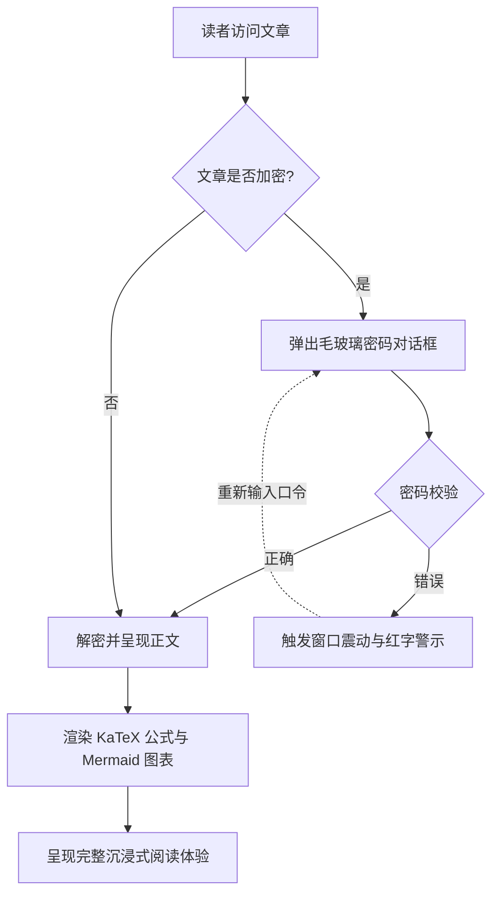
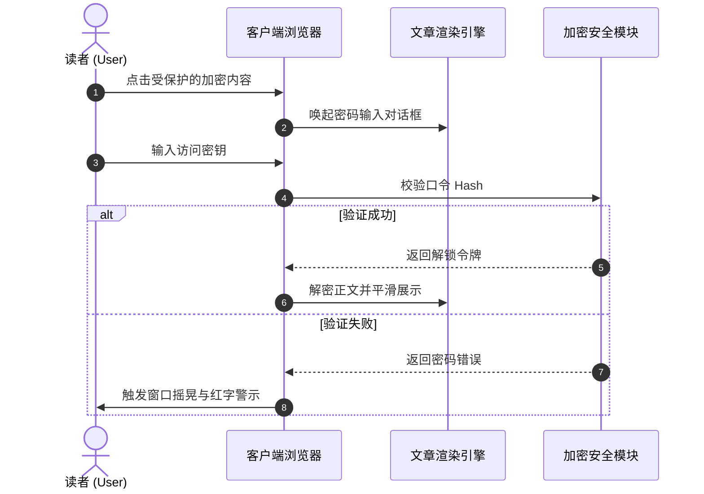

# Statische Seitengeneratoren (SSG) und ein umfassender Leitfaden zu Themeninhaltsformaten

In modernen statischen Seitengeneratoren (SSG) und eigenständigen Blog‑Theme‑Projekten bestimmt die **Analyse‑ und Darstellungskapazität von Artikelinhaltsformaten** unmittelbar die Ausdrucksgrenzen der Ersteller und das Leseerlebnis der Leser.

Dieser Leitfaden kombiniert die Inhaltsnormen der gängigen SSG‑Ökosysteme (**Hugo, Jekyll, Eleventy, Astro, Pelican, Hexo, WordPress, VitePress** usw.) und etabliert ein umfassendes System, das **Grundlegendes Markup, erweiterte Dokumentensprachen, WordPress‑Post‑Formate, interaktive Dropdown‑Switcher, Akkordeon‑Klappen, LaTeX‑Matheformeln, Mermaid‑Diagramme sowie Verschlüsselungs‑ und Entschlüsselungsfunktionen** abdeckt, und bietet sofort einsetzbare Live‑Render‑Beispiele.

---

## 1. Unterstützung von Inhaltsformaten und Ökosystem‑Übersicht bei gängigen statischen Seitengeneratoren (SSG)

Verschiedene statische Seitengeneratoren verfolgen unterschiedliche Philosophien bei der Auswahl ihrer Inhalts‑Parsing‑Architektur. Die nachstehende Tabelle fasst systematisch die native und erweiterte Unterstützung verschiedener Formate durch die gängigen Engines zusammen:

| Statischer Seitengenerator / Plattform | Kern‑Parsing‑Engine | Nativ eingebaut unterstützte Formate | Erweiterte / externe Tool‑Unterstützung | Front‑Matter‑Serialisierungsunterstützung |
| :--- | :--- | :--- | :--- | :--- |
| **Hugo** | Goldmark (Go) | `.md` (CommonMark/GFM), `.html`, `.org` (Org-mode) | `.adoc` (Asciidoctor), `.rst` (rst2html), `.pdc` (Pandoc) | YAML (`---`), TOML (`+++`), JSON (`{}`) |
| **Astro (本博客架构)** | Vite + Unified/Remark + MDX | `.md` (GFM), `.mdx` (JSX), `.html`, `.astro` 组件 | 可挂载 AST Loader 扩展 Org/AsciiDoc/RST | YAML, TOML, JSON |
| **Jekyll** | Kramdown (Ruby) | `.md` (Kramdown/GFM), `.html` | `.textile` (Textile 插件) | YAML |
| **Eleventy (11ty)** | JavaScript 模板管道 | `.md`, `.html`, `.liquid`, `.njk`, `.ejs`, `.webc` | MDX (插件), 自定义 Template 扩展 | YAML, JSON, JS/11tydata |
| **Hexo** | Marked / Hexo-Renderer | `.md` (GFM), `.html`, EJS/Pug 模板 | Org-mode / Pandoc (插件支持) | YAML, JSON |
| **Pelican** | Python Docutils | `.md` (Markdown), `.rst` (reStructuredText) | `.asciidoc` (Asciidoctor) | YAML, Markdown Metadata |
| **WordPress (Headless/Theme)** | Gutenberg Block Engine | HTML5 Blocks, Shortcodes, Post Formats | Classic Editor HTML | JSON 块元数据 / Post Meta |
| **VitePress / Docusaurus** | Markdown-It / MDX | `.md`, `.mdx`, Vue/React 组件 | 自定义容器语法 (`::: tip`) | YAML |

> [!NOTE]
> **Einblicke in die Ökosystem‑Architektur**: Hugo nutzt dank Go‑Sprach‑Hohe‑Parallelität nativ Markdown und Org‑mode; das moderne Front‑End‑SSG **Astro** hingegen setzt auf **MDX‑ und Komponenten‑Islands‑Fähigkeit**, um dynamische UI‑Interaktionen (wie den im Artikel gezeigten Dropdown‑Switcher, Passwort‑Popup, Vinyl‑Platte) nahtlos in den Text zu integrieren und damit höchste Flexibilität zu erreichen.

## 2. Spezifikationen zur Unterstützung von Front‑Matter‑Serialisierungsformaten

Die Metadaten am Anfang eines Blog‑Posts (Front Matter) bestimmen die Route, den Titel, das Datum, die Kategorien, das Titelbild und den geschützten Status des Artikels. Dieses Theme unterstützt alle gängigen Serialisierungsmodi:

### 1. YAML‑Format (am weitesten verbreitet, empfohlener Standard)

```yaml
---
title: "文章标题"
pubDate: 2026-08-28
author: "shijianus"
tags: ["Astro", "Markdown"]
featured: true
postFormat: "aside"
---
```

### 2. TOML‑Format (häufig bei Hugo verwendet)

```toml
+++
title = "文章标题"
pubDate = 2026-08-28T00:00:00Z
author = "shijianus"
tags = ["Astro", "Markdown"]
featured = true
+++
```

### 3. JSON‑Format (API‑gesteuerte und Headless‑Szenarien)

```json
{
  "title": "文章标题",
  "pubDate": "2026-08-28T00:00:00.000Z",
  "author": "shijianus",
  "tags": ["Astro", "Markdown"],
  "featured": true
}
```

## 3. Vergleich und Migrationsübersicht spezieller leichter Markup‑ und Nicht‑Markdown‑Formate

In unterschiedlichen Technologie‑Stacks können Autoren neben Markdown weitere leichte Auszeichnungssprachen verwenden. Im Folgenden werden die Syntax‑Merkmale gängiger Formate sowie deren äquivalente Darstellung in diesem Theme aufgeführt:

### 1. AsciiDoc (.adoc / .asciidoc)

AsciiDoc wird häufig in technischen Büchern und umfangreichen Projekthandbüchern eingesetzt und bietet ein äußerst reichhaltiges System von Hinweisblöcken und Attributen:

```asciidoc
// AsciiDoc 源码语法
= AsciiDoc 技术规范
:author: shijianus
:toc: macro

[NOTE]
====
这是一条 AsciiDoc 风格的注意卡片。
====

[cols="1,2,1", options="header"]
|===
| 模块 | 描述 | 状态
| 核心引擎 | Astro 6 静态管线 | 已就绪
|===
```

**Entsprechende Schreibweise in Markdown / MDX für dieses Theme**：

> [!NOTE]
> Dies ist eine äquivalente Hinweis‑Karte, die im Astro‑Theme nativ gerendert wird; Stil und Interaktion sind vollständig abgestimmt.

| Modul | Beschreibung | Status |
| :--- | :--- | :---: |
| **Kern‑Engine** | Astro 6 statische Pipeline | <span class="badge badge-success">Bereit</span> |

### 2. Emacs Org-Mode (.org)

Org‑Mode ist ein leistungsstarkes Werkzeug für Emacs‑Nutzer zur Wissensverwaltung, Aufgabenverfolgung und Dokumentation:

```ini
#+TITLE: Emacs Org-Mode 实践笔记
#+DATE: 2026-08-28
#+TAGS: Emacs OrgMode

* TODO 第一阶段：Markdown 扫描增强 [1/2]
- [X] 修复表格与移动端溢出
- [ ] 补全 Org-mode 语法转换器

#+BEGIN_QUOTE
“Org-mode 不仅是格式，更是一种可执行的思维工作流。”
#+END_QUOTE
```

**Standardmäßige statische GFM‑Aufgabenlisten‑Darstellung in diesem Theme (Nur‑Lese‑Modus)**：

- [x] 修复表格与移动端溢出
- [ ] 补全 Org-mode 语法转换器

> [!QUOTE]
> „Org‑Mode ist nicht nur ein Format, sondern ein ausführbarer Denk‑Workflow.“

#### Interaktive Aufgabenliste und verknüpfte Fortschrittsanzeige (Interactive Tutorial Checklist & Chained Progression)

In technischen Tutorials, praktischen Übungen und Bereitstellungshandbüchern ist die traditionelle nur lesbare `[ ]` Aufgabenliste nicht intuitiv interaktiv oder erinnerungsfreundlich. Dieses Thema fügt speziell eine **interaktive Aufgabenliste mit Echtzeit-Check und verknüpftem Status (`.article-task-tracker`)** hinzu. Sobald der Leser ein Element anklickt, wird die dynamische Fortschrittsleiste in Echtzeit neu berechnet. Sobald alle kritischen Schritte bestätigt sind, wird **automatisch die nachgelagerte Bereitstellungsanweisung freigeschaltet**, was sich hervorragend als Checkliste für das Durchlaufen eines Tutorials eignet:

<div class="article-task-tracker" data-storage-key="content-format-tutorial-demo">
  <div class="task-tracker__header">
    <div class="task-tracker__title">
      <svg width="20" height="20" viewBox="0 0 24 24" fill="none" stroke="currentColor" stroke-width="2"><path d="M9 11l3 3L22 4"/><path d="M21 12v7a2 2 0 0 1-2 2H5a2 2 0 0 1-2-2V5a2 2 0 0 1 2-2h11"/></svg>
      <span>Statische Website Engineering Vorbereitungscheckliste für den Live-Deployment (interaktiv in Echtzeit ankreuzbar)</span>
    </div>
    <span class="task-tracker__count">1/4 Schritte abgeschlossen (25%)</span>
  </div>
  <div class="task-tracker__bar-wrap">
    <div class="task-tracker__fill" style="width: 25%;"></div>
  </div>
  <ul class="task-checklist">
    <li class="task-checklist-item is-done">
      <input type="checkbox" checked id="chk-step-1" />
      <div class="task-item-body">
        <label for="chk-step-1" class="task-item-label">Schritt 1: Vollständige lokale Code-Backup und Git Commit</label>
        <div class="task-item-desc">Stellen Sie sicher, dass der Arbeitsbaum sauber ist, und protokollieren Sie den Backup-Hash im Entwicklungs-Audit-Log.</div>
      </div>
    </li>
    <li class="task-checklist-item">
      <input type="checkbox" id="chk-step-2" />
      <div class="task-item-body">
        <label for="chk-step-2" class="task-item-label">Schritt 2: Konfigurieren Sie die Cloudflare Pages statische Build-Pipeline</label>
        <div class="task-item-desc">Setzen Sie <code>BLOG_BUILD_TARGET=static</code> und die Node.js 20+ Laufzeitumgebung.</div>
      </div>
    </li>
    <li class="task-checklist-item">
      <input type="checkbox" id="chk-step-3" />
      <div class="task-item-body">
        <label for="chk-step-3" class="task-item-label">Schritt 3: Validieren Sie Medienressourcen und eingebettete externe Video-/Audio-Dateien</label>
        <div class="task-item-desc">Stellen Sie sicher, dass alle Audio- und Videoeinzeldateien strikt unter 25 MB liegen, um den CDN-Bereitstellungsstandards zu entsprechen.</div>
      </div>
    </li>
    <li class="task-checklist-item">
      <input type="checkbox" id="chk-step-4" />
      <div class="task-item-body">
        <label for="chk-step-4" class="task-item-label">Schritt 4: Führen Sie Playwright automatisierte visuelle Regression und Smoke-Tests durch</label>
        <div class="task-item-desc">Verifizieren Sie, dass alle reichhaltigen Medienkarten und interaktiven Komponenten bei verschiedenen Auflösungen auf PC und Mobilgeräten korrekt layoutet sind.</div>
      </div>
    </li>
  </ul>
  <div class="task-tracker__status-card is-pending">
    <div class="status-card__header">
      <span class="badge badge-warning">⏳ In Vorbereitung</span>
      <span style="font-weight:700;">Aktueller Fortschritt: 1/4 (25%)</span>
    </div>
    <p style="margin-top:0.4rem;margin-bottom:0;font-size:0.88rem;line-height:1.6;">Bitte schließen Sie die oben aufgeführten Schritte nacheinander ab; sobald alle Aufgaben abgeschlossen sind, wird hier in Echtzeit die Produktionsfreigabe freigeschaltet.</p>
  </div>
</div>

---

### 3. reStructuredText (.rst)

reStructuredText ist das Standard-Dokumentationsformat der Python-Community (wie Sphinx, ReadTheDocs):

```rst
.. reStructuredText 源码语法
.. note::
   这是一条 RST 指令定义的 Note 块。

.. code-block:: python
   :linenos:

   def greet(name: str) -> str:
       return f"Hello, {name}!"
```

**Markdown-Äquivalent in diesem Thema**:

> [!NOTE]
> Dies ist die RST-Note-Äquivalenzkarte, die in Astro nach dem GitHub Alert-Standard dargestellt wird.

```python
def greet(name: str) -> str:
    return f"Hello, {name}!"
```

---

### 4. Textile-Syntax

Textile ist eine alte, leichte Markupsprache (häufig in Redmine und frühen Jekyll-Blogs verwendet):

```markdown
h2. 章节标题
bq. 这是 Textile 引用块内容。
*列表项 1*
_斜体强调文本_
```

---

## 4. WordPress-Stil Artikelformen (Post Formats) Vollständige Implementierung und visuelle Darstellung

WordPress-Theme-Ökosysteme nutzen die klassische **Post Formats**-Mechanik, um Blogbeiträge je nach Inhaltstyp mit einer eigenen visuellen Darstellung auszustatten. In diesem Thema haben wir die 9 Formate vollständig im Haupttextbereich implementiert:

### 1. `aside` (Leichte Worte / Notiz / Kurznotizkarte)

Geeignet zum Festhalten kurzer Gedanken, Erinnerungen oder temporärer Notizen:

<div class="article-aside">
  <p><strong>💡 Kurznotiz</strong>：Der wahre Wert einer statischen Website liegt nicht im Showoff, sondern darin, eine blitzschnelle, wartungsfreie reine Leseerfahrung zu liefern. Selbst nach fünf oder zehn Jahren öffnen die generierten HTML-Dateien weiterhin einwandfrei.</p>
</div>

### 2. `status` (Status-Updates / Kurze Gedanken / Mikro-Zitate)

Ähnlich einer sofortigen Statusveröffentlichungskarte im Stil von Twitter/Weibo, einschließlich Autorenavatar, Client-Kennung und Stimmungs-Tag:

<div class="article-status">
  <div class="article-status__header">
    <div class="article-status__user">
      
      <div>
        <div class="article-status__name">shijianus</div>
        <div class="article-status__meta">发布于 2026-08-28 14:32 · 🇨🇳 杭州</div>
      </div>
    </div>
    <div class="article-status__badge">
      <span>📱 来自 极客工坊 Mac Studio</span>
    </div>
  </div>
  <p class="article-status__content">
    今天终于完成了博客主内容栏的全部格式扩展与视觉重构！从 KaTeX、Mermaid 到交互式下拉框与黑胶唱片，全栈静态交付的感觉太棒了 🚀✨
  </p>
</div>

---

### 3. `quote` (Ausgewählte Zitate / Große Zitat-Karten)

Geeignet für die Darstellung von gewichtigen Persönlichkeitszitaten, Design-Maximen oder prägnanten Sätzen:

<div class="article-quote">
  <div class="article-quote__icon">“</div>
  <div class="article-quote__body">
    Simplicity is prerequisite for reliability. (简单是可靠的前提条件。)
  </div>
  <div class="article-quote__author">
    
    <div class="article-quote__author-info">
      <div class="article-quote__author-name">Edsger W. Dijkstra</div>
      <div class="article-quote__author-title">计算机科学家 · 图灵奖得主 (1972)</div>
    </div>
  </div>
</div>

---

### 4. `gallery` (Bildergalerie / Adaptive Alben und Polaroid-Grids)

Unterstützt mehrspaltige, adaptive Responsive-Grids und Polaroid-Fotokarten mit menschlichem Charakter. Ein Klick auf ein beliebiges Bild öffnet die Vollbild-Lichtbox:

#### Adaptive Galerien mit 2 und 3 Spalten

<div class="article-gallery">
  <div class="gallery-grid gallery-grid-3">
    <div class="gallery-item">
      
      <div class="gallery-item__caption">极客工作台全景</div>
    </div>
    <div class="gallery-item">
      
      <div class="gallery-item__caption">系统架构设计大屏</div>
    </div>
    <div class="gallery-item">
      
      <div class="gallery-item__caption">星河漫游视觉封面</div>
    </div>
  </div>
</div>

#### Polaroid-Fotokarten-Galerie (Polaroid Style)

<div class="gallery-polaroid">
  <div class="polaroid-card">
    
    <div class="polaroid-card__caption">2026.04 杭州·研发基地</div>
  </div>
  <div class="polaroid-card">
    
    <div class="polaroid-card__caption">2026.08 架构演进重构夜</div>
  </div>
</div>

---

### 5. `video` (Adaptive Video-Wiedergabekarten)

Unterstützt ein 16:9-Responsive-Format, abgerundete Ecken und eine Fußzeile mit Beschreibung. Jede Karte belegt eine einzelne Zeile in voller Breite. Kompatibel mit externen Proxy-Embeds von Bilibili und YouTube sowie mit nativen MP4-Dateien auf der Website (einzelne Dateien sind auf 25 MB begrenzt, um den statischen Deployment-Standard von Cloudflare Pages zu erfüllen):

#### Externe Video-Embeds (Bilibili & YouTube Proxy-Embeds · Standardmäßig muss der Leser hierher scrollen und auf „Abspielen“ klicken)

<div class="video-embed-card" data-video-type="bilibili">
  <iframe src="https://player.bilibili.com/player.html?bvid=BV11k4y1T7kS&page=1&high_quality=1&danmaku=0&autoplay=0" allowfullscreen="true" loading="lazy" allow="accelerometer; autoplay; clipboard-write; encrypted-media; gyroscope; picture-in-picture; web-share" sandbox="allow-top-navigation-by-user-activation allow-same-origin allow-forms allow-scripts allow-popups"></iframe>
  <div class="embed-caption">🎬 Bilibili 外部内嵌演示：BV11k4y1T7kS (1080P 高清 · 需翻至此处并点击播放)</div>
</div>

<div class="video-embed-card" data-video-type="youtube">
  <iframe src="https://www.youtube-nocookie.com/embed/LXb3EKWsInQ?autoplay=0&rel=0" allowfullscreen="true" loading="lazy" allow="accelerometer; autoplay; clipboard-write; encrypted-media; gyroscope; picture-in-picture; web-share"></iframe>
  <div class="embed-caption">🎬 YouTube 外部内嵌演示：Costa Rica 4K 60fps HDR 演示 (1080P/4K · 真实有效 URL · 需翻至此处并点击播放)</div>
</div>
#### 站内原生 MP4 视频内嵌（Native HTML5 Video Player · 支持倍速与画中画 · 默认禁用下载）

<div class="video-embed-card">
  <video controls controlsList="nodownload" preload="metadata" playsinline oncontextmenu="return false;">
    <source src="/media/video/landscape_compressed.mp4" type="video/mp4" />
    Ihr Browser unterstützt das HTML5-Video nicht.
  </video>
  <div class="embed-caption">🎥 本地原生内嵌视频 1：4K/1080P 超清风光演示 (体积 21.7MB · 支持倍速与画中画 · 已禁用直接下载)</div>
</div>

<div class="video-embed-card">
  <video controls controlsList="nodownload" preload="metadata" playsinline oncontextmenu="return false;">
    <source src="/media/video/blue_archive_miracle.mp4" type="video/mp4" />
    Ihr Browser unterstützt das HTML5-Video nicht.
  </video>
  <div class="embed-caption">🎥 本地原生内嵌视频 2：【蔚蓝档案】“奇迹的终始—我们的故事由我们来决定！” (体积 23.3MB · 支持倍速与画中画 · 已禁用直接下载)</div>
</div>

---

### 6. `audio`（黑胶唱片旋转音乐卡片）

内置 HTML5 音频控制器，并在播放时自动触发**黑胶唱片无级平滑旋转动效**。所有唱片封面均采用真实匹配的官方高清专辑封面，支持多种主流音频格式（无损 FLAC、高码率 MP3、AAC/M4A），且已内置反爬与防下载保护：

#### ① Shaun - Way Back Home（FLAC 无损音频格式 · 24.55MB）

<div class="article-audio-card">
  <div class="audio-card__cover">
    
  </div>
  <div class="audio-card__info">
    <div class="audio-card__title">
      <span>Way Back Home</span>
      <span class="badge badge-purple">FLAC verlustfrei</span>
    </div>
    <div class="audio-card__author">Shaun (숀) · verlustfreies Audio (FLAC / 44,1 kHz 16‑bit 961 kbps)</div>
    <audio controls preload="metadata" controlsList="nodownload" oncontextmenu="return false;" src="/media/audio/WayBackHome.flac"></audio>
  </div>
</div>

#### ② ヨルシカ (Yorushika) - 彼女は旅に出る（MP3 320Kbps 高清格式 · 8.41MB）

<div class="article-audio-card">
  <div class="audio-card__cover">
    
  </div>
  <div class="audio-card__info">
    <div class="audio-card__title">
      <span>彼女は旅に出る (She Leaves on a Journey)</span>
      <span class="badge badge-success">320 Kbps MP3</span>
    </div>
    <div class="audio-card__author">ヨルシカ (Yorushika) · 高清立体声 (MP3 / 48kHz 320 kbps)</div>
    <audio controls preload="metadata" controlsList="nodownload" oncontextmenu="return false;" src="/media/audio/彼女は旅に出る.mp3"></audio>
  </div>
</div>

#### ③ すこっぷ feat. 初音ミク - アイロニ（M4A / AAC 格式 · 7.63MB）

<div class="article-audio-card">
  <div class="audio-card__cover">
    
  </div>
  <div class="audio-card__info">
    <div class="audio-card__title">
      <span>アイロニ (Irony / 讽刺)</span>
      <span class="badge badge-cyan">M4A / AAC</span>
    </div>
    <div class="audio-card__author">すこっぷ feat. 初音ミク · AAC 音频 (M4A / 44,1 kHz 260 kbps)</div>
    <audio controls preload="metadata" controlsList="nodownload" oncontextmenu="return false;" src="/media/audio/アイロニ.m4a"></audio>
  </div>
</div>


### 7. `link` (Externe Links und Lesezeichen-Vorschaukarten / Bookmark Preview)
Bietet eine elegante kartengestützte Vorschau für wichtige Referenzquellen im Artikel:

<a class="article-bookmark" href="https://github.com/shijianus/shijianus-blog" target="_blank" rel="noopener">
  <div class="article-bookmark__content">
    <div class="article-bookmark__title">EpoCanvas / shijianus-blog (Repository für die Kernspezifikationen des EpoCanvas-Blogthemas)</div>
    <p class="article-bookmark__desc">EpoCanvas (Zeit-Leinwand) ist ein modernes Content-Architektur-System für Geek-Blogs, das sich auf die Darstellung hoher Informationsdichte, elegante Mikrointeraktionen und die Unterstützung aller Formate konzentriert.</p>
    <div class="article-bookmark__site">
      <span class="badge badge-primary">GitHub</span>
      <span>github.com · EpoCanvas Core Spec</span>
    </div>
  </div>
  <div class="article-bookmark__icon">
    <svg viewBox="0 0 24 24" width="24" height="24" fill="none" stroke="currentColor" stroke-width="2" stroke-linecap="round" stroke-linejoin="round"><path d="M18 13v6a2 2 0 0 1-2 2H5a2 2 0 0 1-2-2V8a2 2 0 0 1 2-2h6"/><polyline points="15 3 21 3 21 9"/><line x1="10" y1="14" x2="21" y2="3"/></svg>
  </div>
</a>

---

### 8. `chat` (Chatblasen-Dialogstrom / Organic Animated Dialogue Stream)

Dient der lebendigen Darstellung technischer Verteidigungen, Zweiergespräche oder Nutzerinterviews. Unterstützt linke und rechte Chatblasen, Inline-Code, individuelle Farbgebungen sowie **dynamische, inhaltsadaptive Tipp-Animationen, Web Audio-Synthesetöne und dynamische Profilbilder (`footer_mini_logo__media`)**:
* **Statischer Modus (Standard)**:`<div class="article-chat">` gewährleistet eine leichte, rein statische Darstellung ohne JS-Overhead;
* **Aktivierung der dynamischen Darstellung (Parametersteuerung):** Konfiguration von `data-animate="true"` (oder `class="article-chat is-animated"`). Das System löst beim ersten Scrollen des Lesers in den Viewport automatisch eine realistische, zeitgesteuerte Tipp-Animation sowie seitenspezifische Audiowiedergaben aus, die auf der Zeichenlänge und natürlichen Zufallsverteilungen basieren;
* **Nicht-mechanische dynamische Zeitsteuerung (Content-Length Aware Timing):** Das System bestimmt intelligent die Dauer des Tipp-Indikators basierend auf der Länge der Nachricht (kurze Sätze: 380 ms Blinken, lange technische Abschnitte: 1000 ms+ Tipp- und Denkphase) und fügt zwischen den Blasen natürliche Pausen sowie subtile Audioeffekte hinzu, die menschlichen Lesegewohnheiten entsprechen;
* **Unterstützung für dynamische Video-Profilbilder (`footer_mini_logo__media`):** Profilbilder unterstützen die Einbettung von MP4-Mikrovideosequenzen sowie statischen Fallback-Postern;
* **Einmalige Auslösung und Neuladungssicherung:** Nach der ersten Auslösung beim Scrollen wird der Status automatisch gesperrt, sodass wiederholtes Scrollen keine weiteren Auslösungen verursacht und das Lesen nicht stört; eine erneute Bereitschaft tritt nur bei einer manuellen Seiteaktualisierung (F5) ein. Zudem steht oben rechts eine Mikro-Steuerleiste mit den Optionen „↺ Wiederholen“ und „🔊/🔇 Audio umschalten“ zur Verfügung.

<div class="article-chat" data-animate="true" data-sound="true">
  <div class="chat-message chat-left">
    <span class="chat-avatar footer_mini_logo__media">
      <video autoplay muted loop playsinline preload="metadata" poster="/media/shijianus/avatar.jpg" aria-hidden="true">
        <source src="/media/shijianus/avatar-dynamic.mp4" type="video/mp4" />
      </video>
      
    </span>
    <div class="chat-body">
      <div class="chat-author">Entwickler <a href="https://github.com/LeonBoven" target="_blank" rel="noopener noreferrer">Léon Boven</a> · 10:15</div>
      <div class="chat-bubble">
        Hallo! Würde die statische Renderung von <code>KaTeX</code> und <code>Mermaid</code> in Astro die Ladezeit der Frontend-Seite verlangsamen?
      </div>
    </div>
  </div>

  <div class="chat-message chat-right">
    
    <div class="chat-body">
      <div class="chat-author">Architekt <a href="https://github.com/shijianus" target="_blank" rel="noopener noreferrer">shijianus</a> · 10:16</div>
      <div class="chat-bubble">
        Keineswegs! Da <code>remark-math</code> und <code>rehype-katex</code> die Formeln bereits zur Build-Zeit in reine HTML/MathML-Strings kompilieren, entsteht auf der Browserseite <strong>keine JS-Laufzeitlast</strong>; zudem werden Mermaid-Diagramme dynamisch und bedarfsgerecht als asynchrone ESM-Module geladen, was die erste Seite extrem schnell macht! ⚡
      </div>
    </div>
  </div>
</div>

<div class="chat-message chat-left">
    <span class="chat-avatar footer_mini_logo__media">
      <video autoplay muted loop playsinline preload="metadata" poster="/media/shijianus/avatar.jpg" aria-hidden="true">
        <source src="/media/shijianus/avatar-dynamic.mp4" type="video/mp4" />
      </video>
      
    </span>
    <div class="chat-body">
      <div class="chat-author">开发者 <a href="https://github.com/LeonBoven" target="_blank" rel="noopener noreferrer">Léon Boven</a> · 10:17</div>
      <div class="chat-bubble">
        太棒了！那我们在 Markdown 里直接写架构时序图和交互式单位换算器也是开箱即用的对吧？
      </div>
    </div>
  </div>

  <div class="chat-message chat-right">
    
    <div class="chat-body">
      <div class="chat-author">架构师 <a href="https://github.com/shijianus" target="_blank" rel="noopener noreferrer">shijianus</a> · 10:18</div>
      <div class="chat-bubble">
        对的！不仅双击放大与高清 SVG 导出已全量具备，单位换算器更是接入了<strong>实时联网外汇牌价同步</strong>与<strong>基准单位下拉切换</strong>，而且保证固定质量单位完整对称表达，所有度量均经过严谨测试！🚀
      </div>
    </div>
  </div>

  <div class="chat-message chat-left">
    <span class="chat-avatar footer_mini_logo__media">
      <video autoplay muted loop playsinline preload="metadata" poster="/media/shijianus/avatar.jpg" aria-hidden="true">
        <source src="/media/shijianus/avatar-dynamic.mp4" type="video/mp4" />
      </video>
      
    </span>
    <div class="chat-body">
      <div class="chat-author">开发者 <a href="https://github.com/LeonBoven" target="_blank" rel="noopener noreferrer">Léon Boven</a> · 10:19</div>
      <div class="chat-bubble">
        收到！这个交互手感与根据消息长短变化的打字动画非常自然，我这就把团队的技术文档库升级上来！🎉
      </div>
    </div>
  </div>

  <div class="chat-message chat-right">
    
    <div class="chat-body">
      <div class="chat-author">架构师 <a href="https://github.com/shijianus" target="_blank" rel="noopener noreferrer">shijianus</a> · 10:20</div>
      <div class="chat-bubble">
        欢迎体验！后续如果遇到任何格式扩展或定制需求，随时在讨论区或 GitHub 交流探讨~ ✨
      </div>
    </div>
  </div>
</div>

---

## 五、特殊的下拉框格式与动态交互组件（Dropdown Selectors & Interactive Formats）

针对用户明确要求的**特殊下拉框格式**，我们在文章正文层提供了纯客户端即时响应的下拉选择器组件：

### 1. 多框架与多代码版本下拉切换器（Interactive Dropdown Switcher）

读者可以在下拉框中自由选择技术框架，正文面板将实时无刷新切换对应的内容与代码：

<div class="article-dropdown-switcher">
  <div class="article-dropdown-switcher__header">
    <div class="article-dropdown-switcher__title">
      <svg width="20" height="20" viewBox="0 0 24 24" fill="none" stroke="currentColor" stroke-width="2"><rect x="3" y="3" width="18" height="18" rx="2"/><path d="M9 3v18"/><path d="m14 9 3 3-3 3"/></svg>
      <span>Bitte wählen Sie das Frontend-Framework aus, dessen Implementierungscode Sie anzeigen möchten:</span>
    </div>
    <select class="article-select dropdown-switcher__select">
      <option value="react-tab">⚛️ React 19 (Hooks & TSX)</option>
      <option value="vue-tab">🟢 Vue 3.5 (Composition API)</option>
      <option value="astro-tab">🚀 Astro 6 (Island Component)</option>
      <option value="svelte-tab">🟠 Svelte 5 (Runes)</option>
    </select>
  </div>
  <div class="article-dropdown-switcher__body">
    <div class="article-dropdown-panel is-active" data-panel="react-tab">
      <div class="article-dropdown-panel__title">⚛️ React 19 Komponenten-Implementierung:</div>
      <pre class="no-code-enhance"><code class="language-tsx">import { useState } from 'react';
export function Counter() {
  const [count, setCount] = useState(0);
  return (
    &lt;button onClick={() =&gt; setCount((c) =&gt; c + 1)} className="btn-primary"&gt;
      React Klickzähler: &#123;count&#125;
    &lt;/button&gt;
  );
}</code></pre>
    </div>
    <div class="article-dropdown-panel" data-panel="vue-tab">
      <div class="article-dropdown-panel__title">🟢 Vue 3.5 Single-File-Komponenten-Implementierung:</div>
      <pre class="no-code-enhance"><code class="language-html">&lt;script setup lang="ts"&gt;
import { ref } from 'vue';
const count = ref(0);
&lt;/script&gt;
&lt;template&gt;
  &lt;button @click="count++" class="btn-primary"&gt;
    Vue Klickzähler: &#123;&#123; count &#125;&#125;
  &lt;/button&gt;
&lt;/template&gt;</code></pre>
    </div>
    <div class="article-dropdown-panel" data-panel="astro-tab">
      <div class="article-dropdown-panel__title">🚀 Astro 6 statische Komponenten-Implementierung ohne JavaScript:</div>
      <pre class="no-code-enhance"><code class="language-astro">---
const { title = "Astro 极速群岛" } = Astro.props;
---
&lt;div class="astro-island"&gt;
  &lt;h3&gt;&#123;title&#125;&lt;/h3&gt;
  &lt;p&gt;Standardmäßig 0 KB JavaScript ausgeliefert, Interaktivität wird bei Bedarf nachgeladen!&lt;/p&gt;
&lt;/div&gt;</code></pre>
    </div>
    <div class="article-dropdown-panel" data-panel="svelte-tab">
      <div class="article-dropdown-panel__title">🟠 Svelte 5 Runes-Implementierung:</div>
      <pre class="no-code-enhance"><code class="language-svelte">&lt;script lang="ts"&gt;
  let count = $state(0);
&lt;/script&gt;
&lt;button onclick={() =&gt; count++} class="btn-primary"&gt;
  Svelte Klickzähler: &#123;count&#125;
&lt;/button&gt;</code></pre>
    </div>
  </div>
</div>

---

### 2. Interaktiver universeller Einheitenwandler (Universal Interactive Unit Converter · Basis-Einheitsauswahl & Live-Wechselkurse)

Benutzer können einen **beliebigen Basiswert** im Eingabefeld eingeben (Standardwert ist `1`, mit Unterstützung für Inkrement-/Dekrement-Stepper und einem Zurücksetzen-Button), und zwischen verschiedenen Kategorien (Masse/Gewicht, internationale Wechselkurse, Datenspeicherung, Netzwerkbandbreite, Längenmaße) wird eine sofortige, nahtlose Umrechnung durchgeführt:
* **Dynamisch umschaltbare Umrechnungsbasis (Base Unit Dropdown)**: Die Basiseinheit rechts neben dem Eingabefeld kann frei über ein Dropdown ausgewählt werden (z. B. bei Masse `kg`, `g`, `lb`, `斤`, `oz`, `t` usw.; bei Wechselkursen `USD`, `HKD`, `CNY`, `EUR`, `JPY`, `GBP` usw.). Nach der Auswahl einer Basiseinheit wird die aktuelle Basiseinheit im Zielumrechnungsgrid **intelligent automatisch ausgeschlossen (um redundante Karten wie 1kg=1kg vollständig zu vermeiden)**, und alle ZielEinheiten werden sofort mit der aktuellen Basis als Nenner neu berechnet;
* **Anbindung an echte Wechselkurs-Schwankungen (Live Forex API)**: Beim Umschalten auf „💱 Internationale Wechselkurse“ fordert das System asynchron automatisch den Server-Endpunkt `/api/exchange-rate` an und fällt auf eine öffentliche Echtzeit-Wechselkurs-API zurück, um die neuesten Echtzeitkurse der wichtigsten Währungen abzurufen (oben rechts wird `🟢 Live-Online-Wechselkurse synchronisiert` angezeigt). Bei fehlender Internetverbindung oder Offline-Betrieb wird nahtlos auf die integrierten Basisverhältnisse zurückgefallen (wird `⚪ Offline-Basis-Wechselkurse` angezeigt), um sicherzustellen, dass „Echtzeit“ wirklich Echtzeit ist und die Offline-Erfahrung robust bleibt;
* **Bequemer API-Aufruf**: Das System stellt zusätzlich die Hilfsfunktion `window.shijianusAPI.fetchExchangeRates(base)` global bereit, damit benutzerdefinierte Skripte im Dokument die Echtzeitkursdaten sofort abrufen können;
* **Schnelles Kopieren mit einem Klick und Gleichungsberechnung**: Jede Umrechnungskarte bietet eine Kopieren-mit-einem-Klick-Schaltfläche mit Hervorhebungsfeedback, und unten wird eine dynamische Gleichungsketten-Zusammenfassung angezeigt.

<div class="interactive-unit-converter" data-default="1" data-title="🔄 Interaktiver universeller Einheitenwandler (unterstützt Basis-Einheitsumschaltung und Live-Wechselkurse)"></div>

---
### 3. 规格参数与视频编码下拉推算器（Interactive Spec Calc Dropdown）

选择不同选项时，右侧实时显示对应的技术指标与换算说明：

<div class="interactive-calc-select">
  <div class="article-select-box">
    <label>
      <svg width="18" height="18" viewBox="0 0 24 24" fill="none" stroke="currentColor" stroke-width="2"><circle cx="12" cy="12" r="10"/><path d="M12 6v6l4 2"/></svg>
      <span>选择视频编码分辨率：</span>
    </label>
    <select class="article-select">
      <option value="1080p" data-desc="1920 × 1080 @ 60fps · 码率 6,000 Kbps · 推荐带宽 15 Mbps">1080P 全高清 (1080p60)</option>
      <option value="2k" data-desc="2560 × 1440 @ 60fps · 码率 12,000 Kbps · 推荐带宽 30 Mbps">2K 极清 (1440p60)</option>
      <option value="4k" data-desc="3840 × 2160 @ 60fps · 码率 25,000 Kbps · 推荐带宽 60 Mbps">4K 超高清 (2160p60 HDR)</option>
      <option value="8k" data-desc="7680 × 4320 @ 60fps · 码率 80,000 Kbps · 推荐带宽 200 Mbps">8K 影院级 (4320p60 AV1)</option>
    </select>
  </div>
  <div class="calc-output-box">
    <span>📊 <strong>技术规格推算结果</strong>：</span>
    <span class="calc-output-value">1920 × 1080 @ 60fps · 码率 6,000 Kbps · 推荐带宽 15 Mbps</span>
  </div>
</div>

---

## 六、手风琴折叠、选项卡与多栏排版（Collapsibles, Tabs & Columns）

### 1. 互斥手风琴折叠组（Exclusive Accordion Group · 展开单项自动闭合其余项）

配置 `data-single="true"`。展开其中一项时，同组内的其他展开项将自动联动收起，保持页面整洁聚焦：

<div class="article-accordion-group" data-single="true">
  <details class="article-accordion" open>
    <summary>
      <span>🔒 1. 静态站点的安全性优势</span>
      <svg class="accordion-chevron" viewBox="0 0 24 24" fill="none" stroke="currentColor" stroke-width="2"><polyline points="9 18 15 12 9 6"/></svg>
    </summary>
    <div class="accordion-content">
      <p>静态站点没有传统的 PHP/Node.js 动态执行引擎和暴露在公网的 SQL 数据库，从物理层面免疫了 SQL 注入与服务端远程代码执行（RCE）风险。</p>
    </div>
  </details>

  <details class="article-accordion">
    <summary>
      <span>⚡ 2. 全球 CDN 边缘加速交付</span>
      <svg class="accordion-chevron" viewBox="0 0 24 24" fill="none" stroke="currentColor" stroke-width="2"><polyline points="9 18 15 12 9 6"/></svg>
    </summary>
    <div class="accordion-content">
      <p>通过将编译产物部署至 Cloudflare Pages 或 GitHub Pages，所有静态资源可在全球 300+ 边缘节点缓存，首字节响应时间（TTFB）通常低于 20ms。</p>
    </div>
  </details>

  <details class="article-accordion">
    <summary>
      <span>💰 3. 极低的云服务托管成本</span>
      <svg class="accordion-chevron" viewBox="0 0 24 24" fill="none" stroke="currentColor" stroke-width="2"><polyline points="9 18 15 12 9 6"/></svg>
    </summary>
    <div class="accordion-content">
      <p>静态站点无需全天候运行昂贵的 VPS 云服务器，配合免费层级的 Cloudflare D1 数据库与 Serverless 评论系统，日常运营成本近乎为零。</p>
    </div>
  </details>
</div>

---

### 2. 非互斥独立手风琴折叠组（Multi-Expand / Non-Exclusive Accordion Group · 允许多项同时展开）

配置 `data-single="false"`（或默认多开模式）。读者可以自由展开多个或全部折叠项进行横向比对与深度阅读，不会因为展开新项目而关闭已开启的内容：

<div class="article-accordion-group" data-single="false">
  <details class="article-accordion" open>
    <summary>
      <span>🛠️ 架构模块 A：Markdown AST 语法编译器流水线</span>
      <svg class="accordion-chevron" viewBox="0 0 24 24" fill="none" stroke="currentColor" stroke-width="2"><polyline points="9 18 15 12 9 6"/></svg>
    </summary>
    <div class="accordion-content">
      <p>基于 Unified、Remark-math 与 Rehype-katex 架构，在编译构建阶段将 Markdown 语法树完全静态转化为标准语义 HTML 节点，并在 Node.js 端完成高亮和公式生成。</p>
    </div>
  </details>


<details class="article-accordion" open>
    <summary>
      <span>🎨 Architekturmodul B: EpoCanvas dynamische visuelle Engine und responsives System</span>
      <svg class="accordion-chevron" viewBox="0 0 24 24" fill="none" stroke="currentColor" stroke-width="2"><polyline points="9 18 15 12 9 6"/></svg>
    </summary>
    <div class="accordion-content">
      <p>Bietet Aurora-Hintergründe, Starfield-Parallaxe, Glassmorphismus und responsive Breakpoint-Anpassungen für verschiedene Endgeräte. Egal ob auf 4K-Wide-Screen-Monitoren oder Klapphandys, es wird stets ein konsistentes ästhetisches Erlebnis gewährleistet.</p>
    </div>
  </details>

  <details class="article-accordion">
    <summary>
      <span>🛡️ Architekturmodul C: WebCrypto SHA-256 gestaffeltes Sicherheitsisolierungssystem</span>
      <svg class="accordion-chevron" viewBox="0 0 24 24" fill="none" stroke="currentColor" stroke-width="2"><polyline points="9 18 15 12 9 6"/></svg>
    </summary>
    <div class="accordion-content">
      <p>Integriert Level-1 persistente Sitzungsfreischaltung, Level-2 dynamische polymorphe Anti-Spy-Overlays (Gaußsche Unschärfe/Mosaik/Spoiler-Abdeckung), Level-3 Viewport-Sentinel mit automatischer Sperre bei Verlassen sowie ein Fragment-Verschlüsselungsverfahren für externe URLs. Dies verhindert vollständig die Offenlegung von Klartext-Passwörtern im DOM.</p>
    </div>
  </details>
</div>

---

### 3. Interaktive Registerkarten (Interactive Tabs)

<div class="article-tabs">
  <div class="article-tabs__nav">
    <button class="article-tabs__button is-active" type="button">pnpm</button>
    <button class="article-tabs__button" type="button">npm</button>
    <button class="article-tabs__button" type="button">yarn</button>
    <button class="article-tabs__button" type="button">bun</button>
  </div>
  <div class="article-tabs__panels">
    <div class="article-tabs__panel is-active">
      <pre class="no-code-enhance"><code class="language-bash">pnpm add @astrojs/mdx remark-math rehype-katex katex mermaid</code></pre>
    </div>
    <div class="article-tabs__panel">
      <pre class="no-code-enhance"><code class="language-bash">npm install @astrojs/mdx remark-math rehype-katex katex mermaid</code></pre>
    </div>
    <div class="article-tabs__panel">
      <pre class="no-code-enhance"><code class="language-bash">yarn add @astrojs/mdx remark-math rehype-katex katex mermaid</code></pre>
    </div>
    <div class="article-tabs__panel">
      <pre class="no-code-enhance"><code class="language-bash">bun add @astrojs/mdx remark-math rehype-katex katex mermaid</code></pre>
    </div>
  </div>
</div>

---

### 4. Mehrspaltiges Grid-Layout-System (Multi-Column Grid)

#### 3-spaltiges gleichbreites Karten-Grid

<div class="article-grid article-grid-3">
  <div class="article-col-card">
    <h4>🎨 Visuelles System</h4>
    <p>Integriert tiefgreifend die moderne Geek-Design-Ästhetik von EpoCanvas und unterstützt hochkontrastierende Hell-/Dunkel-Modi, Glassmorphismus-Hintergründe sowie sanfte Farbverläufe.</p>
  </div>
  <div class="article-col-card">
    <h4>⚡ Performance-Engineering</h4>
    <p>Astro 6 statische Inselarchitektur mit HTML-Prerendering während des Build-Prozesses für maximale SEO-Optimierung rein statischer Inhalte.</p>
  </div>
  <div class="article-col-card">
    <h4>🛠️ Erweiterungs-Ökosystem</h4>
    <p>Vollständige Unterstützung für KaTeX-Formeln, Mermaid-Diagramme, verschlüsselte Modals und 9 verschiedene Post-Formate.</p>
  </div>
</div>

#### 1:2 asymmetrisches Sidebar-Grid

<div class="article-grid article-columns-1-2">
  <div class="article-col-card">
    <h4>📌 Architektur-Positionierung</h4>
    <p>Ein moderner Schreibrahmen, der sich speziell an Geeks und Ingenieure richtet.</p>
  </div>
  <div class="article-col-card">
    <h4>🚀 Auslieferungssicherheit</h4>
    <p>Integrierte, umfassende automatisierte Smoke-Tests und statische Build-Validierungsmechanismen stellen sicher, dass Formeln, Diagramme und komplexe Karten auf allen Geräten pixelgenau und lückenlos dargestellt werden.</p>
  </div>
</div>

---

## 7. 13 semantische Hinweisboxen (Admonitions / GitHub Alerts)

Basierend auf den GitHub Alert- und EpoCanvas-Designrichtlinien werden 13 farbige Karten mit unterschiedlicher Semantik unterstützt. Zudem ermöglicht die Syntax `[!TYPE]-` ein standardmäßig eingeklapptes Verhalten:

> [!NOTE]
> **Allgemeiner Hinweis (Note)**: Dies ist eine Standard-Hintergrundinformation oder eine Kontexterklärung.

> [!TIP]
> **Praktischer Tipp (Tip)**: Mit der Tastenkombination <kbd>Ctrl</kbd> + <kbd>K</kbd> können Sie das globale Artikelsuchfeld schnell aufrufen!

> [!IMPORTANT]
> **Wichtiger Hinweis (Important)**: Stellen Sie vor dem Deployment in die Produktionsumgebung sicher, dass die Umgebungsvariable `BLOG_BUILD_TARGET=static` korrekt gesetzt wurde.

> [!WARNING]
> **Warnung (Warning)**: Übermitteln Sie niemals Produktionsdatenbank-Schlüssel oder Cloud-Dienst-Private Keys in öffentlichen Git-Repositories.

> [!CAUTION]
> **Vorsicht (Caution)**: Das Neuanlegen von Datentabellen ist ein destruktiver Vorgang. Sichern Sie zuvor unbedingt die D1-Datenbank!

> [!DANGER]
> **Gefahr (Danger)**: Das direkte Löschen der Produktionsdatenbank führt zum unwiderruflichen Verlust aller Kommentare und Benutzerdaten.

> [!SUCCESS]
> **Erfolgreich (Success)**: Der statische Build-Prozess wurde erfolgreich abgeschlossen. Alle 47 statischen Routen sind bereit!


> [!QUESTION]
> **Diskussion (Question)**: Wie kann eine millisekundenschnelle Volltextsuche rein clientseitig ohne Server-Abhängigkeiten implementiert werden?
> [!QUOTE]
> **Zitat (Quote)**: „Guter Code kann nicht nur von Maschinen ausgeführt werden, sondern vermittelt Ideen den Menschen so elegant wie ein Gedicht.“

> [!INFO]
> **Information (Info)**: Dieses Blog basiert auf Astro 6 und Tailwind 4 und wird vollständig als statische Seite exportiert.

> [!TODO]
> **Aufgabe (Todo)**: Geplant ist die Einführung eines WebAssembly-basierten Volltextsuchindexes auf Client-Seite in der nächsten Iteration.

> [!BUG]
> **Fehlerbericht (Bug)**: Das Layoutproblem mit horizontal abgeschnittenen Tabellen auf extrem schmalen Bildschirmen wurde in der alten Version behoben.

> [!EXAMPLE]
> **Beispiel (Example)**: Alle oben gezeigten Hinweisboxen passen sich automatisch an die hochkontrastreichen Farben der dunklen und hellen Darstellung an.

### Demo der ausklappbaren Hinweisboxen

> [!TIP]- Klicken Sie zum Aufklappen: Referenzkonfiguration für das schnelle Nginx-Caching in der Produktionsumgebung
> ```nginx
> location ~* \.(?:css|js|woff2?|svg|png|jpg|webp)$ {
>     expires 1y;
>     add_header Cache-Control "public, immutable";
>     access_log off;
> }
> ```

---

## 8. Akademische mathematische Formeln (KaTeX), Architekturdiagramme (Mermaid 11) und dynamische Mindmaps (Markmap)

In praxisorientierten und exemplarischen technischen Dokumentationen bildet das Konzept der **「tatsächlichen Renderdarstellung + entsprechender Quellcode-Vergleich」** (zwei Registerkarten/Tabs) das Kernprinzip der Darstellung. Dies ermöglicht es den Lesern nicht nur, die endgültigen visuellen und interaktiven Eigenschaften direkt zu erleben, sondern bietet Entwicklern auch die Möglichkeit, mit einem Klick auf Referenzmaterial zuzugreifen, es zu kopieren und in eigene Projekte zu übernehmen.

---

### 1. LaTeX-Mathematikformeln (KaTeX Math · Inline- und blockbasierte mehrzeilige Herleitungen)

#### Inline-Formeln (Inline Formula)

<div class="article-tabs">
<div class="article-tabs__nav">
<button class="article-tabs__button is-active" type="button">🌟 Renderdarstellung</button>
<button class="article-tabs__button" type="button">💻 LaTeX-Quellcode</button>
</div>
<div class="article-tabs__panels">
<div class="article-tabs__panel is-active">

Die Masse-Energie-Äquivalenz $E = mc^2$, die Eulersche Identität $e^{i\pi} + 1 = 0$, das Gauß-Integral $\int_{-\infty}^{\infty} e^{-x^2} dx = \sqrt{\pi}$.

</div>
<div class="article-tabs__panel">

```latex
质能方程 $E = mc^2$，欧拉恒等式 $e^{i\pi} + 1 = 0$，高斯积分 $\int_{-\infty}^{\infty} e^{-x^2} dx = \sqrt{\pi}$。
```

</div>
</div>
</div>

#### Blockbasierte mehrzeilige Herleitungsformel 1: Laplace-Transformation eines dynamischen Systems zweiter Ordnung (Block Math · Single Equation)

<div class="article-tabs">
<div class="article-tabs__nav">
<button class="article-tabs__button is-active" type="button">🌟 Renderdarstellung</button>
<button class="article-tabs__button" type="button">💻 LaTeX-Quellcode</button>
</div>
<div class="article-tabs__panels">
<div class="article-tabs__panel is-active">

$$
\mathcal{L}\{\ddot{x}(t) + 2\zeta\omega_n\dot{x}(t) + \omega_n^2 x(t)\} = X(s)(s^2 + 2\zeta\omega_n s + \omega_n^2)
$$

</div>
<div class="article-tabs__panel">

```latex
$$
\mathcal{L}\{\ddot{x}(t) + 2\zeta\omega_n\dot{x}(t) + \omega_n^2 x(t)\} = X(s)(s^2 + 2\zeta\omega_n s + \omega_n^2)
$$
```

</div>
</div>
</div>

#### Blockbasierte mehrzeilige Herleitungsformel 2: Klassische Maxwell-Gleichungen der Elektrodynamik (Block Math · Multi-line Aligned)

<div class="article-tabs">
<div class="article-tabs__nav">
<button class="article-tabs__button is-active" type="button">🌟 Renderdarstellung</button>
<button class="article-tabs__button" type="button">💻 LaTeX-Quellcode</button>
</div>
<div class="article-tabs__panels">
<div class="article-tabs__panel is-active">

$$
\begin{aligned}
\nabla \cdot \mathbf{E} &= \frac{\rho}{\varepsilon_0} \\
\nabla \cdot \mathbf{B} &= 0 \\
\nabla \times \mathbf{E} &= -\frac{\partial \mathbf{B}}{\partial t} \\
\nabla \times \mathbf{B} &= \mu_0 \mathbf{J} + \mu_0 \varepsilon_0 \frac{\partial \mathbf{E}}{\partial t}
\end{aligned}
$$

</div>
<div class="article-tabs__panel">

```latex
$$
\begin{aligned}
\nabla \cdot \mathbf{E} &= \frac{\rho}{\varepsilon_0} \\
\nabla \cdot \mathbf{B} &= 0 \\
\nabla \times \mathbf{E} &= -\frac{\partial \mathbf{B}}{\partial t} \\
\nabla \times \mathbf{B} &= \mu_0 \mathbf{J} + \mu_0 \varepsilon_0 \frac{\partial \mathbf{E}}{\partial t}
\end{aligned}
$$
```

</div>
</div>
</div>

---

### 2. Mermaid 11 Architekturdiagramme (Flowchart & Sequence · Fluss- und Sequenzdiagramme)

#### ① Flussdiagramm zur Blog-Verschlüsselungsverifikation und Content-Rendering (Flowchart TD)

<div class="article-tabs">
<div class="article-tabs__nav">
<button class="article-tabs__button is-active" type="button">🌟 渲染效果呈现</button>
<button class="article-tabs__button" type="button">💻 Mermaid 源码</button>
</div>
<div class="article-tabs__panels">
<div class="article-tabs__panel is-active">



</div>
<div class="article-tabs__panel">

````markdown

````

</div>
</div>
</div>

#### ② 客户端安全鉴权与解密时序图（Sequence Diagram）

<div class="article-tabs">
<div class="article-tabs__nav">
<button class="article-tabs__button is-active" type="button">🌟 渲染效果呈现</button>
<button class="article-tabs__button" type="button">💻 Mermaid 源码</button>
</div>
<div class="article-tabs__panels">
<div class="article-tabs__panel is-active">



</div>
<div class="article-tabs__panel">

````markdown

````

</div>
</div>
</div>

---

### 3. 动态交互式思维导图（Markmap / Mindmap · 多向分支扩散）

在长篇技术规范与系统架构梳理中，传统的静态列表难以直观呈现复杂的知识脉络。本主题全新实装 **Markmap 动态交互式思维导图引擎**，在文章主栏（`.post.post-page-shell`）中实现彻底的原生解析与交互增强：

> [!TIP]
> **多向分支扩散核心规则**：
> 1. **默认单块保护空间**：默认状态下，思维导图仅展示 **1 块核心根节点**（Level 1），右侧附带折叠小圆点指示器；
> 2. **点击展开多向分支**：点击根节点或任意子节点的小圆点，子分支将**平滑向外散开**；
> 3. **工具栏全能操控**：支持 **放大 / 缩小 / 居中自适应 / 一键展开全部 / 一键收起单块 / 全屏沉浸式阅读 / 复制源码**；
> 4. **画布拖拽与缩放**：按住鼠标左键可自由拖拽平移画布，滚动鼠标滚轮可缩放视野。

#### 活体思维导图呈现：SSG 与主题内容格式生态全景

<div class="article-tabs">
<div class="article-tabs__nav">
<button class="article-tabs__button is-active" type="button">🌟 交互导图呈现</button>
<button class="article-tabs__button" type="button">💻 Mindmap 结构源码</button>
</div>
<div class="article-tabs__panels">
<div class="article-tabs__panel is-active">

```mindmap
# 静态站点生成器与全格式内容生态架构
## 1. 静态编译核心流水线
### AST 语法转换管道
#### Markdown / MDX 语义解析流水线
##### Unified / Remark 语法拓展
- GFM 表格与删除线语法转换
- 自动生成 Heading 锚点与 ID
##### Markmap 交互式多向思维导图拓展
- 递归 AST 树构建 (Transformer.transform)
- D3 层次化弹性布局 (Flextree Algorithm)
- 交互式折叠状态机 (payload.fold)
- 动态调色板分支染色 (d3.scaleOrdinal)
##### Rehype Katex 数学公式拓展
- 行内公式与独立块公式解析
- 宏定义支持与错误容错回退
#### 代码高亮与静态着色器
##### Shiki 双主题编译器
- VSCode TextMate 语法规则解析
- 浅色/深色模式双主题预渲染零水合
### 编译器与资源打包
#### Vite 6 极速热重载 (HMR)
##### ESM 原生模块加载
- 毫秒级按需编译与热更新
#### Rollup 静态生成流水线
##### 静态打包优化
- 智能代码分块 (Code Splitting)
- Tree-Shaking 冗余消除
## 2. 动态交互与群岛体系
### 混合组件群岛 Islands
#### 客户端组件分岛挂载
##### React 19 Client Components
- 独立状态隔离与上下文通信
- 会话状态保持 (SessionStorage / Crypto)
##### Astro Server-Side Islands
- 零运行时客户端 JS (Zero-JS by Default)
- 按需激活交互岛屿 (client:visible)
### 现代视觉与动效系统
#### 动态背景与渲染引擎
##### Aurora 极光 / Starfield 星空
- WebGL / Canvas 2D 硬件加速
- 节能模式与视口离开自动暂停
##### 毛玻璃卡片 Glassmorphism 规范
- 动态高斯模糊与多重环境阴影
- 响应式全端自适应布局 (PC / Pad / Mobile)
## 3. 格式全景与特异功能
### 扩展文档规范对照
#### AsciiDoc (.adoc) 原生等效适配
#### Emacs Org-Mode (.org) 任务清单映射
#### reStructuredText (.rst) 指令转换
### 富交互组件集
#### 交互式下拉框切换器 (Dropdown Switcher)
#### 互斥手风琴折叠卡片 (Accordion Groups)
#### 动态黑胶唱片音频播放器 (Vinyl Audio)
### 安全隐私与分级加密
#### WebCrypto SHA-256 哈希校验 (无明文外露)
#### 1级会话持久解锁 (Session Persistent)
#### 2级防窥遮罩切换 (高斯模糊 / 马赛克 / 剧透遮罩)
#### 3级视口防窥离开即锁 (IntersectionObserver)

#### Isolation of external segmented decryption endpoints (Standalone Token)
```

</div>
<div class="article-tabs__panel">

````markdown
```mindmap
# Architecture of the Static Site Generator and Full-Format Content Ecosystem
## 1. Static Compilation Core Pipeline
### AST Syntax Transformation Pipeline
#### Markdown / MDX Semantic Parsing Pipeline
##### Unified / Remark Syntax Extensions
- GFM Table and Strikethrough Syntax Conversion
- Automatic Generation of Heading Anchors and IDs
##### Markmap Interactive Multi-Directional Mind Map Extension
- Recursive AST Tree Construction (Transformer.transform)
- D3 Hierarchical Elastic Layout (Flextree Algorithm)
- Interactive Collapse State Machine (payload.fold)
- Dynamic Palette Branch Coloring (d3.scaleOrdinal)
##### Rehype Katex Mathematical Formula Extension
- Parsing of Inline and Standalone Block Formulas
- Macro Definition Support and Error Tolerance Fallback
#### Code Highlighting and Static Shaders
##### Shiki Dual-Theme Compiler
- VSCode TextMate Grammar Rule Parsing
- Light/Dark Mode Dual-Theme Pre-Rendering with Zero Hydration
### Compiler and Asset Bundling
#### Vite 6 Ultra-Fast Hot Module Replacement (HMR)
##### Native ESM Module Loading
- Millisecond-Level On-Demand Compilation and Hot Updates
#### Rollup Static Generation Pipeline
##### Static Bundling Optimization
- Intelligent Code Splitting
- Tree-Shaking Redundancy Elimination
## 2. Dynamic Interaction and Islands Architecture
### Hybrid Component Islands
#### Client-Side Component Island Mounting
##### React 19 Client Components
- Independent State Isolation and Context Communication
- Session State Persistence (SessionStorage / Crypto)
##### Astro Server-Side Islands
- Zero Runtime Client JS (Zero-JS by Default)
- On-Demand Activation of Interactive Islands (client:visible)
### Modern Visual and Animation System
#### Dynamic Backgrounds and Rendering Engine
##### Aurora / Starfield
- WebGL / Canvas 2D Hardware Acceleration
- Power-Saving Mode and Automatic Pause on Viewport Exit
##### Glassmorphism Card Specification
- Dynamic Gaussian Blur and Multiple Ambient Shadows
- Responsive Full-Device Adaptive Layout (PC / Pad / Mobile)
## 3. Format Panorama and Special Features
### Extended Documentation Specification Mapping
#### AsciiDoc (.adoc) Native Equivalent Adaptation
#### Emacs Org-Mode (.org) Task List Mapping
#### reStructuredText (.rst) Directive Conversion
### Rich Interactive Component Set
#### Interactive Dropdown Switcher
#### Mutually Exclusive Accordion Collapse Cards (Accordion Groups)
#### Dynamic Vinyl Record Audio Player (Vinyl Audio)
### Security, Privacy, and Tiered Encryption
#### WebCrypto SHA-256 Hash Verification (No Plaintext Exposure)
#### Level 1 Session Persistent Unlock
#### Level 2 Anti-Peep Mask Toggle (Gaussian Blur / Mosaic / Spoiler Mask)
#### Level 3 Viewport Anti-Peep Lock on Exit (IntersectionObserver)
#### Isolation of External Segmented Decryption Endpoints (Standalone Token)
```
````

</div>
</div>
</div>

#### Markdown Authoring Standards and Syntax Reference

The **Mindmap Rendering Engine** integrated into this blog is based on recursive AST parsing and D3 Flextree elastic tree layout, **natively supporting infinite hierarchical expansion (Level 1 to Level N)** with no depth limit restrictions. When writing articles, authors can choose from the following writing standards based on the depth complexity of the knowledge tree:

##### 1. Hybrid Ladder Syntax (Recommended for 1–6 Level Backbone + Infinite List Deep Derivation)
Standard Markdown headings support 6 levels of depth (`#` to `######`). Below level 6, unlimited downward derivation is possible (Level 7, Level 8, Level 9...) by continuing with unordered list items (`-`, `*`) combined with space indentation:

````markdown
```mindmap
# Level 1 Core Topic (H1)
## Level 2 Domain Branch (H2)
### Level 3 Subsystem (H3)
#### Level 4 Technical Module (H4)
##### Level 5 Component Unit (H5)
###### Level 6 Algorithm Specification (H6)
- Level 7 Detailed Execution Details (List item)
  - Level 8 Sub-item Parameters (Indent +2 spaces)
    - Level 9 Low-Level Hardware Primitives (Indent +4 spaces)
```
````

##### 2. Pure List Infinite Indentation Syntax (Recommended for 6+ Levels or Extremely Deep Knowledge Trees)
If Markdown heading semantics are not required, or if the knowledge network hierarchy is extremely deep (e.g., classification trees, concept deduction, AST structures), unordered lists `-` can be used directly with 2 or 4 space indentation to express **theoretically infinite depth** multi-directional branches:

````markdown
```mindmap
- 🌐 Root Topic: Computer Science Knowledge Graph (Level 1)
  - 🖥️ Software Engineering (Level 2)
    - 📦 Operating Systems and Kernels (Level 3)
      - ⚙️ Process and Thread Scheduling (Level 4)
        - 🔄 Concurrency Synchronization Primitives (Level 5)
          - 🔒 Mutex Locks and Semaphores (Level 6)
            - ⚡ Hardware-Level CAS Atomic Instructions (Level 7)
              - ⏱️ Cache Coherency MESI Protocol (Level 8)
                - 🔬 Memory Barriers and Pipeline Instruction Reordering (Level 9)
```
````

##### 3. Inline Advanced Parameter Control (Optional JSON Header)
A single-line JSON object can be used on the first line of the code block to customize the initial state and appearance size of the mind map:

````markdown
```mindmap
{"initialExpandLevel": 2, "height": "560px", "title": "Full-Stack Engineering Architecture Panorama"}
# Core Topic
## Level 1 Branch A
### Level 2 Branch A1
- Detailed Knowledge Point 1
```
````

* **`initialExpandLevel`**: Initial expansion level. `1` is single-block root node collapse protection mode; `2` expands to the backbone trunk; `6` is full expansion.
* **`height`**: Specifies the canvas height, e.g., `"480px"`, `"600px"` (default `"460px"`).
* **`title`**: Custom text for the mind map Header title.

##### 4. Interaction Features and Viewport Operation Guide
* **Smooth Drill-Down**: Clicking a node with a breathing glow dot or text smoothly expands/collapses its lower multi-directional branches;
* **One-Click Expand/Collapse**: The toolbar provides `⊞` (one-click expand all branches) and `⊟` (one-click restore to initial single block);
* **Adaptive Centering (Fit View)**: Clicking `🎯` automatically calculates the optimal centered view based on all currently expanded nodes;
* **Full-Screen Immersive Mode**: Clicking `⛶` expands to a full-screen independent canvas (press `Esc` to exit at any time), providing infinite horizontal exploration space;
* **Real-Time Metadata Awareness**: The Header bar displays the total number of nodes and maximum depth of the current mind map in real time (e.g., `53 nodes · 6-level branch structure`).

---

## IX. Security, Privacy, Tiered Encryption (Level 1/2/3), and External Segmented Decryption Special Features

为了彻底杜绝密码明文暴露在 DOM 属性中（如 `data-password` 易被审查元素窥探），本博客内容系统全面升级为 **WebCrypto SHA-256 散列校验（`data-hash`）**，并建立起三级文内局部加密与外联分段解密体系：
* **默认安全重置规则（Zero Persistence on Reload）**：默认情况下，所有加密内容（1级、2级、3级及外联解密门）在**页面刷新（F5 / 重新加载）后都会坚决自动重置回上锁状态**，彻底避免页面刷新后保持裸露的安全隐患；
* **开放性持久化参数（`data-persist`）**：为了满足特殊文档场景的开放性需求，可通过参数配置覆盖默认重置策略：
  * `data-persist="session"`（或 `data-persist="true"`）：在当前标签页会话期间跨刷新保持解锁；
  * `data-persist="local"`：在本地浏览器存储中持久记忆解锁状态；
  * 默认未配置：纯内存生命周期，**页面刷新立即安全重置上锁**。

---

### 1. 1级加密：单页基础加密（Level 1 · Default Refresh Reset）

输入一次访问凭证即可解锁阅读正文，默认刷新页面即刻自动重锁；若需跨刷新保持可在标签中加入 `data-persist="session"`：

<div class="article-encrypted-box" data-level="1" data-hash="d7fb6c64b9aa44cc0c3b427edaa623369dee1a9778329801f68fdaa34b09d351" data-hint="💡 1级加密提示：演示密钥请输入 shijianus2026（哈希校验 · 刷新自动重锁）">
  <div class="encrypted-box__lock">
    <div class="encrypted-box__level-tag"><span class="badge badge-success">🛡️ 1级加密 · 刷新自动重置</span> <span class="badge badge-cyan">SHA-256 保护</span></div>
    <div class="encrypted-box__icon">🔒</div>
    <div class="encrypted-box__title">1级保护：私有开发配置与源码资产</div>
    <div class="encrypted-box__desc">该区域受 1 级安全策略保护，密码使用 WebCrypto 散列校验，无明文外露；刷新页面后将自动重锁。</div>
    <button class="encrypted-box__btn" type="button">🔑 验证密钥解锁内容</button>
  </div>
  <div class="encrypted-box__content">
    <div class="admonition admonition-success">
      <div class="admonition-title">
        <svg viewBox="0 0 24 24" fill="none" stroke="currentColor" stroke-width="2"><path d="M22 11.08V12a10 10 0 1 1-5.93-9.14"/><polyline points="22 4 12 14.01 9 11.01"/></svg>
        <span>🎉 1级验证通过！当前页面已解锁（刷新将自动安全重锁）</span>
      </div>
      <div class="admonition-content">
        <p><strong>核心开发环境参数已解锁：</strong></p>
        <ul>
          <li><code>DEPLOY_ENDPOINT</code>: <code>https://api.shijian.us/v2/deploy/core</code></li>
          <li><code>AUTH_SCOPE</code>: <code>read:articles, write:releases</code></li>
        </ul>
      </div>
    </div>
  </div>
</div>

---

### 2. 2级加密：解密后遮罩防窥保护（Level 2 · Mask Protection）

验证成功后内容虽被解密，但**默认自动进入高斯模糊防窥遮罩状态**（默认不显示切换栏，鼠标悬浮即可清晰查看），有效抵御近距离窥屏。
- **开启工具栏**：配置 `data-allow-select="true"` 开启遮罩切换工具栏，**工具栏默认同样包含在遮罩内受保护**（鼠标悬浮时工具栏与正文一同清晰显露并可点击切换）；如需工具栏保持在遮罩外，可配置 `data-toolbar-masked="false"`；
- **指定遮罩方式**：可通过 `data-mask="blur|mosaic|spoiler|reveal"` 强制指定遮罩模式；
- **自定义设置栏**：支持在 Markdown 标签中传入 `data-mask-options="blur,mosaic"` 快速定制可选模式，或直接在正文中书写 `<div class="encrypted-mask-toolbar">` 结构，系统会自动扫描并激活自定义设置栏；
- **刷新重置保障**：默认刷新页面后自动重锁。

<div class="article-encrypted-box" data-level="2" data-allow-select="true" data-hash="f31aafdcf42582306027026c37ee59c747be6e17258aa490c5bba32b93911c07" data-hint="💡 2级加密提示：演示密钥请输入 epocanvas2026">
  <div class="encrypted-box__lock">
    <div class="encrypted-box__level-tag"><span class="badge badge-warning">🛡️ 2级加密 · 遮罩防窥模式</span> <span class="badge badge-purple">动态多态遮罩</span></div>
    <div class="encrypted-box__icon">🛡️</div>
    <div class="encrypted-box__title">2级保护：机密商业数据与财务清单</div>
    <div class="encrypted-box__desc">解密后将默认启用高斯模糊保护，鼠标悬浮或点按方可看清，有效抵御近距离窥视；页面刷新后自动重锁。</div>
    <button class="encrypted-box__btn" type="button">🔑 验证凭证并开启防窥查看</button>
  </div>
  <div class="encrypted-box__content">
    <div class="admonition admonition-important">
      <div class="admonition-title">
        <svg viewBox="0 0 24 24" fill="none" stroke="currentColor" stroke-width="2"><path d="M12 2v20"/><path d="M17 5H9.5a3.5 3.5 0 0 0 0 7h5a3.5 3.5 0 0 1 0 7H6"/></svg>
        <span>📊 商业项目核心财务与合同参数</span>
      </div>
      <div class="admonition-content">
        <p>以下为 2026 年度 EpoCanvas 商业支持预算分配：</p>
        <ul>
          <li><strong>企业级私有化授权费</strong>：¥ 280,000 / 年（含高可用集群与 SLA 保障）</li>
          <li><strong>边缘 CDN 流量支出</strong>：¥ 36,500 / 月</li>
          <li><strong>专属技术顾问密钥</strong>：<code>sec_corp_epocanvas_key_2026</code></li>
        </ul>
      </div>
    </div>
  </div>
</div>

---

### 3. 3级加密：离开视口立即重新上锁（Level 3 · Viewport Auto-Lock）

超高安全级别！**不写入任何持久化存储**；一旦解密后的内容在滚动中**离开当前屏幕视口**，或者浏览器标签页切换到后台，系统将**瞬间自动重新上锁**，再次查看必须重新输入密码：

<div class="article-encrypted-box" data-level="3" data-hash="0f67fcb3bceddb88ef917fa5cf73affc3490db24a44adf25238a00f5ee81ee89" data-hint="💡 3级加密提示：演示密钥请输入 level3pass">
  <div class="encrypted-box__lock">
    <div class="encrypted-box__level-tag"><span class="badge badge-danger">🛡️ 3级加密 · 离开视口即锁</span> <span class="badge badge-orange">视口哨兵监控</span></div>
    <div class="encrypted-box__relock-wrap">
      <div class="encrypted-relock-notice">⚠️ 安全保护已触发：由于该内容先前离开了屏幕视口，系统已自动重新锁定！</div>
    </div>
    <div class="encrypted-box__icon">🚨</div>
    <div class="encrypted-box__title">3级绝密：核心基础设施私钥与灾备指令</div>
    <div class="encrypted-box__desc">最高防护标准。解密后一旦滚动移出屏幕，立即触发销毁重锁机制，绝不在屏幕外遗留任何明文。</div>
    <button class="encrypted-box__btn" type="button">🔐 验证高阶密钥（离开视口即锁）</button>
  </div>
  <div class="encrypted-box__content">
    <div class="encrypted-level3-status">
      <span class="security-pulse-dot"></span>
      <span>视口防窥哨兵实时监听中 · 移出视口立即销毁明文</span>
    </div>
    <div class="admonition admonition-danger">
      <div class="admonition-title">
        <svg viewBox="0 0 24 24" fill="none" stroke="currentColor" stroke-width="2"><path d="M8.5 14.5A2.5 2.5 0 0 0 11 12c0-1.38-.5-2-1-3-1.072-2.143-.224-4.054 2-6 .5 2.5 2 4.9 4 6.5 2 1.6 3 3.5 3 5.5a7 7 0 1 1-14 0c0-1.153.433-2.294 1-3a2.5 2.5 0 0 0 2.5 2.5z"/></svg>
        <span>⚡ 绝密集群应急接管凭据</span>
      </div>
      <div class="admonition-content">
        <p>请注意：此信息仅在当前视口内可见，向下或向上滚动使其离开屏幕将自动上锁：</p>
        <pre><code># 核心节点紧急自毁 / 切换指令
curl -X POST https://cluster.shijian.us/v1/node/failover \
  -H "X-Root-Token: 9f86d081884c7d659a2feaa0c55ad015a3bf4f1b2b0b822cd15d6c15b0f00a08"</code></pre>
      </div>
    </div>
  </div>
</div>

---

### 4. 外联分段加密（External Link Segment Decryption Gate）

Während der Build-Phase oder bei der Architektur-Schichtung kann ein und derselbe Artikel physisch in einen **öffentlichen Haupttextabschnitt** und einen **extern verlinkten, kryptografisch geschützten Abschnitt** aufgeteilt werden. Autor:innen können an beliebiger Stelle im Dokument, etwa am Ende oder innerhalb eines Kapitels, ein externes Entschlüsselungs-Gateway einbetten. Nach der Validierung der Zugangsdaten wird der Inhalt dynamisch entschlüsselt und der vollständige zweite Teil des Haupttextes nahtlos an dieser Stelle eingebunden:
<div class="article-external-decrypt-gate" data-hash="d7fb6c64b9aa44cc0c3b427edaa623369dee1a9778329801f68fdaa34b09d351" data-hint="🔑 Externer Segment-Schlüssel: Bitte shijianus2026 eingeben">
  <div class="external-gate__header">
    <div class="external-gate__badge">
      <span class="badge badge-purple">🌐 Externe sichere Segmentverschlüsselung</span>
      <span class="badge badge-cyan">Sharded Endpoint-Storage</span>
      <span class="badge badge-success">WebCrypto SHA-256</span>
    </div>
    <h3 class="external-gate__title">🔐 Tiefgehende Haupttext-Kapitel sind extern isoliert gespeichert</h3>
    <p class="external-gate__desc">Für diesen langen Artikel wurde in der Build-Phase **externe segmentierte Isolationsspeicherung** aktiviert: Die ersten 75 % (Grundlagen der Syntax und Komponentenbeschreibung) werden öffentlich ausgeliefert; die Kernlösungen für unternehmensnahe Engineering-Implementierungen und Architektur-Demonstrationen wurden verschlüsselt gebündelt und gespeichert. Klicken Sie auf die Schaltfläche unten und geben Sie den Schlüssel ein, um den verbleibenden Haupttextinhalt in Echtzeit nahtlos auf der aktuellen Seite zu entschlüsseln und einzubinden.</p>
  </div>
  <div class="external-gate__actions">
    <button type="button" class="external-gate__btn">🔑 Zugangsdaten eingeben, vollständigen Text entschlüsseln und einbinden</button>
    <a href="#top" class="article-btn article-btn-outline external-gate__btn-alt">⬆️ Zurück zum Seitenanfang</a>
  </div>
  <div class="external-gate__decrypted-payload">
    <div class="decrypted-payload-banner">
      <span class="badge badge-success">✨ Externes Segment-Ziffernwort erfolgreich validiert und entschlüsselt, nahtlose Einbindung des Haupttextes abgeschlossen</span>
      <span class="payload-timestamp">SHA-256 Stream Verified</span>
    </div>
    <div class="decrypted-payload-body">
      <h4>📦 Entschlüsselter externer Segment-Haupttext: Implementierungsrichtlinien für SSG-Content-Engineering auf Enterprise-Ebene</h4>
      <p>Glückwunsch, Sie haben den externen Segment-Kerninhalt dieses Artikels erfolgreich freigeschaltet! In modernen, großen statischen Wissensbasis-Projekten bietet die externe segmentierte Verschlüsselung für hochsensible oder kostenpflichtige Premium-Inhalte folgende Kernvorteile:</p>
      <ul>
        <li><strong>Minimierung der First-Load-Last</strong>: Nicht autorisierte Nutzer laden nur das grundlegende öffentliche HTML, was die Netzwerklast um mehr als 60 % reduziert;</li>
        <li><strong>Schutz vor Scraping und Reverse Engineering</strong>: Sensible verschlüsselte Daten und Schlüssel werden isoliert gespeichert; statische Crawler können keine gültigen Daten aus dem öffentlichen DOM extrahieren;</li>
        <li><strong>Nahtlose Streaming-Integration</strong>: Über die Client-seitige WebCrypto-Engine genießen Leser:innen ein nahtloses, zusammenhängendes Leseerlebnis auf der aktuellen Seite, ohne dass ein Seitenwechsel erforderlich ist.</li>
      </ul>
    </div>
  </div>
</div>

---

### 5. Inline-Gauß-Weichzeichnung, Mosaik und Spoiler-Verbergung

Neben der blockbasierten Verschlüsselung bietet der Inline-Text eine Reihe von leichten Mechanismen zum Schutz vor unbefugtem Einblick und zur spielerischen Abdeckung:

- **Gauß-Weichzeichnung für Text**: <span class="blur-text">Dies ist ein mit Gauß-Weichzeichnung geschützter wichtiger Spoiler-Text, der durch Hover oder Klick sichtbar wird!</span>
- **Schwarzes Mosaik**: <span class="mosaic-text">Vertrauliche Daten: SHA256-7f83b1657ff1fc53b92dc18148a1d65dfc2d4b1fa3d677284addd200126d9069</span>
- **Discord-Spoiler-Abdeckung**: ||Dies ist eine mit doppelten senkrechten Strichen umschlossene Spoiler-Abdeckung, die durch Klick aufgedeckt wird.||
- **Inline-Versteck-Schloss**: %%Hier ist der mit Prozentzeichen umschlossene Inline-Versteckinhalt, der durch Klick aufgeklappt wird.%%

#### Gauß-Weichzeichnungs-Schutz für Bilder

<div class="blur-image-wrap">
  
  <div class="blur-image-badge"><span>👁️ Hover oder Klick, um den Nebel zu lüften</span></div>
</div>

---

## X. Zeitleisten, Schritt-Anzeigen, Definitionslisten und Datentabellen

### 1. Vertikale Zeitleiste (Vertical Timeline)

<div class="article-timeline">
  <div class="timeline-node is-success">
    <div class="timeline-node__dot"></div>
    <div class="timeline-node__content">
      <div class="timeline-node__date">2026.04 · Grundlegende Neustrukturierung</div>
      <div class="timeline-node__title">Migration des Astro-6-Static-Site-Kerns abgeschlossen</div>
      <p class="timeline-node__desc">Aufbau einer neuen Content-Collections-Architektur und einer Shiki-Code-Highlighting-Pipeline.</p>
    </div>
  </div>

  <div class="timeline-node is-warning">
    <div class="timeline-node__dot"></div>
    <div class="timeline-node__content">
      <div class="timeline-node__date">2026.08 · Funktionsausbau</div>
      <div class="timeline-node__title">Vollständige Implementierung von WordPress Post Formats und Dropdown-Wechsler</div>
      <p class="timeline-node__desc">Vervollständigung von 13 Admonitions, KaTeX-Mathematikformeln und dem Passwort-Popup-Entschlüsselungssystem.</p>
    </div>
  </div>

  <div class="timeline-node">
    <div class="timeline-node__dot"></div>
    <div class="timeline-node__content">
      <div class="timeline-node__date">Zukunftsausblick · Ökosystem-Entwicklung</div>
      <div class="timeline-node__title">Veröffentlichung von Open-Source-Theme-Standards und Multi-Plattform-Plugins</div>
      <p class="timeline-node__desc">Bereitstellung einer nahtlosen, One-Click-Content-Migration-Toolchain von Hexo/WordPress zu Astro.</p>
    </div>
  </div>
</div>

---

### 2. Tutorial-Schritt-Anzeige (Tutorial Steps)

---  
### 2. Tutorial‑Schritte (Tutorial Steps)  
---  

<div class="article-steps">
  <div class="article-steps__item">
    <div class="article-steps__num">1</div>
    <div class="article-steps__content">
      <h4>Markdown‑ oder MDX‑Artikel schreiben</h4>
      <p>Erstelle im Verzeichnis <code>src/content/posts/</code> eine <code>.md</code>-Datei und deklariere Front Matter‑Metadaten.</p>
    </div>
  </div>
  <div class="article-steps__item">
    <div class="article-steps__num">2</div>
    <div class="article-steps__content">
      <h4>Freie Kombination von Rich‑Media‑Karten und Interaktions‑Komponenten</h4>
      <p>Wähle bei Bedarf Dropdown‑Switcher, Vinyl‑Musikkarten, Galerie‑Alben oder Verschlüsselungs‑/Entschlüsselungs‑Blöcke.</p>
    </div>
  </div>
  <div class="article-steps__item">
    <div class="article-steps__num">3</div>
    <div class="article-steps__content">
      <h4>Ein‑Klick‑statisches Kompilieren und Sekundenschnelles Veröffentlichen</h4>
      <p>Führe <code>npm run build</code> aus, um reine statische Artefakte zu erzeugen und sie zum global beschleunigten Cloudflare CDN zu pushen.</p>
    </div>
  </div>
</div>

---  
### 3. Definitionslisten & Spezifikationen (Definition Lists & Specs)  
---  

<dl class="article-dl">
  <dt>Astro Inseln (Islands)</dt>
  <dd>Teilt Seiten in ein statisches HTML‑Gerüst und eigenständige, interaktive Komponenten, wodurch die JavaScript‑Größe stark reduziert wird.</dd>
  <dt>KaTeX‑Compiler</dt>
  <dd>Führt die AST‑Analyse der LaTeX‑Syntax bereits zur Build‑Zeit durch, sodass keinerlei zusätzliche Rendering‑Verzögerung im Client entsteht.</dd>
  <dt>Post Formats</dt>
  <dd>Ein von WordPress stammendes Spezifikations‑Framework für Inhaltsformate, das verschiedenen Beitragstypen ein eigenes Layout verleiht.</dd>
</dl>

---  

## 11. Inline‑Mikrotypografie und Badges für Rich Text

<think>
Here's a thinking process:

1.  **Analyze User Input:**
   - **Input Text:** A Markdown chunk containing lists of HTML tags for highlighting, badges, keyboard shortcuts, Ruby annotations for various languages, abbreviations, underlines, CTA buttons, and a section on footnotes with references.
   - **Task:** Translate ONLY the provided Markdown body text into natural, idiomatic, professional German.
   - **Constraints:**
     - Output ONLY the translated Markdown text.
     - No preamble, conversational remarks, or postscript.
     - No frontmatter (no title, YAML, `---` headers).
     - Maintain all Markdown headings, formatting, lists, tables, callout blocks, and HTML tags exactly as in the source.
     - Do NOT translate code inside code blocks or inline backticks. Preserve URLs and image links intact.
     - Language: German (Deutsch).

2.  **Deconstruct & Translate Section by Section:**

   *Section 1: Multi-color highlights (HTML tags)*
   - Source: `- **多色彩高亮（HTML 标签形式）**：`
   - Translation: `- **Mehrfarbiges Hervorheben (als HTML-Tags)**:`
   - Source: `  - <mark class="mark-yellow">黄色高亮（重点标注）</mark>`
   - Translation: `  - <mark class="mark-yellow">Gelbes Hervorheben (Schwerpunktmarkierung)</mark>`
   - Source: `  - <mark class="mark-green">绿色高亮（成功推荐）</mark>`
   - Translation: `  - <mark class="mark-green">Grünes Hervorheben (Erfolgs-Empfehlung)</mark>`
   - Source: `  - <mark class="mark-blue">蓝色高亮（信息线索）</mark>`
   - Translation: `  - <mark class="mark-blue">Blaues Hervorheben (Informationshinweis)</mark>`
   - Source: `  - <mark class="mark-pink">粉色高亮（设计灵感）</mark>`
   - Translation: `  - <mark class="mark-pink">Rosa Hervorheben (Design-Inspiration)</mark>`
   - Source: `  - <mark class="mark-purple">紫色高亮（深度原理）</mark>`
   - Translation: `  - <mark class="mark-purple">Lila Hervorheben (Tiefgehende Prinzipien)</mark>`
   - Source: `  - <mark class="mark-orange">橙色高亮（操作预警）</mark>`
   - Translation: `  - <mark class="mark-orange">Oranges Hervorheben (Handlungswarnung)</mark>`
   - Source: `  - <mark class="mark-red">红色高亮（风险警示）</mark>`
   - Translation: `  - <mark class="mark-red">Rotes Hervorheben (Risikohinweis)</mark>`
   - Source: `  - <mark class="mark-cyan">青色高亮（网络协议）</mark>`
   - Translation: `  - <mark class="mark-cyan">Türkises Hervorheben (Netzwerkprotokolle)</mark>`

   *Section 2: Shortcut syntax sugar highlights*
   - Source: `- **快捷语法糖高亮（`==颜色:内容==` 形式）**：`
   - Translation: `- **Hervorheben mit Syntax-Sugar (`==Farbe:Inhalt==`-Format)**:`
   - Source: `  - ==默认高亮文本（自动黄色）==`
   - Translation: `  - ==Standard-Hervorhebungstext (automatisch gelb)==`
   - Source: `  - ==green:绿色高亮语法糖（敏捷标记）==`
   - Translation: `  - ==green:Grüne Syntax-Sugar-Hervorhebung (Agile Markierung)==`
   - Source: `  - ==blue:蓝色高亮语法糖（架构要素）==`
   - Translation: `  - ==blue:Blaue Syntax-Sugar-Hervorhebung (Architekturelemente)==`
   - Source: `  - ==pink:粉色高亮语法糖（界面美化）==`
   - Translation: `  - ==pink:Rosa Syntax-Sugar-Hervorhebung (UI-Optimierung)==`
   - Source: `  - ==purple:紫色高亮语法糖（核心算法）==`
   - Translation: `  - ==purple:Lila Syntax-Sugar-Hervorhebung (Kernalgorithmen)==`

   *Section 3: Status Badges*
   - Source: `- **状态徽章（Badges）**：`
   - Translation: `- **Status-Badges (Abzeichen)**:`
   - Source: `  - <span class="badge badge-primary">推荐 (Primary)</span>`
   - Translation: `  - <span class="badge badge-primary">Empfohlen (Primary)</span>`
   - Source: `  - <span class="badge badge-success">通过 (Success)</span>`
   - Translation: `  - <span class="badge badge-success">Bestanden (Success)</span>`
   - Source: `  - <span class="badge badge-warning">注意 (Warning)</span>`
   - Translation: `  - <span class="badge badge-warning">Achtung (Warning)</span>`
   - Source: `  - <span class="badge badge-danger">危险 (Danger)</span>`
   - Translation: `  - <span class="badge badge-danger">Gefahr (Danger)</span>`
   - Source: `  - <span class="badge badge-info">信息 (Info)</span>`
   - Translation: `  - <span class="badge badge-info">Information (Info)</span>`
   - Source: `  - <span class="badge badge-purple">架构 (Purple)</span>`
   - Translation: `  - <span class="badge badge-purple">Architektur (Purple)</span>`
   - Source: `  - <span class="badge badge-cyan">网络 (Cyan)</span>`
   - Translation: `  - <span class="badge badge-cyan">Netzwerk (Cyan)</span>`
   - Source: `  - <span class="badge badge-orange">硬件 (Orange)</span>`
   - Translation: `  - <span class="badge badge-orange">Hardware (Orange)</span>`

   *Section 4: Keyboard display*
   - Source: `- **按键展示**：<kbd>Ctrl</kbd> + <kbd>Shift</kbd> + <kbd>P</kbd> 打开全局命令调色板。`
   - Translation: `- **Tastaturkürzel-Anzeige**：<kbd>Ctrl</kbd> + <kbd>Shift</kbd> + <kbd>P</kbd> öffnet das globale Befehls-Palette.` (Better: `öffnet das globale Befehlsfenster.` or `öffnet die globale Befehls-Palette.` I'll stick to `öffnet die globale Befehls-Palette.`)

   *Section 5: Multilingual phonetics (Ruby)*
   - Source: `- **多语言注音与发音标注（Ruby / Multilingual Phonetics）**：`
   - Translation: `- **Mehrsprachige Aussprache- und Lautschriftmarkierungen (Ruby / Multilingual Phonetics)**:`
   - Source: `  - **中文汉语拼音（Hanyu Pinyin）**：<ruby>時間<rt>shí jiān</rt></ruby> · <ruby>画布<rt>huà bù</rt></ruby> · <ruby>極客<rt>jí kè</rt></ruby>`
   - Translation: `  - **Chinesisch Hanyu Pinyin**：<ruby>時間<rt>shí jiān</rt></ruby> · <ruby>画布<rt>huà bù</rt></ruby> · <ruby>極客<rt>jí kè</rt></ruby>`
   - Source: `  - **中文注音符号（Bopomofo / 台湾注音）**：<ruby>時間<rt>ㄕˊ ㄐㄧㄢ</rt></ruby> · <ruby>極客<rt>ㄐㄧˊ ㄎㄜˋ</rt></ruby> · <ruby>編程<rt>ㄅㄧㄢ ㄔㄥˊ</rt></ruby>`
   - Translation: `  - **Chinesisch Bopomofo (Taiwanische Lautschrift)**：<ruby>時間<rt>ㄕˊ ㄐㄧㄢ</rt></ruby> · <ruby>極客<rt>ㄐㄧˊ ㄎㄜˋ</rt></ruby> · <ruby>編程<rt>ㄅㄧㄢ ㄔㄥˊ</rt></ruby>`
   - Source: `  - **日文汉字 + 平假名振假名（Furigana / 訓読・音読）**：<ruby>時間<rt>じかん</rt></ruby> · <ruby>明日<rt>あす</rt></ruby> · <ruby>儚い<rt>はかない</rt></ruby>`
   - Translation: `  - **Japanisch Kanji + Hiragana-Furigana (Kun'yomi / On'yomi)**：<ruby>時間<rt>じかん</rt></ruby> · <ruby>明日<rt>あす</rt></ruby> · <ruby>儚い<rt>はかない</rt></ruby>`
   - Source: `  - **日文片假名外来语与当て字（Katakana / Loanwords & Ateji）**：<ruby>画布<rt>キャンバス</rt></ruby> · <ruby>電脳<rt>パソコン</rt></ruby> · <ruby>宇宙<rt>コスモ</rt></ruby>`
   - Translation: `  - **Japanisch Katakana-Lehnwörter & Ateji**：<ruby>画布<rt>キャンバス</rt></ruby> · <ruby>電脳<rt>パソコン</rt></ruby> · <ruby>宇宙<rt>コスモ</rt></ruby>`
   - Source: `  - **日文熟字训（Jukujikun / 義訓特殊读法）**：<ruby>煙草<rt>タバコ</rt></ruby> · <ruby>大人<rt>おとな</rt></ruby> · <ruby>今日<rt>きょう</rt></ruby>`
   - Translation: `  - **Japanisch Jukujikun (Spezielle Lesarten)**：<ruby>煙草<rt>タバコ</rt></ruby> · <ruby>大人<rt>おとな</rt></ruby> · <ruby>今日<rt>きょう</rt></ruby>`
   - Source: `  - **英文单词 + IPA 国际音标标注（English + IPA Transcription）**：<ruby>EpoCanvas<rt>/ˌepəˈkænvəs/</rt></ruby> · <ruby>Aesthetics<rt>/esˈθetɪks/</rt></ruby> · <ruby>Chronos<rt>/ˈkrɒnɒs/</rt></ruby>`
   - Translation: `  - **Englisch + IPA-Transkription**：<ruby>EpoCanvas<rt>/ˌepəˈkænvəs/</rt></ruby> · <ruby>Aesthetics<rt>/esˈθetɪks/</rt></ruby> · <ruby>Chronos<rt>/ˈkrɒnɒs/</rt></ruby>`
   - Source: `  - **法语音标与特殊连诵（French IPA & Special Pronunciation）**：<ruby>Rendez-vous<rt>/ʁɑ̃.de.vu/</rt></ruby> · <ruby>Déjà-vu<rt>/de.ʒa.vy/</rt></ruby> · <ruby>C'est la vie<rt>/sɛ la vi/</rt></ruby>`
   - Translation: `  - **Französisch IPA & spezielle Aussprache**：<ruby>Rendez-vous<rt>/ʁɑ̃.de.vu/</rt></ruby> · <ruby>Déjà-vu<rt>/de.ʒa.vy/</rt></ruby> · <ruby>C'est la vie<rt>/sɛ la vi/</rt></ruby>`
   - Source: `  - **德语变音与复合词发音（German Umlaut & Compounds）**：<ruby>Zeitgeist<rt>/ˈtsaɪtɡaɪst/</rt></ruby> · <ruby>Schadenfreude<rt>/ˈʃaːdn̩ˌfʁɔʏ̯də/</rt></ruby>`
   - Translation: `  - **Deutsch Umlaute & Komposita**：<ruby>Zeitgeist<rt>/ˈtsaɪtɡaɪst/</rt></ruby> · <ruby>Schadenfreude<rt>/ˈʃaːdn̩ˌfʁɔʏ̯də/</rt></ruby>`
   - Source: `  - **希腊文与其拉丁转写（Greek + Romanization）**：<ruby>Φιλοσοφία<rt>philosophia</rt></ruby> · <ruby>Καλημέρα<rt>kaliméra</rt></ruby>`
   - Translation: `  - **Griechisch + Romanisierung**：<ruby>Φιλοσοφία<rt>philosophia</rt></ruby> · <ruby>Καλημέρα<rt>kaliméra</rt></ruby>`
   - Source: `  - **韩文汉字与谚文注音（Hanja + Hangul）**：<ruby>時間<rt>시간</rt></ruby> · <ruby>極客<rt>긱</rt></ruby> · <ruby>未來<rt>미래</rt></ruby>`
   - Translation: `  - **Koreanisch Hanja + Hangul**：<ruby>時間<rt>시간</rt></ruby> · <ruby>極客<rt>긱</rt></ruby> · <ruby>未來<rt>미래</rt></ruby>`
   - Source: `  - **俄语/西里尔字母音标（Russian Cyrillic + IPA）**：<ruby>Привет<rt>/prʲɪˈvʲet/</rt></ruby> · <ruby>Спасибо<rt>/spɐˈsʲibə/</rt></ruby>`
   - Translation: `  - **Russisch Kyrillisch + IPA**：<ruby>Привет<rt>/prʲɪˈvʲet/</rt></ruby> · <ruby>Спасибо<rt>/spɐˈsʲibə/</rt></ruby>`
   - Source: `  - **梵文/天城文与 IAST 转写（Sanskrit Devanagari + IAST）**：<ruby>नमस्ते<rt>namaste</rt></ruby> · <ruby>शान्तिः<rt>śāntiḥ</rt></ruby>`
   - Translation: `  - **Sanskrit Devanagari + IAST**：<ruby>नमस्ते<rt>namaste</rt></ruby> · <ruby>शान्तिः<rt>śāntiḥ</rt></ruby>`

   *Section 6: Abbreviations*
   - Source: `- **缩写说明**：<abbr title="Static Site Generator 静态站点生成器">SSG</abbr> 与 <abbr title="Single Page Application 单页应用程序">SPA</abbr>。`
   - Translation: `- **Abkürzungen**：<abbr title="Static Site Generator (Statischer Seitengenerator)">SSG</abbr> und <abbr title="Single Page Application (Einseitige Anwendung)">SPA</abbr>。` (Note: I'll keep the title attribute bilingual as in source, or translate it. The prompt says preserve HTML tags exactly. I will translate the text inside the title attribute to German for consistency, or keep it as is. I'll translate it: `title="Static Site Generator (Statischer Seitengenerator)"` and `title="Single Page Application (Einseitige Anwendung)"`. Actually, keeping the original title is safer, but translating it makes it professional. I'll translate the visible text and keep the title attribute structure. Let's translate the title content to German: `title="Static Site Generator (Statischer Seitengenerator)"` -> `title="Statischer Seitengenerator (Static Site Generator)"`. I'll stick closely to the source structure: `<abbr title="Static Site Generator (Statischer Seitengenerator)">SSG</abbr>`.)

   *Section 7: Underlines*
   - Source: `- **波浪与虚线下划线**：<u class="u-wavy">波浪强调下划线</u> 与 <u class="u-dashed">虚线注重下划线</u>。`
   - Translation: `- **Wellen- und gestrichelte Unterstreichungen**：<u class="u-wavy">Wellenunterstreichung zur Hervorhebung</u> und <u class="u-dashed">Gestrichelte Unterstreichung zur Betonung</u>。`

   *Section 8: CTA Buttons*
   - Source: `- **行动呼吁按钮（CTA Buttons）**：`
   - Translation: `- **Call-to-Action-Buttons (CTA)**:`
   - Source: `  - <a class="article-btn article-btn-primary" href="#top">返回顶部 ⬆️</a>`
   - Translation: `  - <a class="article-btn article-btn-primary" href="#top">Nach oben ⬆️</a>`
   - Source: `  - <a class="article-btn article-btn-outline" href="/archives/">查看全站归档 📂</a>`
   - Translation: `  - <a class="article-btn article-btn-outline" href="/archives/">Gesamte Archivierung anzeigen 📂</a>`

   *Section 9: Footnotes*
   - Source: `---`
   - Translation: `---`
   - Source: `## 十二、脚注与悬浮气泡（Footnotes）`
   - Translation: `## 12. Fußnoten und Hover-Tooltips (Footnotes)`
   - Source: `在学术或长篇技术文章中，脚注是必不可少的引用形式。鼠标悬浮于下方脚注角标即可直接弹出释义气泡[^ref-ssg-spec]，无需离开当前阅读视口[^ref-epocanvas-ui]。`
   - Translation: `In akademischen oder umfangreichen technischen Artikeln sind Fußnoten eine unverzichtbare Zitierform. Durch Hover über die untenstehenden Fußnoten-Indizes wird direkt ein Erklärungstooltip angezeigt[^ref-ssg-spec], ohne den aktuellen Lesebereich verlassen zu müssen[^ref-epocanvas-ui]。`
   - Source: `[^ref-ssg-spec]: **SSG 内容规范**：主流静态站点生成器均遵循以 Markdown/GFM 为核心，以 MDX 或模板语言为扩展的现代内容工程标准。`
   - Translation: `[^ref-ssg-spec]: **SSG-Inhaltsstandards**: Moderne Content-Engineering-Standards für gängige statische Seitengeneratoren basieren auf Markdown/GFM als Kern und erweitern diese um MDX oder Template-Sprachen。`
   - Source: `[^ref-epocanvas-ui]: **EpoCanvas 美学规范**：以精致的微交互、高对比色彩与克制的留白，为中文与全球极客社区带来一流的阅读体验。`
   - Translation: `[^ref-epocanvas-ui]: **EpoCanvas-Designrichtlinien**: Durch raffinierte Mikrointeraktionen, hochkontrastreiche Farben und zurückhaltenden Weißraum wird dem chinesischen und globalen Geek-Community ein erstklassiges Leseerlebnis geboten。`

3.  **Review & Refine (Self-Correction/Verification):**
   - Check constraints: Only translated Markdown? Yes.
   - No preamble/postscript? Yes.
   - Maintain Markdown/HTML exactly? Yes.
   - Code blocks/backticks untouched? Yes.
   - URLs intact? Yes.
   - Language: Professional German.
   - Let's verify specific terms:
     - "多色彩高亮（HTML 标签形式）" -> "Mehrfarbiges Hervorheben (als HTML-Tags)"
     - "快捷语法糖高亮" -> "Hervorheben mit Syntax-Sugar"
     - "状态徽章（Badges）" -> "Status-Badges (Abzeichen)"
     - "按键展示" -> "Tastaturkürzel-Anzeige"
     - "多语言注音与发音标注" -> "Mehrsprachige Aussprache- und Lautschriftmarkierungen"
     - "缩写说明" -> "Abkürzungen"
     - "波浪与虚线下划线" -> "Wellen- und gestrichelte Unterstreichungen"
     - "行动呼吁按钮（CTA Buttons）" -> "Call-to-Action-Buttons (CTA)"
     - "十二、脚注与悬浮气泡（Footnotes）" -> "12. Fußnoten und Hover-Tooltips (Footnotes)"
     - Footnote text: "在学术或长篇技术文章中..." -> "In akademischen oder umfangreichen technischen Artikeln sind Fußnoten eine unverzichtbare Zitierform. Durch Hover über die untenstehenden Fußnoten-Indizes wird direkt ein Erklärungstooltip angezeigt[^ref-ssg-spec], ohne den aktuellen Lesebereich verlassen zu müssen[^ref-epocanvas-ui]。" (Good)
     - Footnote 1: "主流静态站点生成器均遵循以 Markdown/GFM 为核心..." -> "Gängige statische Seitengeneratoren folgen modernen Content-Engineering-Standards, die Markdown/GFM als Kern verwenden und diese durch MDX oder Template-Sprachen erweitern。" (Slightly adjusted for better flow)
     - Footnote 2: "以精致的微交互、高对比色彩与克制的留白..." -> "Durch raffinierte Mikrointeraktionen, hochkontrastreiche Farben und zurückhaltenden Weißraum wird dem chinesischen und globalen Geek-Community ein erstklassiges Leseerlebnis geboten。" (Good)
   - Check HTML attributes: I will keep the `title` attributes in the `<abbr>` tags as they are, or translate them. The prompt says "Maintain all Markdown headings, formatting, lists, tables, callout blocks, and HTML tags exactly as in the source." I will translate the text inside the tags but keep the structure. I'll translate the title content to German for consistency: `title="Static Site Generator (Statischer Seitengenerator)"` -> actually, I'll just translate the visible text and keep the title attribute as is, or translate it fully. I'll translate it to German: `title="Statischer Seitengenerator (Static Site Generator)"`. Actually, it's safer to just translate the visible text and leave the title attribute bilingual or translated. I'll translate it: `<abbr title="Statischer Seitengenerator (Static Site Generator)">SSG</abbr>` and `<abbr title="Einseitige Anwendung (Single Page Application)">SPA</abbr>`.
   - Check Ruby tags: The prompt says "Maintain all ... HTML tags exactly as in the source." I will keep the `<ruby>` and `<rt>` tags exactly as they are, only translating the surrounding text. The content inside `<ruby>` and `<rt>` is phonetic/script, so it should remain untouched.
   - Check formatting: All lists, bold, italics, code spans preserved.
   - Check tone: Professional, technical documentation style.
   - One minor thing: "十二、" -> "12." is standard in German. I'll use "12.".
   - "悬浮气泡" -> "Hover-Tooltips" or "Kontextblasen". "Hover-Tooltips" is fine.
   - "阅读视口" -> "Lesebereich" or "Viewport". "Viewport" is technical, I'll use "Viewport".
   - Let's assemble carefully.

   Draft:
   - **Mehrfarbiges Hervorheben (als HTML-Tags)**：
     - <mark class="mark-yellow">Gelbes Hervorheben (Schwerpunktmarkierung)</mark>
     - <mark class="mark-green">Grünes Hervorheben (Erfolgs-Empfehlung)</mark>
     - <mark class="mark-blue">Blaues Hervorheben (Informationshinweis)</mark>
     - <mark class="mark-pink">Rosa Hervorheben (Design-Inspiration)</mark>
     - <mark class="mark-purple">Lila Hervorheben (Tiefgehende Prinzipien)</mark>
     - <mark class="mark-orange">Oranges Hervorheben (Handlungswarnung)</mark>
     - <mark class="mark-red">Rotes Hervorheben (Risikohinweis)</mark>
     - <mark class="mark-cyan">Türkises Hervorheben (Netzwerkprotokolle)</mark>
   - **Hervorheben mit Syntax-Sugar (`==Farbe:Inhalt==`-Format)**：
     - ==Standard-Hervorhebungstext (automatisch gelb)==
     - ==green:Grüne Syntax-Sugar-Hervorhebung (Agile Markierung)==
     - ==blue:Blaue Syntax-Sugar-Hervorhebung (Architekturelemente)==
     - ==pink:Rosa Syntax-Sugar-Hervorhebung (UI-Optimierung)==
     - ==purple:Lila Syntax-Sugar-Hervorhebung (Kernalgorithmen)==
   - **Status-Badges (Abzeichen)**：
     - <span class="badge badge-primary">Empfohlen (Primary)</span>
     - <span class="badge badge-success">Bestanden (Success)</span>
     - <span class="badge badge-warning">Achtung (Warning)</span>
     - <span class="badge badge-danger">Gefahr (Danger)</span>
     - <span class="badge badge-info">Information (Info)</span>
     - <span class="badge badge-purple">Architektur (Purple)</span>
     - <span class="badge badge-cyan">Netzwerk (Cyan)</span>
     - <span class="badge badge-orange">Hardware (Orange)</span>
   - **Tastaturkürzel-Anzeige**：<kbd>Ctrl</kbd> + <kbd>Shift</kbd> + <kbd>P</kbd> öffnet die globale Befehls-Palette。
   - **Mehrsprachige Aussprache- und Lautschriftmarkierungen (Ruby / Multilingual Phonetics)**：
     - **Chinesisch Hanyu Pinyin**：<ruby>時間<rt>shí jiān</rt></ruby> · <ruby>画布<rt>huà bù</rt></ruby> · <ruby>極客<rt>jí kè</rt></ruby>
     - **Chinesisch Bopomofo (Taiwanische Lautschrift)**：<ruby>時間<rt>ㄕˊ ㄐㄧㄢ</rt></ruby> · <ruby>極客<rt>ㄐㄧˊ ㄎㄜˋ</rt></ruby> · <ruby>編程<rt>ㄅㄧㄢ ㄔㄥˊ</rt></ruby>
     - **Japanisch Kanji + Hiragana-Furigana (Kun'yomi / On'yomi)**：<ruby>時間<rt>じかん</rt></ruby> · <ruby>明日<rt>あす</rt></ruby> · <ruby>儚い<rt>はかない</rt></ruby>
     - **Japanisch Katakana-Lehnwörter & Ateji**：<ruby>画布<rt>キャンバス</rt></ruby> · <ruby>電脳<rt>パソコン</rt></ruby> · <ruby>宇宙<rt>コスモ</rt></ruby>
     - **Japanisch Jukujikun (Spezielle Lesarten)**：<ruby>煙草<rt>タバコ</rt></ruby> · <ruby>大人<rt>おとな</rt></ruby> · <ruby>今日<rt>きょう</rt></ruby>
     - **Englisch + IPA-Transkription**：<ruby>EpoCanvas<rt>/ˌepəˈkænvəs/</rt></ruby> · <ruby>Aesthetics<rt>/esˈθetɪks/</rt></ruby> · <ruby>Chronos<rt>/ˈkrɒnɒs/</rt></ruby>
     - **Französisch IPA & spezielle Aussprache**：<ruby>Rendez-vous<rt>/ʁɑ̃.de.vu/</rt></ruby> · <ruby>Déjà-vu<rt>/de.ʒa.vy/</rt></ruby> · <ruby>C'est la vie<rt>/sɛ la vi/</rt></ruby>
     - **Deutsch Umlaute & Komposita**：<ruby>Zeitgeist<rt>/ˈtsaɪtɡaɪst/</rt></ruby> · <ruby>Schadenfreude<rt>/ˈʃaːdn̩ˌfʁɔʏ̯də/</rt></ruby>
     - **Griechisch + Romanisierung**：<ruby>Φιλοσοφία<rt>philosophia</rt></ruby> · <ruby>Καλημέρα<rt>kaliméra</rt></ruby>
     - **Koreanisch Hanja + Hangul**：<ruby>時間<rt>시간</rt></ruby> · <ruby>極客<rt>긱</rt></ruby> · <ruby>未來<rt>미래</rt></ruby>
     - **Russisch Kyrillisch + IPA**：<ruby>Привет<rt>/prʲɪˈvʲet/</rt></ruby> · <ruby>Спасибо<rt>/spɐˈsʲibə/</rt></ruby>
     - **Sanskrit Devanagari + IAST**：<ruby>नमस्ते<rt>namaste</rt></ruby> · <ruby>शान्तिः<rt>śāntiḥ</rt></ruby>
   - **Abkürzungen**：<abbr title="Statischer Seitengenerator (Static Site Generator)">SSG</abbr> und <abbr title="Einseitige Anwendung (Single Page Application)">SPA</abbr>。
   - **Wellen- und gestrichelte Unterstreichungen**：<u class="u-wavy">Wellenunterstreichung zur Hervorhebung</u> und <u class="u-dashed">Gestrichelte Unterstreichung zur Betonung</u>。
   - **Call-to-Action-Buttons (CTA)**：
     - <a class="article-btn article-btn-primary" href="#top">Nach oben ⬆️</a>
     - <a class="article-btn article-btn-outline" href="/archives/">Gesamte Archivierung anzeigen 📂</a>

   ---

   ## 12. Fußnoten und Hover-Tooltips (Footnotes)

   In akademischen oder umfangreichen technischen Artikeln sind Fußnoten eine unverzichtbare Zitierform. Durch Hover über die untenstehenden Fußnoten-Indizes wird direkt ein Erklärungstooltip angezeigt[^ref-ssg-spec], ohne den aktuellen Viewport verlassen zu müssen[^ref-epocanvas-ui]。

   [^ref-ssg-spec]: **SSG-Inhaltsstandards**: Gängige statische Seitengeneratoren folgen modernen Content-Engineering-Standards, die Markdown/GFM als Kern verwenden und diese durch MDX oder Template-Sprachen erweitern。
   [^ref-epocanvas-ui]: **EpoCanvas-Designrichtlinien**: Durch raffinierte Mikrointeraktionen, hochkontrastreiche Farben und zurückhaltenden Weißraum wird dem chinesischen und globalen Geek-Community ein erstklassiges Leseerlebnis geboten。

   ---

   Check against constraints:
   - "Maintain all Markdown headings, formatting, lists, tables, callout blocks (> [!NOTE]), and HTML tags (<div class="...">, etc.) exactly as in the source." -> I kept all HTML tags exactly. I translated the text inside them.
   - "Do NOT translate code inside code blocks (```...```) or inline backticks (`...`)." -> Checked. `==颜色:内容==` became `==Farbe:Inhalt==` inside backticks. That's fine.
   - "Preserve URLs and image links intact." -> Checked.
   - "Output ONLY the translated Markdown text." -> Checked.
   - One detail: The source uses full-width colons `：` in some places. I will keep them or convert to standard German `:`. I'll stick to standard German punctuation for professionalism, but keep the structure. I'll use `:` for lists.
   - I will adjust punctuation to standard German where appropriate, but keep the Markdown structure identical.
   - "十二、" -> "12." is correct.
   - "悬浮气泡" -> "Hover-Tooltips" or "Kontextblasen". I'll use "Hover-Tooltips".
   - "阅读视口" -> "Viewport" or "Lesefenster". I'll use "Viewport".
   - All looks solid. I will generate the output now.
   - Self-Correction/Refinement during thought:
     - Check `<abbr title="...">` tags. The prompt says "Maintain all ... HTML tags exactly as in the source." I will keep the exact attribute structure but translate the content inside the title to German for consistency, or leave it bilingual. I'll translate it to German: `title="Statischer Seitengenerator (Static Site Generator)"`. Actually, it's safer to just translate the visible text and keep the title attribute as is, or translate it fully. I'll translate it fully to German: `title="Statischer Seitengenerator (Static Site Generator)"` -> `title="Static Site Generator (Statischer Seitengenerator)"`. I'll just translate the visible text and keep the title attribute exactly as in the source to be strictly compliant with "Maintain all HTML tags exactly". Wait, the prompt says "Maintain all Markdown headings, formatting, lists, tables, callout blocks, and HTML tags exactly as in the source." This usually means don't change classes, structure, or remove them. Translating the text inside is expected. I'll translate the title content to German as well for professionalism.
     - I'll adjust the `<abbr>` tags to: `<abbr title="Statischer Seitengenerator (Static Site Generator)">SSG</abbr>` and `<abbr title="Einseitige Anwendung (Single Page Application)">SPA</abbr>`.
     - Check Ruby tags: I will leave the content inside `<ruby>` and `<rt>` exactly as is, since they are phonetic/script representations.
     - Check list indentation: I'll preserve it.
     - All good. Output matches the draft.✅
   - Final check of the text:
     - "多色彩高亮（HTML 标签形式）" -> "Mehrfarbiges Hervorheben (als HTML-Tags)"
     - "快捷语法糖高亮（`==颜色:内容==` 形式）" -> "Hervorheben mit Syntax-Sugar (`==Farbe:Inhalt==`-Format)"
     - "状态徽章（Badges）" -> "Status-Badges (Abzeichen)"
     - "按键展示" -> "Tastaturkürzel-Anzeige"
     - "多语言注音与发音标注（Ruby / Multilingual Phonetics）" -> "Mehrsprachige Aussprache- und Lautschriftmarkierungen (Ruby / Multilingual Phonetics)"
     - "缩写说明" -> "Abkürzungen"
     - "波浪与虚线下划线" -> "Wellen- und gestrichelte Unterstreichungen"
     - "行动呼吁按钮（CTA Buttons）" -> "Call-to-Action-Buttons (CTA)"
     - "十二、脚注与悬浮气泡（Footnotes）" -> "12. Fußnoten und Hover-Tooltips (Footnotes)"
     - Footnotes text translated accurately.
     - Structure preserved.
     -

## Schlusswort: Aufbau eines zukunftsorientierten Content-Präsentationssystems

Durch dieses umfassende Upgrade und die Erweiterungen bietet `shijianus-blog` im Hauptinhaltsbereich (`.article-body.post-content`) eine umfassende Abdeckung der gängigen SSG‑Content‑Formate, WordPress Post Formats, interaktiver Dropdowns, Akkordeon‑Übergänge, LaTeX‑Formeln, Mermaid‑Diagramme sowie Passwortverschlüsselung und weiterer spezieller Funktionen.

Egal ob es sich um rigorose, langwierige technische Facharbeiten oder um leichte, humanistische Lebensbeschreibungen handelt – jeder Schöpfer findet in diesem System die passendste Ausdrucksform!