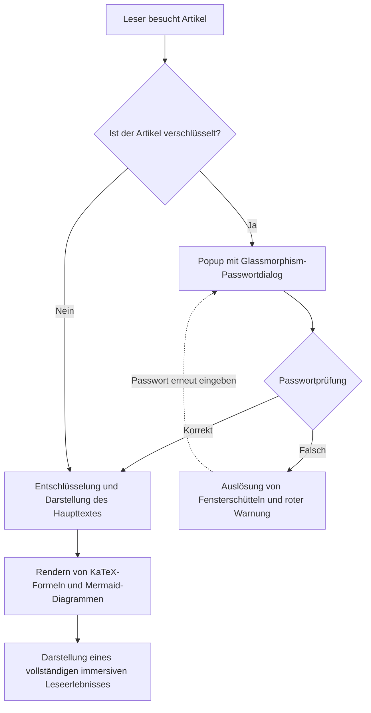
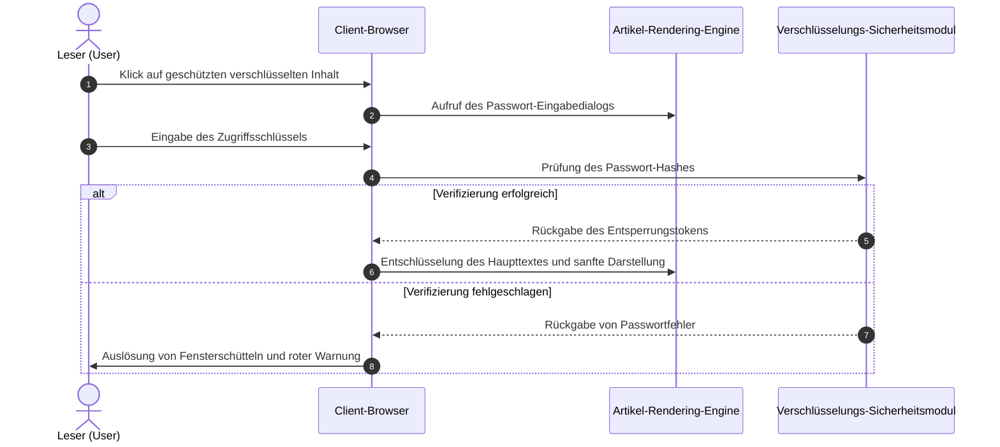

<div class="chat-message chat-left">
    <span class="chat-avatar footer_mini_logo__media">
      <video autoplay muted loop playsinline preload="metadata" poster="/media/shijianus/avatar.jpg" aria-hidden="true">
        <source src="/media/shijianus/avatar-dynamic.mp4" type="video/mp4" />
      </video>
      
    </span>
    <div class="chat-body">
      <div class="chat-author">Entwickler <a href="https://github.com/LeonBoven" target="_blank" rel="noopener noreferrer">Léon Boven</a> · 10:17</div>
      <div class="chat-bubble">
        Fantastisch! Können wir also Architektur-Sequenzdiagramme und interaktive Einheitenkonverter direkt in Markdown schreiben, und diese sind sofort einsatzbereit, oder?
      </div>
    </div>
  </div>

  <div class="chat-message chat-right">
    
    <div class="chat-body">
      <div class="chat-author">Architekt <a href="https://github.com/shijianus" target="_blank" rel="noopener noreferrer">shijianus</a> · 10:18</div>
      <div class="chat-bubble">
        Genau! Nicht nur die Vergrößerung per Doppelklick und der Export in hochauflösendes SVG sind vollständig integriert, auch der Einheitenkonverter ist mit <strong>Echtzeit-Synchronisation der Online-Wechselkurse</strong> und <strong>Dropdown-Umschaltung der Basiseinheiten</strong> ausgestattet. Zudem wird eine vollständige und symmetrische Darstellung fester Masseneinheiten garantiert, und alle Maßeinheiten wurden rigoros getestet! 🚀
      </div>
    </div>
  </div>

  <div class="chat-message chat-left">
    <span class="chat-avatar footer_mini_logo__media">
      <video autoplay muted loop playsinline preload="metadata" poster="/media/shijianus/avatar.jpg" aria-hidden="true">
        <source src="/media/shijianus/avatar-dynamic.mp4" type="video/mp4" />
      </video>
      
    </span>
    <div class="chat-body">
      <div class="chat-author">Entwickler <a href="https://github.com/LeonBoven" target="_blank" rel="noopener noreferrer">Léon Boven</a> · 10:19</div>
      <div class="chat-bubble">
        Verstanden! Das Bedienungserlebnis und die Schreibanimation, die sich an der Nachrichtenlänge orientiert, wirken sehr natürlich. Ich werde das technische Dokumentations-Repository unseres Teams sofort darauf aktualisieren! 🎉
      </div>
    </div>
  </div>

  <div class="chat-message chat-right">
    
    <div class="chat-body">
      <div class="chat-author">Architekt <a href="https://github.com/shijianus" target="_blank" rel="noopener noreferrer">shijianus</a> · 10:20</div>
      <div class="chat-bubble">
        Probieren Sie es gerne aus! Für zukünftige Fragen zu Format-Erweiterungen oder Anpassungswünschen stehen wir Ihnen jederzeit im Diskussionsbereich oder auf GitHub zur Verfügung. ✨
      </div>
    </div>
  </div>
</div>

---

## 5. Spezielle Dropdown-Formate und dynamische Interaktionskomponenten (Dropdown-Auswähler & Interaktive Formate)

Für die von Nutzern explizit angeforderten **speziellen Dropdown-Formate** bieten wir auf der Haupttextebene reaktive Dropdown-Auswählerkomponenten an, die vollständig clientseitig und in Echtzeit reagieren:

### 1. Dropdown-Umschalter für mehrere Frameworks und Codeversionen (Interactive Dropdown Switcher)

Leser können im Dropdown-Menü frei ein technisches Framework auswählen, und der Inhaltsbereich wechselt die entsprechenden Inhalte und den Code in Echtzeit ohne Neuladen:

<!-- context from previous chunk -->
ats）

针对用户明确要求的**特殊下拉框格式**，我们在文章正文层提供了纯客户端即时响应的下拉选择器组件：

### 1. 多框架与多代码版本下拉切换器（Interactive Dropdown Switcher）

读者可以在下拉框中自由选择技术框架，正文面板将实时无刷新切换对应的内容与代码：
<!-- end context -->

<div class="article-dropdown-switcher">
  <div class="article-dropdown-switcher__header">
    <div class="article-dropdown-switcher__title">
      <svg width="20" height="20" viewBox="0 0 24 24" fill="none" stroke="currentColor" stroke-width="2"><rect x="3" y="3" width="18" height="18" rx="2"/><path d="M9 3v18"/><path d="m14 9 3 3-3 3"/></svg>
      <span>请选择要查看的前端框架实现代码：</span>
    </div>
    <select class="article-select dropdown-switcher__select">
      <option value="react-tab">⚛️ React 19 (Hooks & TSX)</option>
      <option value="vue-tab">🟢 Vue 3.5 (Composition API)</option>
      <option value="astro-tab">🚀 Astro 6 (Island Component)</option>
      <option value="svelte-tab">🟠 Svelte 5 (Runes)</option>
    </select>
  </div>
  <div class="article-dropdown-switcher__body">
    <div class="article-dropdown-panel is-active" data-panel="react-tab">
      <div class="article-dropdown-panel__title">⚛️ React 19 组件实现方式：</div>
      <pre class="no-code-enhance"><code class="language-tsx">import { useState } from 'react';
export function Counter() {
  const [count, setCount] = useState(0);
  return (
    &lt;button onClick={() =&gt; setCount((c) =&gt; c + 1)} className="btn-primary"&gt;
      React 点击计数：&#123;count&#125;
    &lt;/button&gt;
  );
}</code></pre>
    </div>
    <div class="article-dropdown-panel" data-panel="vue-tab">
      <div class="article-dropdown-panel__title">🟢 Vue 3.5 单文件组件实现方式：</div>
      <pre class="no-code-enhance"><code class="language-html">&lt;script setup lang="ts"&gt;
import { ref } from 'vue';
const count = ref(0);
&lt;/script&gt;
&lt;template&gt;
  &lt;button @click="count++" class="btn-primary"&gt;
    Vue 点击计数：&#123;&#123; count &#125;&#125;
  &lt;/button&gt;
&lt;/template&gt;</code></pre>
    </div>
    <div class="article-dropdown-panel" data-panel="astro-tab">
      <div class="article-dropdown-panel__title">🚀 Astro 6 零 JS 静态组件实现方式：</div>
      <pre class="no-code-enhance"><code class="language-astro">---
const { title = "Astro 极速群岛" } = Astro.props;
---
&lt;div class="astro-island"&gt;
  &lt;h3&gt;&#123;title&#125;&lt;/h3&gt;
  &lt;p&gt;默认交付 0KB JavaScript，按需注水交互！&lt;/p&gt;
&lt;/div&gt;</code></pre>
    </div>
    <div class="article-dropdown-panel" data-panel="svelte-tab">
      <div class="article-dropdown-panel__title">🟠 Svelte 5 Runes 实现方式：</div>
      <pre class="no-code-enhance"><code class="language-svelte">&lt;script lang="ts"&gt;
  let count = $state(0);
&lt;/script&gt;
&lt;button onclick={() =&gt; count++} class="btn-primary"&gt;
  Svelte 点击计数：&#123;count&#125;
&lt;/button&gt;</code></pre>
    </div>
  </div>
</div>

---

### 2. 交互式多品类通用单位换算器（Universal Interactive Unit Converter · 基准下拉切换与实时汇率）

支持用户在输入框中自由输入**任意基数数值**（默认值为 `1`，支持增减步进器与一键重置），并在不同品类（质量重量、国际汇率、数据存储、网络带宽、长度尺寸）之间即时无缝换算：
* **动态可切换换算基准（Base Unit Dropdown）**：输入框右侧的基准单位支持下拉自由选择（例如在质量中可选择 `kg`、`g`、`lb`、`斤`、`oz`、`t` 等；在汇率中可选择 `USD`、`HKD`、`CNY`、`EUR`、`JPY`、`GBP` 等）。选择任一基准单位后，目标换算网格将**智能自动排除当前基准单位（彻底杜绝 1kg=1kg 冗余卡片）**，并以当前基准为分母即时重算所有目标单位；
* **真实汇率波动联网接入（Live Forex API）**：切换至「💱 国际汇率」时，系统将自动异步请求服务端 `/api/exchange-rate` 并回退公共实时汇率接口，获取各大主流货币的最新实时牌价（右上角显示 `🟢 实时联网汇率已同步`）；在未联网或断网离线时自动无缝回退至内置基准比例（显示 `⚪ 离线基准汇率`），确保“实时”真正实时且离线体验坚如磐石；
* **通用 API 便捷调用**：系统同时在全局暴露了 `window.shijianusAPI.fetchExchangeRates(base)` 辅助函数，方便文档内的任何自定义脚本即时调用实时牌价数据；
* **快捷一键复制与等式推算**：每个换算卡片均提供一键复制按钮与高亮反馈，底部同步展示动态等式链推算摘要。

<div class="interactive-unit-converter" data-default="1" data-title="🔄 交互式通用单位换算器（支持基准单位切换与实时汇率）"></div>

## Sechs. Akkordeon-Aufklappmechanismen, Tabs und mehrspaltiges Layout (Collapsibles, Tabs & Columns)

### 1. Exklusive Akkordeon-Gruppe (Exclusive Accordion Group · Beim Ausklappen eines Elements werden die anderen automatisch geschlossen)

Konfiguration `data-single="true"`. Wenn ein Element ausgeklappt wird, werden die anderen ausgeklappten Elemente in derselben Gruppe automatisch zusammengeklappt, um die Seite aufgeräumt und fokussiert zu halten:

<div class="article-accordion-group" data-single="true">
  <details class="article-accordion" open>
    <summary>
      <span>🔒 1. Sicherheitsvorteile statischer Websites</span>
      <svg class="accordion-chevron" viewBox="0 0 24 24" fill="none" stroke="currentColor" stroke-width="2"><polyline points="9 18 15 12 9 6"/></svg>
    </summary>
    <div class="accordion-content">
      <p>Statische Websites verfügen nicht über traditionelle PHP/Node.js-Dynamik-Executoren und öffentlich zugängliche SQL-Datenbanken, wodurch sie auf physischer Ebene gegen SQL-Injection und Remote Code Execution (RCE) auf dem Server immun sind.</p>
    </div>
  </details>

  <details class="article-accordion">
    <summary>
      <span>⚡ 2. Globale CDN-Edge-Acceleration</span>
      <svg class="accordion-chevron" viewBox="0 0 24 24" fill="none" stroke="currentColor" stroke-width="2"><polyline points="9 18 15 12 9 6"/></svg>
    </summary>
    <div class="accordion-content">
      <p>Durch die Bereitstellung der kompilierten Artefakte auf Cloudflare Pages oder GitHub Pages können alle statischen Ressourcen auf über 300 Edge-Knoten weltweit gecacht werden; die Time-to-First-Byte (TTFB) liegt in der Regel unter 20 ms.</p>
    </div>
  </details>

  <details class="article-accordion">
    <summary>
      <span>💰 3. Geringe Cloud-Hosting-Kosten</span>
      <svg class="accordion-chevron" viewBox="0 0 24 24" fill="none" stroke="currentColor" stroke-width="2"><polyline points="9 18 15 12 9 6"/></svg>
    </summary>
    <div class="accordion-content">
      <p>Statische Websites benötigen keine teuren VPS-Cloudserver, die rund um die Uhr laufen. In Kombination mit der kostenlosen Cloudflare-D1-Datenbank und einem Serverless-Kommentarsystem sind die laufenden Betriebskosten nahezu null.</p>
    </div>
  </details>
</div>

---

### 2. Nicht-exklusive unabhängige Akkordeon-Gruppe (Multi-Expand / Non-Exclusive Accordion Group · Mehrere Elemente können gleichzeitig ausgeklappt werden)

Konfiguration `data-single="false"` (oder Standard-Multi-Expand-Modus). Leser können mehrere oder alle Aufklapp-Elemente frei ausklappen, um sie horizontal zu vergleichen und vertiefend zu lesen, ohne dass bereits geöffnete Inhalte beim Öffnen neuer Elemente geschlossen werden:

<div class="article-accordion-group" data-single="false">
  <details class="article-accordion" open>
    <summary>
      <span>🛠️ Architekturmodul A: Markdown-AST-Syntax-Kompiler-Pipeline</span>
      <svg class="accordion-chevron" viewBox="0 0 24 24" fill="none" stroke="currentColor" stroke-width="2"><polyline points="9 18 15 12 9 6"/></svg>
    </summary>
    <div class="accordion-content">
      <p>Auf Basis der Unified-, Remark-math- und Rehype-katex-Architektur wird der Markdown-Syntaxbaum in der Kompilierungs- und Build-Phase vollständig statisch in standardisierte semantische HTML-Knoten umgewandelt, wobei die Syntax-Hervorhebung und Formelgenerierung auf der Node.js-Seite abgeschlossen werden.</p>
    </div>
  </details>

<!-- context from previous chunk -->
ontent">
      <p>基于 Unified、Remark-math 与 Rehype-katex 架构，在编译构建阶段将 Markdown 语法树完全静态转化为标准语义 HTML 节点，并在 Node.js 端完成高亮和公式生成。</p>
    </div>
  </details>
<!-- end context -->

<details class="article-accordion" open>
    <summary>
      <span>🎨 架构模块 B：EpoCanvas 动态视觉引擎与响应式系统</span>
      <svg class="accordion-chevron" viewBox="0 0 24 24" fill="none" stroke="currentColor" stroke-width="2"><polyline points="9 18 15 12 9 6"/></svg>
    </summary>
    <div class="accordion-content">
      <p>提供极光背景（Aurora）、星空视差（Starfield）、毛玻璃拟态（Glassmorphism）与多端响应式断点适配，无论在 4K 宽屏还是折叠屏手机上均呈现一致的美学体验。</p>
    </div>
  </details>

  <details class="article-accordion">
    <summary>
      <span>🛡️ 架构模块 C：WebCrypto SHA-256 分级安全隔离体系</span>
      <svg class="accordion-chevron" viewBox="0 0 24 24" fill="none" stroke="currentColor" stroke-width="2"><polyline points="9 18 15 12 9 6"/></svg>
    </summary>
    <div class="accordion-content">
      <p>内置 1 级会话持久解锁、2 级防窥动态多态遮罩（高斯模糊/马赛克/剧透遮罩）、3 级视口哨兵离开即锁以及外联 URL 分片加密方案，彻底杜绝密码明文在 DOM 中的暴露。</p>
    </div>
  </details>
</div>

---

### 3. 多标签选项卡（Interactive Tabs）

<div class="article-tabs">
  <div class="article-tabs__nav">
    <button class="article-tabs__button is-active" type="button">pnpm</button>
    <button class="article-tabs__button" type="button">npm</button>
    <button class="article-tabs__button" type="button">yarn</button>
    <button class="article-tabs__button" type="button">bun</button>
  </div>
  <div class="article-tabs__panels">
    <div class="article-tabs__panel is-active">
      <pre class="no-code-enhance"><code class="language-bash">pnpm add @astrojs/mdx remark-math rehype-katex katex mermaid</code></pre>
    </div>
    <div class="article-tabs__panel">
      <pre class="no-code-enhance"><code class="language-bash">npm install @astrojs/mdx remark-math rehype-katex katex mermaid</code></pre>
    </div>
    <div class="article-tabs__panel">
      <pre class="no-code-enhance"><code class="language-bash">yarn add @astrojs/mdx remark-math rehype-katex katex mermaid</code></pre>
    </div>
    <div class="article-tabs__panel">
      <pre class="no-code-enhance"><code class="language-bash">bun add @astrojs/mdx remark-math rehype-katex katex mermaid</code></pre>
    </div>
  </div>
</div>

---

### 4. 多栏网格布局系统（Multi-Column Grid）

#### 3 列等宽卡片网格

<div class="article-grid article-grid-3">
  <div class="article-col-card">
    <h4>🎨 视觉体系</h4>
    <p>深度吸收 EpoCanvas 现代极客设计美学，支持明暗高对比、毛玻璃背景与平滑色彩过渡。</p>
  </div>
  <div class="article-col-card">
    <h4>⚡ 性能工程</h4>
    <p>Astro 6 静态群岛架构，构建期 HTML 预渲染，纯静态极致 SEO 优化。</p>
  </div>
  <div class="article-col-card">
    <h4>🛠️ 扩展生态</h4>
    <p>全面支持 KaTeX 公式、Mermaid 图表、加密弹窗与 9 种 Post Formats。</p>
  </div>
</div>

#### 1:2 不均等侧边栏网格

<div class="article-grid article-columns-1-2">
  <div class="article-col-card">
    <h4>📌 架构定位</h4>
    <p>专注于极客与工程师的现代化技术写作载体。</p>
  </div>
  <div class="article-col-card">
    <h4>🚀 交付保障</h4>
    <p>内建完善的自动化烟测与静态构建验证机制，无论公式、图表还是复杂卡片，都能确保在全设备上严丝合缝呈现。</p>
  </div>
</div>

---

## 七、13 种语义告示框（Admonitions / GitHub Alerts）

基于 GitHub Alert 与 EpoCanvas 设计规范，支持 13 种不同语义的彩色卡片，并支持使用 `[!TYPE]-` 语法实现默认折叠：

> [!NOTE]
> **常规备注（Note）**：这是一条标准的背景信息或上下文说明。

> [!TIP]
> **实用技巧（Tip）**：使用快捷键 <kbd>Ctrl</kbd> + <kbd>K</kbd> 可以快速唤起全局文章搜索面板！

> [!IMPORTANT]
> **重要事项（Important）**：在部署生产环境前，请确认 `BLOG_BUILD_TARGET=static` 环境变量已正确注入。

> [!WARNING]
> **风险警告（Warning）**：请勿在公开 Git 仓库中提交生产数据库密钥或云服务私钥。

> [!CAUTION]
> **危险警示（Caution）**：执行数据表重建操作具有破坏性，请先备份 D1 数据库！

> [!DANGER]
> **致命危险（Danger）**：直接删除生产数据库将导致全部评论与用户资产永久损毁。

> [!SUCCESS]
> **操作成功（Success）**：静态构建流程已成功完成，所有 47 个静态路由已就绪！


> [!QUESTION]
> **Fragestellung (Question)**: Wie kann eine millisekundenschnelle Volltextsuche rein auf der Client-Seite ohne Server-Abhängigkeiten implementiert werden?

> [!QUOTE]
> **Zitat (Quote)**: „Guter Code kann nicht nur von Maschinen ausgeführt werden, sondern vermittelt Ideen den Menschen so elegant wie ein Gedicht.“

> [!INFO]
> **Informationen (Info)**: Dieses Blog basiert auf Astro 6 und Tailwind 4 und wird vollständig als statische Seite exportiert.

> [!TODO]
> **Aufgaben (Todo)**: Geplant ist die Einführung eines WebAssembly-basierten Volltextsuchindex auf der Client-Seite in der nächsten Iteration.

> [!BUG]
> **Fehlerbericht (Bug)**: Das Layoutproblem mit dem horizontalen Abschneiden von Tabellen auf extrem schmalen Bildschirmen wurde in der alten Version behoben.

> [!EXAMPLE]
> **Beispiel (Example)**: Alle oben genannten Hinweisboxen passen sich automatisch an die hochkontrastreichen Farben der dunklen und hellen Modus an.

### Demo für ausklappbare Hinweisboxen

> [!TIP]- Klicken Sie zum Aufklappen: Referenzkonfiguration für blitzschnelles Caching mit Nginx in der Produktionsumgebung
> ```nginx
> location ~* \.(?:css|js|woff2?|svg|png|jpg|webp)$ {
>     expires 1y;
>     add_header Cache-Control "public, immutable";
>     access_log off;
> }
> ```

---

## 8. Akademische mathematische Formeln (KaTeX), Architekturdiagramme (Mermaid 11) und dynamische Mindmaps (Markmap)

In präsentierenden und exemplarischen technischen Dokumentationen steht das Konzept der **「tatsächlichen Renderergebnisse + entsprechender Quellcode-Vergleich」** (zwei Registerkarten/Tabs) im Mittelpunkt. Dies ermöglicht es Lesern nicht nur, die endgültigen visuellen und interaktiven Eigenschaften intuitiv zu erleben, sondern erleichtert Entwicklern auch das Referenzieren, Kopieren und Übertragen in reale Projekte mit nur einem Klick.

---

### 1. LaTeX-Mathematikformeln (KaTeX Math · Inline und blockbasierte mehrzeilige Herleitungen)

#### Inline-Formeln (Inline Formula)

<div class="article-tabs">
<div class="article-tabs__nav">
<button class="article-tabs__button is-active" type="button">🌟 Renderergebnis</button>
<button class="article-tabs__button" type="button">💻 LaTeX-Quellcode</button>
</div>
<div class="article-tabs__panels">
<div class="article-tabs__panel is-active">

Die Masse-Energie-Äquivalenz $E = mc^2$, die Eulersche Identität $e^{i\pi} + 1 = 0$, das Gauß-Integral $\int_{-\infty}^{\infty} e^{-x^2} dx = \sqrt{\pi}$.

</div>
<div class="article-tabs__panel">

```latex
Die Masse-Energie-Äquivalenz $E = mc^2$, die Eulersche Identität $e^{i\pi} + 1 = 0$, das Gauß-Integral $\int_{-\infty}^{\infty} e^{-x^2} dx = \sqrt{\pi}$.
```

</div>
</div>
</div>

#### Blockbasierte mehrzeilige Herleitungsformel 1: Laplace-Transformation eines dynamischen Systems zweiter Ordnung (Block Math · Single Equation)

<div class="article-tabs">
<div class="article-tabs__nav">
<button class="article-tabs__button is-active" type="button">🌟 Renderergebnis</button>
<button class="article-tabs__button" type="button">💻 LaTeX-Quellcode</button>
</div>
<div class="article-tabs__panels">
<div class="article-tabs__panel is-active">

$$
\mathcal{L}\{\ddot{x}(t) + 2\zeta\omega_n\dot{x}(t) + \omega_n^2 x(t)\} = X(s)(s^2 + 2\zeta\omega_n s + \omega_n^2)
$$

</div>
<div class="article-tabs__panel">

```latex
$$
\mathcal{L}\{\ddot{x}(t) + 2\zeta\omega_n\dot{x}(t) + \omega_n^2 x(t)\} = X(s)(s^2 + 2\zeta\omega_n s + \omega_n^2)
$$
```

</div>
</div>
</div>

#### Blockbasierte mehrzeilige Herleitungsformel 2: Klassische Maxwell-Gleichungen der Elektrodynamik (Block Math · Multi-line Aligned)

<div class="article-tabs">
<div class="article-tabs__nav">
<button class="article-tabs__button is-active" type="button">🌟 Renderergebnis</button>
<button class="article-tabs__button" type="button">💻 LaTeX-Quellcode</button>
</div>
<div class="article-tabs__panels">
<div class="article-tabs__panel is-active">

$$
\begin{aligned}
\nabla \cdot \mathbf{E} &= \frac{\rho}{\varepsilon_0} \\
\nabla \cdot \mathbf{B} &= 0 \\
\nabla \times \mathbf{E} &= -\frac{\partial \mathbf{B}}{\partial t} \\
\nabla \times \mathbf{B} &= \mu_0 \mathbf{J} + \mu_0 \varepsilon_0 \frac{\partial \mathbf{E}}{\partial t}
\end{aligned}
$$

</div>
<div class="article-tabs__panel">

```latex
$$
\begin{aligned}
\nabla \cdot \mathbf{E} &= \frac{\rho}{\varepsilon_0} \\
\nabla \cdot \mathbf{B} &= 0 \\
\nabla \times \mathbf{E} &= -\frac{\partial \mathbf{B}}{\partial t} \\
\nabla \times \mathbf{B} &= \mu_0 \mathbf{J} + \mu_0 \varepsilon_0 \frac{\partial \mathbf{E}}{\partial

<div class="article-tabs">
<div class="article-tabs__nav">
<button class="article-tabs__button is-active" type="button">🌟 Darstellung des gerenderten Ergebnisses</button>
<button class="article-tabs__button" type="button">💻 Mermaid-Quellcode</button>
</div>
<div class="article-tabs__panels">
<div class="article-tabs__panel is-active">



</div>
<div class="article-tabs__panel">

````markdown

````

</div>
</div>
</div>

#### ② Client-seitige Sicherheitsauthentifizierung und Entschlüsselungs-Sequenzdiagramm (Sequence Diagram)

<div class="article-tabs">
<div class="article-tabs__nav">
<button class="article-tabs__button is-active" type="button">🌟 Darstellung des gerenderten Ergebnisses</button>
<button class="article-tabs__button" type="button">💻 Mermaid-Quellcode</button>
</div>
<div class="article-tabs__panels">
<div class="article-tabs__panel is-active">



</div>
<div class="article-tabs__panel">

````markdown

````

</div>
</div>
</div>

---

### 3. Dynamische interaktive Mindmaps (Markmap / Mindmap · Mehrfachzweig-Diffusion)

In umfangreichen technischen Spezifikationen und der Systemarchitektur-Überprüfung ist es mit herkömmlichen statischen Listen schwierig, komplexe Wissensstrukturen intuitiv darzustellen. Dieses Theme implementiert neu die **Markmap dynamische interaktive Mindmap-Engine** und ermöglicht im Hauptbereich des Artikels (`.post.post-page-shell`) eine vollständige native Analyse und interaktive Erweiterung:

> [!TIP]
> **Kernregeln für die Mehrfachzweig-Diffusion**:
> 1. **Standardmäßiger Schutzraum für einen Block**: Im Standardzustand zeigt die Mindmap nur **1 Kern-Wurzelknoten** (Level 1) an, rechts daneben befindet sich ein einklappbarer Punkt-Indikator;
> 2. **Klicken zum Aufklappen von Mehrfachzweigen**: Durch Klicken auf den Wurzelknoten oder den Punkt-Indikator eines beliebigen Unterknotens werden die Unterzweige **sanft nach außen aufgefächert**;
> 3. **Vollständige Steuerung über die Werkzeugleiste**: Unterstützt **Vergrößern / Verkleinern / Zentrieren & Auto-Fit / Alle aufklappen / Alle einklappen / Vollbild-Immersives Lesen / Quellcode kopieren**;
> 4. **Canvas-Ziehen und Zoomen**: Halten Sie die linke Maustaste gedrückt, um das Canvas frei zu verschieben, und verwenden Sie das Mausrad, um die Ansicht zu zoomen.

#### Darstellung einer lebendigen Mindmap: SSG und Theme-Inhaltsformat-Ökosystem Panorama

<div class="article-tabs">
<div class="article-tabs__nav">
<button class="article-tabs__button is-active" type="button">🌟 Darstellung der interaktiven Mindmap</button>
<button class="article-tabs__button" type="button">💻 Mindmap-Struktur-Quellcode</button>
</div>
<div class="article-tabs__panels">
<div class="article-tabs__panel is-active">

```mindmap
# Architektur von Static Site Generators und dem Ökosystem für alle Inhaltsformate
## 1. Kernpipeline der statischen Kompilierung
### AST-Syntax-Umwandlungspipeline
#### Markdown / MDX Semantik-Analyse-Pipeline
##### Unified / Remark Syntax-Erweiterungen
- Umwandlung von GFM-Tabellen und Durchstreich-Syntax
- Automatische Generierung von Heading-Ankern und IDs
##### Markmap Interaktive Mehrfachzweig-Mindmap-Erweiterung
- Rekursive AST-Baumkonstruktion (Transformer.transform)
- D3 hierarchisches elastisches Layout (Flextree Algorithmus)
- Interaktiver Faltzustandsautomat (payload.fold)
- Dynamische Farbpalette für Zweigfärbung (d3.scaleOrdinal)
##### Rehype Katex Mathematikformel-Erweiterung
- Analyse von Inline-Formeln und eigenständigen Blockformeln
- Unterstützung von Makrodefinitionen und Fehler-Toleranz-Fallback
#### Code-Highlighting und statische Shader
##### Shiki Dual-Theme-Kompiler
- Analyse von VSCode TextMate-Syntaxregeln
- Vorgerenderte Dual-Theme-Modi (Hell/Dunkel) ohne Hydration
### Kompilierer und Ressourcen-Bundling
#### Vite 6 Ultra-Schnelle Hot Reload (HMR)
##### ESM Native Modul-Loading
- Millisekunden-schnelle Kompilierung und Hot-Updates bei Bedarf
#### Rollup Statische Generierungspipeline
##### Statische Bundling-Optimierung
- Intelligente Code-Splitting
- Tree-Shaking zur Eliminierung von Redundanz
## 2. Dynamische Interaktion und Insel-System
### Hybrid-Komponenten-Inseln Islands
#### Client-seitige Komponenten-Insel-Montage
##### React 19 Client Components
- Unabhängige Zustandsisolierung und Kontextkommunikation
- Beibehaltung des Sitzungszustands (SessionStorage / Crypto)
##### Astro Server-Side Islands
- Null Runtime Client JS (Zero-JS by Default)
- Aktivierung interaktiver Inseln bei Bedarf (client:visible)
### Modernes visuelles und Animationssystem
#### Dynamischer Hintergrund und Rendering-Engine
##### Aurora Polarlicht / Starfield Sternenhimmel
- WebGL / Canvas 2D Hardware-Beschleunigung
- Energiesparmodus und automatische Pause bei Verlassen des Viewports
##### Glassmorphism Karten-Standard
- Dynamische Gaußsche Unschärfe und mehrfache Umgebungs-Schatten
- Responsives Layout für alle Endgeräte (PC / Pad / Mobile)
## 3. Format-Panorama und Sonderfunktionen
### Vergleich der erweiterten Dokumentationsstandards
#### AsciiDoc (.adoc) Native Äquivalent-Adaption
#### Emacs Org-Mode (.org) Aufgabenlisten-Mapping
#### reStructuredText (.rst) Direktiven-Umwandlung
### Reichhaltige interaktive Komponenten-Sammlung
#### Interaktiver Dropdown-Umschalter (Dropdown Switcher)
#### Exklusive Akkordeon-Faltkarten (Accordion Groups)
#### Dynamischer Vinyl-Schallplatten-Audioplayer (Vinyl Audio)
### Sicherheits- und Datenschutz-Stufenverschlüsselung
#### WebCrypto SHA-256 Hash-Prüfung (keine Klartext-Exposition)
#### Stufe 1: Sitzungspersistente Entsperrung (Session Persistent)
#### Stufe 2: Peek-Proof-Maske-Umschaltung (Gaußsche Unschärfe / Mosaik / Spoiler-Maske)
#### Stufe 3: Viewport Peek-Proof, Sperre bei Verlassen (IntersectionObserver)

#### Markdown-Schreibstandards und Syntaxreferenz

Dieser Blog integriert die **Mindmap-Render-Engine**, die auf rekursiver AST-Analyse und dem flexiblen D3 Flextree-Baum-Layout basiert, **unterstützt von Haus aus unbegrenzte Ebenen (Level 1 bis Level N)** und hat keine Begrenzung der Tiefe. Der Autor kann beim Schreiben von Artikeln je nach Komplexität des Wissensbaums die folgenden Schreibstandards wählen:

##### 1. Mischstufen-Syntax (empfohlen 1~6 Ebenen Hauptstruktur + unbegrenzte tiefe Listenentwicklung)

Standard-Markdown-Überschriften unterstützen eine Tiefe von 6 Ebenen (`#` bis `######`). Unter Ebene 6 kann man weiter mit ungeordneter Listen (`-`, `*`) und Einrückungen durch Leerzeichen unbegrenzt nach unten erweitern (Level 7, Level 8, Level 9 ...):

````markdown
```mindmap
# Level 1 核心主题 (H1)
## Level 2 领域分支 (H2)
### Level 3 子系统 (H3)
#### Level 4 技术模块 (H4)
##### Level 5 组件单元 (H5)
###### Level 6 算法规范 (H6)
- Level 7 细分执行细节 (List item)
  - Level 8 子项参数 (Indent +2 spaces)
    - Level 9 底层硬件原语 (Indent +4 spaces)
```
````

##### 2. Nur-Listen-Unendliche-Einrückungssyntax (empfohlen ab Ebene 6 oder sehr tiefen Wissensbäumen)

Wenn keine Markdown-Überschriftsemantik benötigt wird oder der Wissensnetzwerk-Ebenen sehr tief sind (z. B. Klassifikationsbäume, Konzeptderivation, AST-Strukturen), kann man direkt ungeordnete Listen `-` verwenden und mit 2 oder 4 Leerzeichen einrücken, um **theoretisch unbegrenzte Tiefe** mehrdimensionaler Zweige auszudrücken:

````markdown
```mindmap
- 🌐 根主题：计算机科学知识图谱 (Level 1)
  - 🖥️ 软件系统工程 (Level 2)
    - 📦 操作系统与内核 (Level 3)
      - ⚙️ 进程与线程调度 (Level 4)
        - 🔄 并发同步原语 (Level 5)
          - 🔒 互斥锁与信号量 (Level 6)
            - ⚡ 硬件级 CAS 原子指令 (Level 7)
              - ⏱️ Cache Coherency MESI 协议 (Level 8)
                - 🔬 内存屏障与流水线指令重排 (Level 9)
```
````

##### 3. Inline-Hochrangige-Parametersteuerung (optional JSON-Header)

Man kann in der ersten Zeile eines Codeblocks ein einzelnes JSON-Objekt verwenden, um den Anfangszustand und die Aussehen des Mindmaps anzupassen:

````markdown
```mindmap
{"initialExpandLevel": 2, "height": "560px", "title": "全栈工程架构全景"}
# 核心主题
## 一级分支 A
### 二级分支 A1
- 细分知识点 1
```
````

* **`initialExpandLevel`**: Anfangserweiterungsebene. `1` bedeutet ein einzelner zusammengeklappter/aufbewahrter Wurzelknoten; `2` bedeutet die Erweiterung bis zur Hauptstruktur; `6` bedeutet vollständige Erweiterung.
* **`height`**: Gibt die Leinwandhöhe an, z. B. `"480px"`, `"600px"` (Standard `...`).
* **`title`**: Benutzerdefinierter Titel des Mindmaps ...

##### 4. Interaktive Eigenschaften und Viewport-Steuerungsanweisungen

* **Klick zum sanften Drill-down**: Durch Klicken auf einen Knoten mit Atemlichtkreis oder Text kann man die darunter liegenden mehrdimensionalen Zweige sanft erweitern/zusammenklappen;
* **Ein-Klick-Erweitern/Zusammenklappen**: Die Symbolleiste bietet `⊞` (Ein-Klick-Erweiterung aller Zweige) und `⊟` (Ein-Klick-Wiederherstellung des ursprünglichen Einzelknotens);
* **Adaptive Zentrierung (Fit View)**: Durch Klicken auf `🎯` wird automatisch die optimale Ansicht basierend auf allen aktuell erweiterten Knoten berechnet;
* **Vollbild-Immersionsmodus**: Durch Klicken auf `⛶` wird die Leinwand im Vollbild geöffnet (drücke `Esc`, um jederzeit zu beenden), um einen unbegrenzten horizontalen Erkundungsraum zu erhalten;
* **Metadaten in Echtzeit**: Die Kopfzeile zeigt in Echtzeit die Gesamtzahl der Knoten und die maximale Tiefe des Mindmaps an (z. B. `53 Knoten · 6 Ebenen Struktur`).

---

## Neun, Sicherheit, Datenschutz, gestaffelte Verschlüsselung (Level 1/2/3) und externe segmentierte Entschlüsselungsfunktionen

Um die Klartext-Exposition von Passwörtern in DOM-Attributen (wie `data-password`, die durch die Element-Inspektion leicht ausgelesen werden kann) vollständig zu verhindern, wurde das Inhalts-System dieses Blogs umfassend auf **WebCrypto SHA-256-Hash-Prüfungen (`data-hash`)** umgestellt, und ein dreistufiges System für lokale Verschlüsselung innerhalb des Dokuments und segmentierte Entschlüsselung externer Links etabliert:
* **Standard-Sicherheits-Reset-Regel (Zero Persistence on Reload)**: Standardmäßig werden alle verschlüsselten Inhalte (Stufe 1, 2, 3 sowie externe Entschlüsselungs-Gates) nach einem **Seiten-Refresh (F5 / Neuladen) konsequent automatisch in den gesperrten Zustand zurückgesetzt**, um Sicherheitsrisiken durch freigelegte Inhalte nach einem Seiten-Refresh vollständig zu vermeiden;
* **Offene Persistenz-Parameter (`data-persist`)**: Um die offenen Anforderungen spezieller Dokument-Szenarien zu erfüllen, kann die Standard-Reset-Strategie durch Parameterkonfiguration überschrieben werden:
  * `data-persist="session"` (oder `data-persist="true"`): Behält den entsperrten Zustand über Refreshes hinweg innerhalb der aktuellen Tab-Sitzung bei;
  * `data-persist="local"`: Merkt sich den entsperrten Zustand dauerhaft im lokalen Browser-Speicher;
  * Standardmäßig nicht konfiguriert: Reine Speicherlebensdauer, **Seiten-Refresh führt zu sofortigem, sicherem Reset und Sperren**.

---

### 1. Stufe-1-Verschlüsselung: Basisverschlüsselung für eine Seite (Level 1 · Default Refresh Reset)

Durch einmalige Eingabe der Zugangsdaten kann der Lesetext entsperrt werden; standardmäßig wird die Seite nach einem Refresh sofort automatisch wieder gesperrt. Wenn der entsperrte Zustand über Refreshes hinweg beibehalten werden soll, kann im Tag `data-persist="session"` hinzugefügt werden:

<div class="article-encrypted-box" data-level="1" data-hash="d7fb6c64b9aa44cc0c3b427edaa623369dee1a9778329801f68fdaa34b09d351" data-hint="💡 Stufe-1-Verschlüsselungshinweis: Demo-Schlüssel bitte eingeben: shijianus2026 (Hash-Prüfung · Automatischer Reset bei Refresh)">
  <div class="encrypted-box__lock">
    <div class="encrypted-box__level-tag"><span class="badge badge-success">🛡️ Stufe-1-Verschlüsselung · Automatischer Reset bei Refresh</span> <span class="badge badge-cyan">SHA-256-Schutz</span></div>
    <div class="encrypted-box__icon">🔒</div>
    <div class="encrypted-box__title">Stufe-1-Schutz: Private Entwickler-Konfiguration und Quellcode-Assets</div>
    <div class="encrypted-box__desc">Dieser Bereich ist durch die Stufe-1-Sicherheitsstrategie geschützt, das Passwort wird per WebCrypto-Hash-Prüfung validiert, es gibt keine Klartext-Exposition; nach einem Seiten-Refresh wird automatisch wieder gesperrt.</div>
    <button class="encrypted-box__btn" type="button">🔑 Schlüssel validieren und Inhalt entsperren</button>
  </div>
  <div class="encrypted-box__content">
    <div class="admonition admonition-success">
      <div class="admonition-title">
        <svg viewBox="0 0 24 24" fill="none" stroke="currentColor" stroke-width="2"><path d="M22 11.08V12a10 10 0 1 1-5.93-9.14"/><polyline points="22 4 12 14.01 9 11.01"/></svg>
        <span>🎉 Stufe-1-Verifizierung bestanden! Die aktuelle Seite ist entsperrt (Refresh führt zu automatischem, sicherem Re-Sperren)</span>
      </div>
      <div class="admonition-content">
        <p><strong>Kern-Entwicklungs-Umgebungsparameter entsperrt:</strong></p>
        <ul>
          <li><code>DEPLOY_ENDPOINT</code>: <code>https://api.shijian.us/v2/deploy/core</code></li>
          <li><code>AUTH_SCOPE</code>: <code>read:articles, write:releases</code></li>
        </ul>
      </div>
    </div>
  </div>
</div>

---

### 2. Stufe-2-Verschlüsselung: Anti-Spy-Maske nach Entschlüsselung (Level 2 · Mask Protection)

Nach erfolgreicher Verifizierung wird der Inhalt zwar entschlüsselt, geht aber **standardmäßig automatisch in einen Gauß-Blur-Anti-Spy-Masken-Zustand über** (Standardmäßig wird keine Umschaltleiste angezeigt, durch Maushover kann klar eingesehen werden), um effektiv gegen Nahdistanz-Screen-Spying zu schützen.
- **Toolbar aktivieren**: Konfigurieren Sie `data-allow-select="true"`, um die Masken-Umschaltleiste zu aktivieren. **Die Toolbar ist standardmäßig ebenfalls innerhalb der Maske geschützt** (beim Maushover werden Toolbar und Text gemeinsam klar angezeigt und sind klickbar umschaltbar); falls die Toolbar außerhalb der Maske bleiben soll, kann `data-toolbar-masked="false"` konfiguriert werden;
- **Maskenart festlegen**: Über `data-mask="blur|mosaic|spoiler|reveal"` kann der Maskenmodus erzwungen werden;
- **Anpassbare Einstellungsleiste**: Es wird unterstützt, in Markdown-Tags `data-mask-options="blur,mosaic"` zu übergeben, um wählbare Modi schnell anzupassen, oder direkt im Text die Struktur `<div class="encrypted-mask-toolbar">` zu schreiben; das System wird die angepasste Einstellungsleiste automatisch scannen und aktivieren;
- **Refresh-Reset-Garantie**: Standardmäßig wird nach einem Seiten-Refresh automatisch wieder gesperrt.

<!-- context from previous chunk -->
kdown 标签中传入 `data-mask-options="blur,mosaic"` 快速定制可选模式，或直接在正文中书写 `<div class="encrypted-mask-toolbar">` 结构，系统会自动扫描并激活自定义设置栏；
- **刷新重置保障**：默认刷新页面后自动重锁。
<!-- end context -->

<div class="article-encrypted-box" data-level="2" data-allow-select="true" data-hash="f31aafdcf42582306027026c37ee59c747be6e17258aa490c5bba32b93911c07" data-hint="💡 2级加密提示：演示密钥请输入 epocanvas2026">
  <div class="encrypted-box__lock">
    <div class="encrypted-box__level-tag"><span class="badge badge-warning">🛡️ 2级加密 · 遮罩防窥模式</span> <span class="badge badge-purple">动态多态遮罩</span></div>
    <div class="encrypted-box__icon">🛡️</div>
    <div class="encrypted-box__title">2级保护：机密商业数据与财务清单</div>
    <div class="encrypted-box__desc">解密后将默认启用高斯模糊保护，鼠标悬浮或点按方可看清，有效抵御近距离窥视；页面刷新后自动重锁。</div>
    <button class="encrypted-box__btn" type="button">🔑 验证凭证并开启防窥查看</button>
  </div>
  <div class="encrypted-box__content">
    <div class="admonition admonition-important">
      <div class="admonition-title">
        <svg viewBox="0 0 24 24" fill="none" stroke="currentColor" stroke-width="2"><path d="M12 2v20"/><path d="M17 5H9.5a3.5 3.5 0 0 0 0 7h5a3.5 3.5 0 0 1 0 7H6"/></svg>
        <span>📊 商业项目核心财务与合同参数</span>
      </div>
      <div class="admonition-content">
        <p>以下为 2026 年度 EpoCanvas 商业支持预算分配：</p>
        <ul>
          <li><strong>企业级私有化授权费</strong>：¥ 280,000 / 年（含高可用集群与 SLA 保障）</li>
          <li><strong>边缘 CDN 流量支出</strong>：¥ 36,500 / 月</li>
          <li><strong>专属技术顾问密钥</strong>：<code>sec_corp_epocanvas_key_2026</code></li>
        </ul>
      </div>
    </div>
  </div>
</div>

---

### 3. 3级加密：离开视口立即重新上锁（Level 3 · Viewport Auto-Lock）

超高安全级别！**不写入任何持久化存储**；一旦解密后的内容在滚动中**离开当前屏幕视口**，或者浏览器标签页切换到后台，系统将**瞬间自动重新上锁**，再次查看必须重新输入密码：

<div class="article-encrypted-box" data-level="3" data-hash="0f67fcb3bceddb88ef917fa5cf73affc3490db24a44adf25238a00f5ee81ee89" data-hint="💡 3级加密提示：演示密钥请输入 level3pass">
  <div class="encrypted-box__lock">
    <div class="encrypted-box__level-tag"><span class="badge badge-danger">🛡️ 3级加密 · 离开视口即锁</span> <span class="badge badge-orange">视口哨兵监控</span></div>
    <div class="encrypted-box__relock-wrap">
      <div class="encrypted-relock-notice">⚠️ 安全保护已触发：由于该内容先前离开了屏幕视口，系统已自动重新锁定！</div>
    </div>
    <div class="encrypted-box__icon">🚨</div>
    <div class="encrypted-box__title">3级绝密：核心基础设施私钥与灾备指令</div>
    <div class="encrypted-box__desc">最高防护标准。解密后一旦滚动移出屏幕，立即触发销毁重锁机制，绝不在屏幕外遗留任何明文。</div>
    <button class="encrypted-box__btn" type="button">🔐 验证高阶密钥（离开视口即锁）</button>
  </div>
  <div class="encrypted-box__content">
    <div class="encrypted-level3-status">
      <span class="security-pulse-dot"></span>
      <span>视口防窥哨兵实时监听中 · 移出视口立即销毁明文</span>
    </div>
    <div class="admonition admonition-danger">
      <div class="admonition-title">
        <svg viewBox="0 0 24 24" fill="none" stroke="currentColor" stroke-width="2"><path d="M8.5 14.5A2.5 2.5 0 0 0 11 12c0-1.38-.5-2-1-3-1.072-2.143-.224-4.054 2-6 .5 2.5 2 4.9 4 6.5 2 1.6 3 3.5 3 5.5a7 7 0 1 1-14 0c0-1.153.433-2.294 1-3a2.5 2.5 0 0 0 2.5 2.5z"/></svg>
        <span>⚡ 绝密集群应急接管凭据</span>
      </div>
      <div class="admonition-content">
        <p>请注意：此信息仅在当前视口内可见，向下或向上滚动使其离开屏幕将自动上锁：</p>
        <pre><code># 核心节点紧急自毁 / 切换指令
curl -X POST https://cluster.shijian.us/v1/node/failover \
  -H "X-Root-Token: 9f86d081884c7d659a2feaa0c55ad015a3bf4f1b2b0b822cd15d6c15b0f00a08"</code></pre>
      </div>
    </div>
  </div>
</div>

---

### 4. 外联分段加密（External Link Segment Decryption Gate）


### 5. Inline-Gaußunschärfe, Mosaik und Spoiler-Verdeckung

Neben der blockbasierten Verschlüsselung bietet der Fließtext auch eine Vielzahl von leichtgewichtigen Schutz- und dekorativen Maskierungen:

- **Text-Gaußunschärfe**：<span class="blur-text">Dies ist ein wichtiger Spoiler-Text, der durch Gaußunschärfe geschützt ist. Bewegen Sie die Maus darüber oder klicken Sie, um ihn zu enthüllen!</span>
- **Mosaik-Verdeckung**：<span class="mosaic-text">Vertrauliche Daten: SHA256-7f83b1657ff1fc53b92dc18148a1d65dfc2d4b1fa3d677284addd200126d9069</span>
- **Discord-Spoiler-Maskierung**：||Dies ist eine Spoiler-Maskierung, die in doppelte senkrechte Striche eingeschlossen ist. Klicken Sie, um sie zu enthüllen.||
- **Inline-Versteckschloss**：%%Dies ist inline versteckter Inhalt, der in Prozentzeichen eingeschlossen ist. Klicken Sie, um ihn zu erweitern.%%

#### Gaußunschärfe-Schutz für Bilder

<div class="blur-image-wrap">
  
  <div class="blur-image-badge"><span>👁️ Bewegen Sie die Maus darüber oder klicken Sie, um den Schleier zu lüften</span></div>
</div>

---

## 10. Zeitachse, Schrittfolgen, Definitionslisten und Datentabellen

### 1. Vertikale Zeitachse (Vertical Timeline)

<div class="article-timeline">
  <div class="timeline-node is-success">
    <div class="timeline-node__dot"></div>
    <div class="timeline-node__content">
      <div class="timeline-node__date">2026.04 · Grundlegende Refaktorierung</div>
      <div class="timeline-node__title">Abschluss der Migration des Astro 6-Static-Site-Kernels</div>
      <p class="timeline-node__desc">Aufbau einer neuen Content Collections-Architektur und einer Shiki-Code-Hervorhebungspipeline.</p>
    </div>
  </div>

  <div class="timeline-node is-warning">
    <div class="timeline-node__dot"></div>
    <div class="timeline-node__content">
      <div class="timeline-node__date">2026.08 · Funktionserweiterung</div>
      <div class="timeline-node__title">Vollständige Implementierung von WordPress Post Formats und Dropdown-Umschaltern</div>
      <p class="timeline-node__desc">Ergänzung von 13 Admonitions-Typen, KaTeX-Mathematikformeln und einem Passwort-Popup-Entschlüsselungssystem.</p>
    </div>
  </div>

  <div class="timeline-node">
    <div class="timeline-node__dot"></div>
    <div class="timeline-node__content">
      <div class="timeline-node__date">Zukunftsausblick · Ökosystem-Entwicklung</div>
      <div class="timeline-node__title">Veröffentlichung offener Themenstandards und plattformübergreifender Plugins</div>
      <p class="timeline-node__desc">Bereitstellung einer nahtlosen One-Click-Inhaltsmigrations-Toolchain von Hexo/WordPress zu Astro.</p>
    </div>
  </div>
</div>

---

### 2. Tutorial-Schrittfolge (Tutorial Steps)

</div>
      <p class="timeline-node__desc">Bietet ein One‑Click‑nahtloses Werkzeug zur Inhaltsmigration von Hexo/WordPress zu Astro.</p>
    </div>
  </div>
</div>

---

### 2. Tutorial-Schritte (Tutorial Steps)
<!-- end context -->

<div class="article-steps">
  <div class="article-steps__item">
    <div class="article-steps__num">1</div>
    <div class="article-steps__content">
      <h4>Schreiben von Markdown- oder MDX-Artikeln</h4>
      <p>Erstelle im Verzeichnis <code>src/content/posts/</code> eine <code>.md</code>-Datei und deklariere Front Matter Metadaten.</p>
    </div>
  </div>
  <div class="article-steps__item">
    <div class="article-steps__num">2</div>
    <div class="article-steps__content">
      <h4>Freie Kombination von Rich-Media-Karten und interaktiven Komponenten</h4>
      <p>Wähle nach Bedarf Dropdown‑Switcher, Vinyl‑Musikkarten, Galerie‑Alben oder Verschlüsselungs‑/Entschlüsselungs‑Blöcke.</p>
    </div>
  </div>
  <div class="article-steps__item">
    <div class="article-steps__num">3</div>
    <div class="article-steps__content">
      <h4>Ein‑Klick statische Kompilierung und Sekundenschnelle Veröffentlichung</h4>
      <p>Führe <code>npm run build</code> aus, um reine statische Artefakte zu erzeugen und sie zum global beschleunigten Cloudflare CDN zu pushen.</p>
    </div>
  </div>
</div>

---

### 3. Definitionslisten & Spezifikationen (Definition Lists & Specs)

<dl class="article-dl">
  <dt>Astro Islands (Islands)</dt>
  <dd>Teilt die Seite in ein statisches HTML‑Gerüst und eigenständige, interaktive Komponenten, wodurch die JavaScript‑Größe erheblich reduziert wird.</dd>
  <dt>KaTeX-Compiler</dt>
  <dd>Führt die AST‑Analyse der LaTeX‑Syntax während des Build‑Vorgangs durch, wodurch keinerlei zusätzliche clientseitige Renderverzögerung entsteht.</dd>
  <dt>Post Formats</dt>
  <dd>Ein von WordPress stammendes Standardformat für Inhaltsarten, das verschiedenen Beitragstypen ein eigenes Layout verleiht.</dd>
</dl>

---

## 11. Rich-Text Inline-Mikrotypografie und Badges

<!-- context from previous chunk -->
>在构建期完成 LaTeX 语法的 AST 解析，零客户端额外渲染延迟。</dd>
  <dt>Post Formats</dt>
  <dd>源自 WordPress 的内容形态定义规范，用于赋予不同文章类型专属的排版外观。</dd>
</dl>

---

## 十一、富文本行内微排版美化与徽章
<!-- end context -->

- **多色彩高亮（HTML 标签形式）**：
  - <mark class="mark-yellow">黄色高亮（重点标注）</mark>
  - <mark class="mark-green">绿色高亮（成功推荐）</mark>
  - <mark class="mark-blue">蓝色高亮（信息线索）</mark>
  - <mark class="mark-pink">粉色高亮（设计灵感）</mark>
  - <mark class="mark-purple">紫色高亮（深度原理）</mark>
  - <mark class="mark-orange">橙色高亮（操作预警）</mark>
  - <mark class="mark-red">红色高亮（风险警示）</mark>
  - <mark class="mark-cyan">青色高亮（网络协议）</mark>
- **快捷语法糖高亮（`==颜色:内容==` 形式）**：
  - ==默认高亮文本（自动黄色）==
  - ==green:绿色高亮语法糖（敏捷标记）==
  - ==blue:蓝色高亮语法糖（架构要素）==
  - ==pink:粉色高亮语法糖（界面美化）==
  - ==purple:紫色高亮语法糖（核心算法）==
- **状态徽章（Badges）**：
  - <span class="badge badge-primary">推荐 (Primary)</span>
  - <span class="badge badge-success">通过 (Success)</span>
  - <span class="badge badge-warning">注意 (Warning)</span>
  - <span class="badge badge-danger">危险 (Danger)</span>
  - <span class="badge badge-info">信息 (Info)</span>
  - <span class="badge badge-purple">架构 (Purple)</span>
  - <span class="badge badge-cyan">网络 (Cyan)</span>
  - <span class="badge badge-orange">硬件 (Orange)</span>
- **按键展示**：<kbd>Ctrl</kbd> + <kbd>Shift</kbd> + <kbd>P</kbd> 打开全局命令调色板。
- **多语言注音与发音标注（Ruby / Multilingual Phonetics）**：
  - **中文汉语拼音（Hanyu Pinyin）**：<ruby>時間<rt>shí jiān</rt></ruby> · <ruby>画布<rt>huà bù</rt></ruby> · <ruby>極客<rt>jí kè</rt></ruby>
  - **中文注音符号（Bopomofo / 台湾注音）**：<ruby>時間<rt>ㄕˊ ㄐㄧㄢ</rt></ruby> · <ruby>極客<rt>ㄐㄧˊ ㄎㄜˋ</rt></ruby> · <ruby>編程<rt>ㄅㄧㄢ ㄔㄥˊ</rt></ruby>
  - **日文汉字 + 平假名振假名（Furigana / 訓読・音読）**：<ruby>時間<rt>じかん</rt></ruby> · <ruby>明日<rt>あす</rt></ruby> · <ruby>儚い<rt>はかない</rt></ruby>
  - **日文片假名外来语与当て字（Katakana / Loanwords & Ateji）**：<ruby>画布<rt>キャンバス</rt></ruby> · <ruby>電脳<rt>パソコン</rt></ruby> · <ruby>宇宙<rt>コスモ</rt></ruby>
  - **日文熟字训（Jukujikun / 義訓特殊读法）**：<ruby>煙草<rt>タバコ</rt></ruby> · <ruby>大人<rt>おとな</rt></ruby> · <ruby>今日<rt>きょう</rt></ruby>
  - **英文单词 + IPA 国际音标标注（English + IPA Transcription）**：<ruby>EpoCanvas<rt>/ˌepəˈkænvəs/</rt></ruby> · <ruby>Aesthetics<rt>/esˈθetɪks/</rt></ruby> · <ruby>Chronos<rt>/ˈkrɒnɒs/</rt></ruby>
  - **法语音标与特殊连诵（French IPA & Special Pronunciation）**：<ruby>Rendez-vous<rt>/ʁɑ̃.de.vu/</rt></ruby> · <ruby>Déjà-vu<rt>/de.ʒa.vy/</rt></ruby> · <ruby>C'est la vie<rt>/sɛ la vi/</rt></ruby>
  - **德语变音与复合词发音（German Umlaut & Compounds）**：<ruby>Zeitgeist<rt>/ˈtsaɪtɡaɪst/</rt></ruby> · <ruby>Schadenfreude<rt>/ˈʃaːdn̩ˌfʁɔʏ̯də/</rt></ruby>
  - **希腊文与其拉丁转写（Greek + Romanization）**：<ruby>Φιλοσοφία<rt>philosophia</rt></ruby> · <ruby>Καλημέρα<rt>kaliméra</rt></ruby>
  - **韩文汉字与谚文注音（Hanja + Hangul）**：<ruby>時間<rt>시간</rt></ruby> · <ruby>極客<rt>긱</rt></ruby> · <ruby>未來<rt>미래</rt></ruby>
  - **俄语/西里尔字母音标（Russian Cyrillic + IPA）**：<ruby>Привет<rt>/prʲɪˈvʲet/</rt></ruby> · <ruby>Спасибо<rt>/spɐˈsʲibə/</rt></ruby>
  - **梵文/天城文与 IAST 转写（Sanskrit Devanagari + IAST）**：<ruby>नमस्ते<rt>namaste</rt></ruby> · <ruby>शान्तिः<rt>śāntiḥ</rt></ruby>
- **缩写说明**：<abbr title="Static Site Generator 静态站点生成器">SSG</abbr> 与 <abbr title="Single Page Application 单页应用程序">SPA</abbr>。
- **波浪与虚线下划线**：<u class="u-wavy">波浪强调下划线</u> 与 <u class="u-dashed">虚线注重下划线</u>。
- **行动呼吁按钮（CTA Buttons）**：
  - <a class="article-btn article-btn-primary" href="#top">返回顶部 ⬆️</a>
  - <a class="article-btn article-btn-outline" href="/archives/">查看全站归档 📂</a>

---

## 十二、脚注与悬浮气泡（Footnotes）

在学术或长篇技术文章中，脚注是必不可少的引用形式。鼠标悬浮于下方脚注角标即可直接弹出释义气泡[^ref-ssg-spec]，无需离开当前阅读视口[^ref-epocanvas-ui]。

[^ref-ssg-spec]: **SSG 内容规范**：主流静态站点生成器均遵循以 Markdown/GFM 为核心，以 MDX 或模板语言为扩展的现代内容工程标准。
[^ref-epocanvas-ui]: **EpoCanvas 美学规范**：以精致的微交互、高对比色彩与克制的留白，为中文与全球极客社区带来一流的阅读体验。

---

<!-- context from previous chunk -->
G 内容规范**：主流静态站点生成器均遵循以 Markdown/GFM 为核心，以 MDX 或模板语言为扩展的现代内容工程标准。
[^ref-epocanvas-ui]: **EpoCanvas 美学规范**：以精致的微交互、高对比色彩与克制的留白，为中文与全球极客社区带来一流的阅读体验。

---
<!-- end context -->

---

## 结语：构建面向未来的内容呈现系统

通过本次全量升级与扩展，`shijianus-blog` 在主内容栏（`.article-body.post-content`）上实现了对主流 SSG 内容格式、WordPress Post Formats、交互式下拉框、手风琴折叠、LaTeX 公式、Mermaid 图表以及密码加密等特异功能的全景覆盖。

无论是严谨的长篇技术论文，还是轻量的人文生活随笔，每一位创作者都能在这套系统中找到最契合的表达形态！