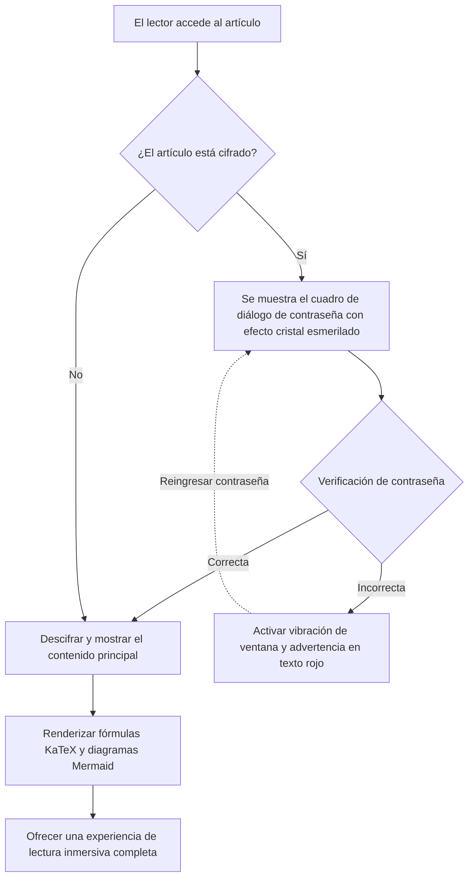
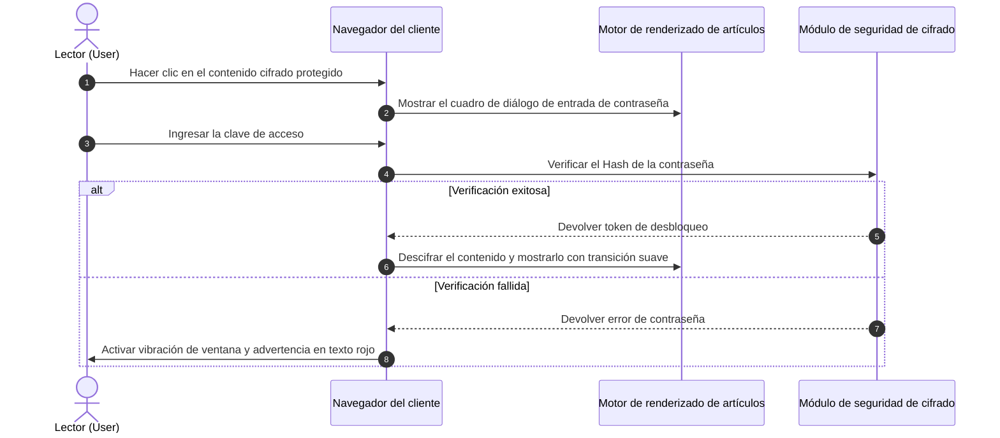

# Guía panorámica de generadores de sitios estáticos (SSG) y formatos de contenido de temas

En los proyectos modernos de generadores de sitios estáticos (SSG) y temas de blogs independientes, la **capacidad de análisis y presentación de los formatos de contenido de los artículos** determina directamente los límites de expresión del creador y la experiencia de lectura del lector.

Esta guía combina las normas de contenido del ecosistema de SSG más populares (**Hugo, Jekyll, Eleventy, Astro, Pelican, Hexo, WordPress, VitePress**, etc.), estableciendo un conjunto panorámico que cubre **Markup básico, lenguajes de documentación extendidos, WordPress Post Formats, conmutador de menús desplegables interactivos, acordeón plegable, fórmulas matemáticas LaTeX, diagramas Mermaid y funciones especiales de cifrado y descifrado**, y ofrece demostraciones de renderizado en vivo listas para usar.

---

## 1. Resumen de soporte de formatos de contenido y ecosistema de generadores de sitios estáticos (SSG)

Los diferentes generadores de sitios estáticos tienen filosofías de selección distintas en la arquitectura de análisis de contenido. La siguiente tabla resume sistemáticamente el soporte nativo y extendido de los principales motores para diversos formatos:

| Generador de sitios estáticos / Plataforma | Motor de análisis principal | Formatos de soporte nativo incorporados | Formatos soportados por extensiones / herramientas externas | Soporte de serialización de Front Matter |
| :--- | :--- | :--- | :--- | :--- |
| **Hugo** | Goldmark (Go) | `.md` (CommonMark/GFM), `.html`, `.org` (Org-mode) | `.adoc` (Asciidoctor), `.rst` (rst2html), `.pdc` (Pandoc) | YAML (`---`), TOML (`+++`), JSON (`{}`) |
| **Astro (estructura de este blog)** | Vite + Unified/Remark + MDX | `.md` (GFM), `.mdx` (JSX), `.html`, `.astro` componentes | Puede montar extensiones de AST Loader Org/AsciiDoc/RST | YAML, TOML, JSON |
| **Jekyll** | Kramdown (Ruby) | `.md` (Kramdown/GFM), `.html` | `.textile` (plugin Textile) | YAML |
| **Eleventy (11ty)** | Pipeline de plantillas JavaScript | `.md`, `.html`, `.liquid`, `.njk`, `.ejs`, `.webc` | MDX (plugin), extensiones de plantillas personalizadas | YAML, JSON, JS/11tydata |
| **Hexo** | Marked / Hexo-Renderer | `.md` (GFM), `.html`, plantillas EJS/Pug | Org-mode / Pandoc (soporte de plugin) | YAML, JSON |
| **Pelican** | Python Docutils | `.md` (Markdown), `.rst` (reStructuredText) | `.asciidoc` (Asciidoctor) | YAML, Markdown Metadata |
| **WordPress (Headless/Theme)** | Gutenberg Block Engine | HTML5 Blocks, Shortcodes, Post Formats | Classic Editor HTML | JSON metadata de bloques / Meta de publicación |
| **VitePress / Docusaurus** | Markdown-It / MDX | `.md`, `.mdx`, componentes Vue/React | Sintaxis de contenedor personalizado (`::: tip`) | YAML |

> [!NOTE]
> **Perspectiva de la arquitectura del ecosistema**: Hugo, con el soporte nativo de concurrencia de Go, admite Markdown y Org-mode; mientras que el SSG de front-end moderno representado por **Astro** aprovecha la capacidad de **MDX y las islas de componentes (Islands)** para integrar sin problemas UI interactivo dinámico (como el conmutador desplegable, la ventana emergente de contraseña y el disco de vinilo demostrados en este artículo) con la máxima flexibilidad.

---

## 2. Especificaciones de soporte de formatos de serialización de Front Matter

Los metadatos (Front Matter) del encabezado de la publicación del blog determinan la ruta, el título, la fecha, la categoría, la portada y el estado de protección del artículo. Este tema admite todos los modos de serialización principales:

### 1. Formato YAML (el más utilizado, recomendado por defecto)

```yaml
---
title: "文章标题"
pubDate: 2026-08-28
author: "shijianus"
tags: ["Astro", "Markdown"]
featured: true
postFormat: "aside"
---
```

### 2. Formato TOML (común en Hugo)

```toml
+++
title = "文章标题"
pubDate = 2026-08-28T00:00:00Z
author = "shijianus"
tags = ["Astro", "Markdown"]
featured = true
+++
```

### 3. Formato JSON (para escenarios API-driven y Headless)

```json
{
  "title": "文章标题",
  "pubDate": "2026-08-28T00:00:00.000Z",
  "author": "shijianus",
  "tags": ["Astro", "Markdown"],
  "featured": true
}
```

---

## 3. Comparación y correspondencia de migración de Markup ligero y formatos no Markdown

En diferentes pilas tecnológicas, los autores pueden usar otras lenguajes de marcado ligero además de Markdown. A continuación se presentan las características sintácticas de los formatos más populares y su equivalente en este tema:

### 1. AsciiDoc (.adoc / .asciidoc)

AsciiDoc es común en libros técnicos y manuales de ingeniería extensos, con bloques de notas y sistemas de atributos muy ricos:

```asciidoc
// AsciiDoc 源码语法
= AsciiDoc 技术规范
:author: shijianus
:toc: macro

[NOTE]
====
这是一条 AsciiDoc 风格的注意卡片。
====

[cols="1,2,1", options="header"]
|===
| 模块 | 描述 | 状态
| 核心引擎 | Astro 6 静态管线 | 已就绪
|===
```

**Escritura equivalente en Markdown / MDX en este tema**:

> [!NOTE]
> Esta es una tarjeta de nota equivalente renderizada nativamente en el tema Astro, con estilo e interacción totalmente alineados.

| Módulo | Descripción | Estado |
| :--- | :--- | :---: |
| **Motor principal** | Pipeline estático Astro 6 | <span class="badge badge-success">Listo</span> |

### 2. Emacs Org-Mode (.org)

Org-mode es una poderosa herramienta para usuarios de Emacs para la gestión del conocimiento, el seguimiento de tareas y la redacción de documentos:

```ini
#+TITLE: Emacs Org-Mode 实践笔记
#+DATE: 2026-08-28
#+TAGS: Emacs OrgMode

* TODO 第一阶段：Markdown 扫描增强 [1/2]
- [X] 修复表格与移动端溢出
- [ ] 补全 Org-mode 语法转换器

#+BEGIN_QUOTE
“Org-mode 不仅是格式，更是一种可执行的思维工作流。”
#+END_QUOTE
```

**Presentación estándar de la lista de tareas GFM estática (solo lectura) en este tema**:

- [x] Corregir la superposición de tablas y móvil
- [ ] Completar el convertidor de sintaxis Org-mode

> [!QUOTE]
> “Org-mode no es solo un formato, sino un flujo de trabajo de pensamiento ejecutable.”

#### Listas de tareas interactivas y barras de progreso encadenadas (Interactive Tutorial Checklist & Chained Progression)

En tutoriales técnicos, ejercicios prácticos y guías de despliegue, las listas de tareas tradicionales de solo lectura `[ ]` no permiten una interacción ni una retención intuitivas. Este tema incorpora específicamente **listas interactivas con marcado en tiempo real y estados encadenados (`.article-task-tracker`)**. Cada vez que el lector marca una casilla, la barra de progreso dinámica recalcula el porcentaje en tiempo real; una vez que se confirman todos los pasos clave, se **desbloquea automáticamente y en cadena la instrucción de preparación aguas abajo**, lo que la hace ideal como lista de verificación de finalización para tutoriales:

<div class="article-task-tracker" data-storage-key="content-format-tutorial-demo">
  <div class="task-tracker__header">
    <div class="task-tracker__title">
      <svg width="20" height="20" viewBox="0 0 24 24" fill="none" stroke="currentColor" stroke-width="2"><path d="M9 11l3 3L22 4"/><path d="M21 12v7a2 2 0 0 1-2 2H5a2 2 0 0 1-2-2V5a2 2 0 0 1 2-2h11"/></svg>
      <span>Lista de verificación previa al despliegue de sitios estáticos (marcado interactivo en tiempo real)</span>
    </div>
    <span class="task-tracker__count">1/4 pasos completados (25%)</span>
  </div>
  <div class="task-tracker__bar-wrap">
    <div class="task-tracker__fill" style="width: 25%;"></div>
  </div>
  <ul class="task-checklist">
    <li class="task-checklist-item is-done">
      <input type="checkbox" checked id="chk-step-1" />
      <div class="task-item-body">
        <label for="chk-step-1" class="task-item-label">Paso 1: Completar la copia de seguridad completa del código local y el Git Commit</label>
        <div class="task-item-desc">Confirmar que el árbol de trabajo actual está limpio y registrar el Hash de la copia de seguridad en el registro de auditoría de desarrollo.</div>
      </div>
    </li>
    <li class="task-checklist-item">
      <input type="checkbox" id="chk-step-2" />
      <div class="task-item-body">
        <label for="chk-step-2" class="task-item-label">Paso 2: Configurar la línea de construcción estática de Cloudflare Pages</label>
        <div class="task-item-desc">Establecer <code>BLOG_BUILD_TARGET=static</code> y el entorno de ejecución Node.js 20+.</div>
      </div>
    </li>
    <li class="task-checklist-item">
      <input type="checkbox" id="chk-step-3" />
      <div class="task-item-body">
        <label for="chk-step-3" class="task-item-label">Paso 3: Verificar recursos multimedia y la incrustación de videos/audios externos</label>
        <div class="task-item-desc">Asegurar que el tamaño de cada archivo de audio y video se mantenga estrictamente por debajo de 25 MB, cumpliendo con las normas de despliegue en CDN.</div>
      </div>
    </li>
    <li class="task-checklist-item">
      <input type="checkbox" id="chk-step-4" />
      <div class="task-item-body">
        <label for="chk-step-4" class="task-item-label">Paso 4: Ejecutar pruebas de humo y regresión visual automatizadas con Playwright</label>
        <div class="task-item-desc">Verificar que la maquetación de todas las tarjetas multimedia ricas y los componentes interactivos sea correcta en múltiples resoluciones para PC y dispositivos móviles.</div>
      </div>
    </li>
  </ul>
  <div class="task-tracker__status-card is-pending">
    <div class="status-card__header">
      <span class="badge badge-warning">⏳ En espera de preparación</span>
      <span style="font-weight:700;">Progreso actual: 1/4 (25%)</span>
    </div>
    <p style="margin-top:0.4rem;margin-bottom:0;font-size:0.88rem;line-height:1.6;">Por favor, complete secuencialmente cada paso marcado en la lista superior; una vez que todas las tareas estén completadas, la instrucción de publicación en producción se desbloqueará aquí en tiempo real y en cadena.</p>
  </div>
</div>

---

### 3. reStructuredText (.rst)

reStructuredText es el formato de documentación estándar de la comunidad de Python (como Sphinx, ReadTheDocs):

```rst
.. reStructuredText 源码语法
.. note::
   这是一条 RST 指令定义的 Note 块。

.. code-block:: python
   :linenos:

   def greet(name: str) -> str:
       return f"Hello, {name}!"
```

**Presentación equivalente en Markdown en este tema**:

> [!NOTE]
> Esta es la tarjeta equivalente a una nota RST presentada según la especificación de GitHub Alert en Astro.

```python
def greet(name: str) -> str:
    return f"Hello, {name}!"
```

---

### 4. Sintaxis Textile

Textile es un lenguaje de marcado ligero de larga data (común en Redmine y blogs Jekyll tempranos):

```markdown
h2. 章节标题
bq. 这是 Textile 引用块内容。
*列表项 1*
_斜体强调文本_
```

---

## IV. Implementación completa y presentación visual de formatos de artículo estilo WordPress (Post Formats)

El mecanismo clásico de **Post Formats** en el ecosistema de temas de WordPress permite a los blogs mostrar formas visuales exclusivas para diferentes tipos de contenido. Hemos implementado completamente estas 9 formas en la columna de contenido de este tema:

### 1. `aside` (Susurro / Nota / Tarjeta de apunte)

Adecuado para registrar inspiraciones breves, recordatorios o notas temporales:

<div class="article-aside">
  <p><strong>💡 Nota al margen</strong>: El verdadero valor de los sitios estáticos no reside en la exhibición técnica, sino en la entrega de una experiencia de lectura pura, ultrarrápida y sin la carga de mantenimiento del servidor. Incluso después de cinco o diez años, los archivos HTML generados aún se pueden abrir perfectamente.</p>
</div>

---


### 2. `status` (Estado dinámico / Reflexiones / Microcitas)

Tarjetas de publicación de estado en tiempo real al estilo de Twitter/Weibo, que incluyen el avatar del autor, el identificador del cliente y etiquetas de estado de ánimo:

<div class="article-status">
  <div class="article-status__header">
    <div class="article-status__user">
      
      <div>
        <div class="article-status__name">shijianus</div>
        <div class="article-status__meta">Publicado el 2026-08-28 14:32 · 🇨🇳 Hangzhou</div>
      </div>
    </div>
    <div class="article-status__badge">
      <span>📱 Desde el Mac Studio de Taller de Geeks</span>
    </div>
  </div>
  <p class="article-status__content">
    ¡Por fin he completado la extensión de formato y la reconstrucción visual de la columna principal de contenido del blog! Desde KaTeX y Mermaid hasta menús desplegables interactivos y discos de vinilo, la sensación de entrega estática full-stack es increíble 🚀✨
  </p>
</div>

---

### 3. `quote` (Citas seleccionadas / Tarjetas de frases célebres)

Diseñada para mostrar citas de personajes de gran peso, máximas de diseño o frases destacadas:

<div class="article-quote">
  <div class="article-quote__icon">“</div>
  <div class="article-quote__body">
    Simplicity is prerequisite for reliability. (La simplicidad es un requisito previo para la fiabilidad.)
  </div>
  <div class="article-quote__author">
    
    <div class="article-quote__author-info">
      <div class="article-quote__author-name">Edsger W. Dijkstra</div>
      <div class="article-quote__author-title">Científico de la computación · Ganador del Premio Turing (1972)</div>
    </div>
  </div>
</div>

---

### 4. `gallery` (Galería de imágenes / Álbum adaptativo y cuadrícula estilo Polaroid)

Compatible con cuadrículas responsivas adaptativas de múltiples columnas y tarjetas de papel fotográfico estilo Polaroid con un toque humano. Al hacer clic en cualquier imagen, se activa un visor de pantalla completa (lightbox):

#### Galería adaptativa de 2 y 3 columnas

<div class="article-gallery">
  <div class="gallery-grid gallery-grid-3">
    <div class="gallery-item">
      
      <div class="gallery-item__caption">Vista panorámica del espacio de trabajo geek</div>
    </div>
    <div class="gallery-item">
      
      <div class="gallery-item__caption">Pantalla grande de diseño de arquitectura del sistema</div>
    </div>
    <div class="gallery-item">
      
      <div class="gallery-item__caption">Portada visual de viaje por la galaxia</div>
    </div>
  </div>
</div>

#### Galería de papel fotográfico Polaroid (Estilo Polaroid)

<div class="gallery-polaroid">
  <div class="polaroid-card">
    
    <div class="polaroid-card__caption">2026.04 Hangzhou · Base de I+D</div>
  </div>
  <div class="polaroid-card">
    
    <div class="polaroid-card__caption">2026.08 Noche de evolución y refactorización de arquitectura</div>
  </div>
</div>

---

### 5. `video` (Tarjeta de reproducción de video adaptativa)

Compatible con una proporción responsiva de 16:9, bordes redondeados y leyenda inferior, ocupando una fila completa en horizontal. Compatible con incrustaciones externas vía proxy de Bilibili y YouTube, así como con MP4 nativos del sitio (cada archivo se mantiene por debajo de 25 MB, cumpliendo con las normas de despliegue estático de Cloudflare Pages):

#### Incrustación de video externo (Incrustación vía proxy de enlaces de Bilibili & YouTube · Por defecto, el lector debe desplazarse hasta aquí y hacer clic para comenzar la reproducción)

<div class="video-embed-card" data-video-type="bilibili">
  <iframe src="https://player.bilibili.com/player.html?bvid=BV11k4y1T7kS&page=1&high_quality=1&danmaku=0&autoplay=0" allowfullscreen="true" loading="lazy" allow="accelerometer; autoplay; clipboard-write; encrypted-media; gyroscope; picture-in-picture; web-share" sandbox="allow-top-navigation-by-user-activation allow-same-origin allow-forms allow-scripts allow-popups"></iframe>
  <div class="embed-caption">🎬 Demostración de incrustación externa de Bilibili: BV11k4y1T7kS (HD 1080P · Debe desplazarse hasta aquí y hacer clic para reproducir)</div>
</div>

#### Video MP4 nativo incrustado en el sitio (Native HTML5 Video Player · Soporta velocidad variable y pantalla dentro de pantalla · Descarga deshabilitada por defecto)

<div class="video-embed-card">
  <video controls controlsList="nodownload" preload="metadata" playsinline oncontextmenu="return false;">
    <source src="/media/video/landscape_compressed.mp4" type="video/mp4" />
    您的浏览器不支持 HTML5 视频播放。
  </video>
  <div class="embed-caption">🎥 Video nativo incrustado local 1: Demostración de paisaje ultra claro 4K/1080P (Tamaño 21.7MB · Soporta velocidad variable y pantalla dentro de pantalla · Descarga directa deshabilitada)</div>
</div>

<div class="video-embed-card">
  <video controls controlsList="nodownload" preload="metadata" playsinline oncontextmenu="return false;">
    <source src="/media/video/blue_archive_miracle.mp4" type="video/mp4" />
    您的浏览器不支持 HTML5 视频播放。
  </video>
  <div class="embed-caption">🎥 Video nativo incrustado local 2: 【Archivo Azul】“El principio y fin del milagro—nuestra historia la decidimos nosotros!” (Tamaño 23.3MB · Soporta velocidad variable y pantalla dentro de pantalla · Descarga directa deshabilitada)</div>
</div>

---

### 6. `audio` (Tarjeta de música con disco de vinilo giratorio)

Controlador de audio HTML5 incorporado, y al reproducir, activa automáticamente la **animación de rotación suave y continua del disco de vinilo**. Todas las portadas de discos utilizan portadas oficiales de alta definición reales, soportan varios formatos de audio populares (FLAC sin pérdida, MP3 de alta tasa de bits, AAC/M4A), y ya incluyen protección anti-crawling y anti-descarga:

#### ① Shaun - Way Back Home (Formato de audio FLAC sin pérdida · 24.55MB)

<div class="article-audio-card">
  <div class="audio-card__cover">
    
  </div>
  <div class="audio-card__info">
    <div class="audio-card__title">
      <span>Way Back Home</span>
      <span class="badge badge-purple">FLAC Lossless</span>
    </div>
    <div class="audio-card__author">Shaun (숀) · Audio sin pérdida (FLAC / 44.1kHz 16-bit 961 kbps)</div>
    <audio controls preload="metadata" controlsList="nodownload" oncontextmenu="return false;" src="/media/audio/WayBackHome.flac"></audio>
  </div>
</div>

#### ② ヨルシカ (Yorushika) - 彼女は旅に出る (MP3 320Kbps formato HD · 8.41MB)

<div class="article-audio-card">
  <div class="audio-card__cover">
    
  </div>
  <div class="audio-card__info">
    <div class="audio-card__title">
      <span>彼女は旅に出る (She Leaves on a Journey)</span>
      <span class="badge badge-success">320 Kbps MP3</span>
    </div>
    <div class="audio-card__author">ヨルシカ (Yorushika) · Estéreo HD (MP3 / 48kHz 320 kbps)</div>
    <audio controls preload="metadata" controlsList="nodownload" oncontextmenu="return false;" src="/media/audio/彼女は旅に出る.mp3"></audio>
  </div>
</div>

#### ③ すこっぷ feat. 初音ミク - アイロニ (M4A / AAC formato · 7.63MB)

<div class="article-audio-card">
  <div class="audio-card__cover">
    
  </div>
  <div class="audio-card__info">
    <div class="audio-card__title">
      <span>アイロニ (Irony / irónico)</span>
      <span class="badge badge-cyan">M4A / AAC</span>
    </div>
    <div class="audio-card__author">すこっぷ feat. 初音ミク · Audio AAC (M4A / 44.1kHz 260 kbps)</div>
    <audio controls preload="metadata" controlsList="nodownload" oncontextmenu="return false;" src="/media/audio/アイロニ.m4a"></audio>
  </div>
</div>

### 7. `link` (Tarjetas de vista previa de enlaces externos y marcadores / Bookmark Preview)

Proporciona una vista previa elegante en formato de tarjeta para las fuentes de referencia clave dentro del artículo:

<a class="article-bookmark" href="https://github.com/shijianus/shijianus-blog" target="_blank" rel="noopener">
  <div class="article-bookmark__content">
    <div class="article-bookmark__title">EpoCanvas / shijianus-blog (Repositorio de especificaciones de diseño central del tema del blog de 時間)</div>
    <p class="article-bookmark__desc">EpoCanvas (Lienzo de la Era) es un sistema de arquitectura de contenido para blogs geeks modernos, centrado en la presentación de información de alta densidad, microinteracciones elegantes y soporte para todos los formatos.</p>
    <div class="article-bookmark__site">
      <span class="badge badge-primary">GitHub</span>
      <span>github.com · EpoCanvas Core Spec</span>
    </div>
  </div>
  <div class="article-bookmark__icon">
    <svg viewBox="0 0 24 24" width="24" height="24" fill="none" stroke="currentColor" stroke-width="2" stroke-linecap="round" stroke-linejoin="round"><path d="M18 13v6a2 2 0 0 1-2 2H5a2 2 0 0 1-2-2V8a2 2 0 0 1 2-2h6"/><polyline points="15 3 21 3 21 9"/><line x1="10" y1="14" x2="21" y2="3"/></svg>
  </div>
</a>

---

### 8. `chat` (Flujo de diálogo con burbujas de chat / Organic Animated Dialogue Stream)

Se utiliza para demostrar de manera vívida escenarios de defensas técnicas, discusiones en diálogos de dos personas o entrevistas a usuarios. Admite burbujas izquierda/derecha, código en línea, colores personalizados y **animaciones de escritura adaptativas dinámicas, efectos de sonido sintetizados con Web Audio y avatares dinámicos (`footer_mini_logo__media`)**:
* **Modo estático (predeterminado)**: `<div class="article-chat">` mantiene una presentación ligera y puramente estática, sin costo de JS;
* **Activar demostración dinámica (controlado por parámetros)**: Configure `data-animate="true"` (o `class="article-chat is-animated"`), y el sistema **disparará automáticamente una animación de escritura con secuencia temporal realista, determinada por la longitud de los caracteres y la ley de aleatoriedad natural, junto con sonidos de notificación exclusivos para izquierda y derecha, cuando el lector haga scroll por primera vez hasta que el elemento entre en el viewport**;
* **Secuencia temporal dinámica no mecánica (Content-Length Aware Timing)**: El sistema decide inteligentemente la duración del indicador de escritura según la longitud del mensaje (parpadeo de 380 ms para frases cortas, escritura y reflexión de 1000 ms+ para párrafos técnicos largos), y añade pausas naturales y vibraciones de microfrecuencia de sonido entre burbujas que se ajustan al juicio de lectura humana;
* **Soporte para avatares de video dinámicos (`footer_mini_logo__media`)**: Los avatares admiten la incorporación de microvideos MP4 animados y pósters estáticos de respaldo;
* **Disparo único y garantía de recarga**: Después del primer disparo al hacer scroll, se bloquea automáticamente; los scrolls repetidos posteriores no volverán a dispararlo, evitando interrumpir la lectura; solo se volverá a preparar cuando el usuario recargue la página web (F5); al mismo tiempo, se proporciona una barra de microcontrol en la esquina superior derecha con «↺ Reproducir de nuevo» y «🔊/🔇 Alternar sonido».

<div class="article-chat" data-animate="true" data-sound="true">
  <div class="chat-message chat-left">
    <span class="chat-avatar footer_mini_logo__media">
      <video autoplay muted loop playsinline preload="metadata" poster="/media/shijianus/avatar.jpg" aria-hidden="true">
        <source src="/media/shijianus/avatar-dynamic.mp4" type="video/mp4" />
      </video>
      
    </span>
    <div class="chat-body">
      <div class="chat-author">Desarrollador <a href="https://github.com/LeonBoven" target="_blank" rel="noopener noreferrer">Léon Boven</a> · 10:15</div>
      <div class="chat-bubble">
        ¡Hola! ¿Crees que implementar la renderización estática de <code>KaTeX</code> y <code>Mermaid</code> en Astro ralentizará la velocidad de carga de la página frontend?
      </div>
    </div>
  </div>

  <div class="chat-message chat-right">
    
    <div class="chat-body">
      <div class="chat-author">Arquitecto <a href="https://github.com/shijianus" target="_blank" rel="noopener noreferrer">shijianus</a> · 10:16</div>
      <div class="chat-bubble">
        ¡En absoluto! Porque <code>remark-math</code> y <code>rehype-katex</code> ya han compilado las fórmulas en cadenas puras de HTML/MathML durante la fase de construcción (Build-time), lo que supone una **carga de ejecución JS en el navegador de 0**; y los diagramas de Mermaid también cargan módulos ESM de forma asíncrona y bajo demanda, ¡lo que hace que la primera pantalla sea extremadamente ligera! ⚡
      </div>
    </div>
  </div>

<div class="chat-message chat-left">
    <span class="chat-avatar footer_mini_logo__media">
      <video autoplay muted loop playsinline preload="metadata" poster="/media/shijianus/avatar.jpg" aria-hidden="true">
        <source src="/media/shijianus/avatar-dynamic.mp4" type="video/mp4" />
      </video>
      
    </span>
    <div class="chat-body">
      <div class="chat-author">Desarrollador <a href="https://github.com/LeonBoven" target="_blank" rel="noopener noreferrer">Léon Boven</a> · 10:17</div>
      <div class="chat-bubble">
        ¡Excelente! Entonces, ¿podemos escribir directamente diagramas de secuencia de arquitectura y un convertidor de unidades interactivo en Markdown y que funcionen de inmediato, verdad?
      </div>
    </div>
  </div>

  <div class="chat-message chat-right">
    
    <div class="chat-body">
      <div class="chat-author">Arquitecto <a href="https://github.com/shijianus" target="_blank" rel="noopener noreferrer">shijianus</a> · 10:18</div>
      <div class="chat-bubble">
        ¡Correcto! No solo se puede hacer zoom doble y exportar SVG de alta definición, el convertidor de unidades también se ha integrado con <strong>sincronización de precios de divisas en tiempo real</strong> y <strong>cambio de unidad base mediante menú desplegable</strong>, y garantiza una expresión completa y simétrica de unidades de calidad fija; todas las métricas han sido rigurosamente probadas! 🚀
      </div>
    </div>
  </div>

  <div class="chat-message chat-left">
    <span class="chat-avatar footer_mini_logo__media">
      <video autoplay muted loop playsinline preload="metadata" poster="/media/shijianus/avatar.jpg" aria-hidden="true">
        <source src="/media/shijianus/avatar-dynamic.mp4" type="video/mp4" />
      </video>
      
    </span>
    <div class="chat-body">
      <div class="chat-author">Desarrollador <a href="https://github.com/LeonBoven" target="_blank" rel="noopener noreferrer">Léon Boven</a> · 10:19</div>
      <div class="chat-bubble">
        ¡Entendido! La sensación de interacción y la animación de escritura que varía según la longitud del mensaje son muy naturales; voy a actualizar la biblioteca de documentación técnica de mi equipo ahora mismo! 🎉
      </div>
    </div>
  </div>

  <div class="chat-message chat-right">
    
    <div class="chat-body">
      <div class="chat-author">Arquitecto <a href="https://github.com/shijianus" target="_blank" rel="noopener noreferrer">shijianus</a> · 10:20</div>
      <div class="chat-bubble">
        ¡Bienvenido a probar! Si encuentras alguna extensión de formato o necesidad de personalización en el futuro, no dudes en discutirlo en el foro o en GitHub. ✨
      </div>
    </div>
  </div>
</div>

---

## 5. Formatos especiales de cuadro desplegable y componentes interactivos (Dropdown Selectors & Interactive Formats)

Para los requisitos explícitos de los usuarios de **formatos especiales de cuadro desplegable**, proporcionamos en la capa de contenido del artículo un componente selector desplegable de respuesta instantánea en el cliente puro:

### 1. Selector desplegable de múltiples marcos y versiones de código (Interactive Dropdown Switcher)

Los lectores pueden seleccionar libremente el marco tecnológico en el cuadro desplegable, y el panel de contenido cambiará en tiempo real sin recargar el contenido y el código correspondiente:

<div class="article-dropdown-switcher">
  <div class="article-dropdown-switcher__header">
    <div class="article-dropdown-switcher__title">
      <svg width="20" height="20" viewBox="0 0 24 24" fill="none" stroke="currentColor" stroke-width="2"><rect x="3" y="3" width="18" height="18" rx="2"/><path d="M9 3v18"/><path d="m14 9 3 3-3 3"/></svg>
      <span>Seleccione el código de implementación del framework de frontend que desea ver:</span>
    </div>
    <select class="article-select dropdown-switcher__select">
      <option value="react-tab">⚛️ React 19 (Hooks & TSX)</option>
      <option value="vue-tab">🟢 Vue 3.5 (Composition API)</option>
      <option value="astro-tab">🚀 Astro 6 (Island Component)</option>
      <option value="svelte-tab">🟠 Svelte 5 (Runes)</option>
    </select>
  </div>
  <div class="article-dropdown-switcher__body">
    <div class="article-dropdown-panel is-active" data-panel="react-tab">
      <div class="article-dropdown-panel__title">⚛️ Implementación del componente en React 19:</div>
      <pre class="no-code-enhance"><code class="language-tsx">import { useState } from 'react';
export function Counter() {
  const [count, setCount] = useState(0);
  return (
    &lt;button onClick={() =&gt; setCount((c) =&gt; c + 1)} className="btn-primary"&gt;
      React contador de clics: &#123;count&#125;
    &lt;/button&gt;
  );
}</code></pre>
    </div>
    <div class="article-dropdown-panel" data-panel="vue-tab">
      <div class="article-dropdown-panel__title">🟢 Implementación del componente de archivo único en Vue 3.5:</div>
      <pre class="no-code-enhance"><code class="language-html">&lt;script setup lang="ts"&gt;
import { ref } from 'vue';
const count = ref(0);
&lt;/script&gt;
&lt;template&gt;
  &lt;button @click="count++" class="btn-primary"&gt;
    Vue contador de clics: &#123;&#123; count &#125;&#125;
  &lt;/button&gt;
&lt;/template&gt;</code></pre>
    </div>
    <div class="article-dropdown-panel" data-panel="astro-tab">
      <div class="article-dropdown-panel__title">🚀 Implementación del componente estático sin JS en Astro 6:</div>
      <pre class="no-code-enhance"><code class="language-astro">---
const { title = "Astro 极速群岛" } = Astro.props;
---
&lt;div class="astro-island"&gt;
  &lt;h3&gt;&#123;title&#125;&lt;/h3&gt;
  &lt;p&gt;Entrega 0KB de JavaScript por defecto, ¡inyecta interactividad bajo demanda!&lt;/p&gt;
&lt;/div&gt;</code></pre>
    </div>
    <div class="article-dropdown-panel" data-panel="svelte-tab">
      <div class="article-dropdown-panel__title">🟠 Implementación con Runes en Svelte 5:</div>
      <pre class="no-code-enhance"><code class="language-svelte">&lt;script lang="ts"&gt;
  let count = $state(0);
&lt;/script&gt;
&lt;button onclick={() =&gt; count++} class="btn-primary"&gt;
  Svelte contador de clics: &#123;count&#125;
&lt;/button&gt;</code></pre>
    </div>
  </div>
</div>

---

### 2. Convertidor de unidades universal interactivo (Universal Interactive Unit Converter · Cambio de base mediante desplegable y tipo de cambio en tiempo real)

Permite a los usuarios ingresar libremente **cualquier valor numérico base** en el campo de entrada (valor predeterminado `1`, con soporte para pasos de incremento/decremento y reinicio con un clic), y realizar conversiones instantáneas y sin interrupciones entre diferentes categorías (masa/peso, tipo de cambio internacional, almacenamiento de datos, ancho de banda de red, longitud/dimensiones):
* **Base de conversión dinámica y conmutable (Desplegable de unidad base)**: La unidad base a la derecha del campo de entrada permite la selección libre mediante desplegable (por ejemplo, en masa se pueden seleccionar `kg`, `g`, `lb`, `jin`, `oz`, `t`, etc.; en tipo de cambio se pueden seleccionar `USD`, `HKD`, `CNY`, `EUR`, `JPY`, `GBP`, etc.). Al seleccionar cualquier unidad base, la cuadrícula de conversión de destino **excluirá automáticamente e inteligentemente la unidad base actual (eliminando por completo las tarjetas redundantes como 1kg=1kg)** y recalculará instantáneamente todas las unidades de destino utilizando la base actual como denominador;
* **Conexión en línea con fluctuaciones de tipo de cambio reales (API de divisas en vivo)**: Al cambiar a «💱 Tipo de cambio internacional», el sistema solicitará asincrónicamente al servidor `/api/exchange-rate` y recurrirá a una interfaz pública de tipo de cambio en tiempo real para obtener las cotizaciones más recientes de las principales monedas (se mostrará `🟢 Tipo de cambio en línea en tiempo real sincronizado` en la esquina superior derecha); en caso de no estar en línea o estar desconectado, se recurrirá automáticamente y sin interrupciones a la proporción base integrada (se mostrará `⚪ Tipo de cambio base sin conexión`), garantizando que "tiempo real" sea verdaderamente en tiempo real y que la experiencia sin conexión sea sólida como una roca;
* **Llamada conveniente a la API universal**: El sistema expone simultáneamente la función auxiliar `window.shijianusAPI.fetchExchangeRates(base)` a nivel global, facilitando que cualquier script personalizado dentro del documento llame instantáneamente a los datos de cotización en tiempo real;
* **Copia rápida con un clic y deducción de ecuaciones**: Cada tarjeta de conversión proporciona un botón de copia con un clic y retroalimentación resaltada, mostrando simultáneamente en la parte inferior un resumen de deducción de la cadena de ecuaciones dinámica.

<div class="interactive-unit-converter" data-default="1" data-title="🔄 Convertidor de unidades universal interactivo (soporta cambio de unidad base y tipo de cambio en tiempo real)"></div>


---

### 3. Calculadora desplegable de especificaciones y codificación de video (Interactive Spec Calc Dropdown)

Al seleccionar diferentes opciones, se muestran en tiempo real a la derecha las especificaciones técnicas correspondientes y los detalles de conversión:

<div class="interactive-calc-select">
  <div class="article-select-box">
    <label>
      <svg width="18" height="18" viewBox="0 0 24 24" fill="none" stroke="currentColor" stroke-width="2"><circle cx="12" cy="12" r="10"/><path d="M12 6v6l4 2"/></svg>
      <span>Seleccione la resolución de codificación de video:</span>
    </label>
    <select class="article-select">
      <option value="1080p" data-desc="1920 × 1080 @ 60fps · Tasa de bits 6,000 Kbps · Ancho de banda recomendado 15 Mbps">1080P Full HD (1080p60)</option>
      <option value="2k" data-desc="2560 × 1440 @ 60fps · Tasa de bits 12,000 Kbps · Ancho de banda recomendado 30 Mbps">2K QHD (1440p60)</option>
      <option value="4k" data-desc="3840 × 2160 @ 60fps · Tasa de bits 25,000 Kbps · Ancho de banda recomendado 60 Mbps">4K UHD (2160p60 HDR)</option>
      <option value="8k" data-desc="7680 × 4320 @ 60fps · Tasa de bits 80,000 Kbps · Ancho de banda recomendado 200 Mbps">8K Calidad de cine (4320p60 AV1)</option>
    </select>
  </div>
  <div class="calc-output-box">
    <span>📊 <strong>Resultado del cálculo de especificaciones técnicas</strong>:</span>
    <span class="calc-output-value">1920 × 1080 @ 60fps · Tasa de bits 6,000 Kbps · Ancho de banda recomendado 15 Mbps</span>
  </div>
</div>

---

## VI. Acordeones, pestañas y diseño de columnas múltiples (Collapsibles, Tabs & Columns)

### 1. Grupo de acordeones excluyentes (Exclusive Accordion Group · Al expandir un elemento, los demás se cierran automáticamente)

Configure `data-single="true"`. Al expandir un elemento, los demás elementos expandidos del mismo grupo se colapsarán automáticamente, manteniendo la página limpia y enfocada:

<div class="article-accordion-group" data-single="true">
  <details class="article-accordion" open>
    <summary>
      <span>🔒 1. Ventajas de seguridad de los sitios estáticos</span>
      <svg class="accordion-chevron" viewBox="0 0 24 24" fill="none" stroke="currentColor" stroke-width="2"><polyline points="9 18 15 12 9 6"/></svg>
    </summary>
    <div class="accordion-content">
      <p>Los sitios estáticos carecen de motores de ejecución dinámica tradicionales como PHP/Node.js y bases de datos SQL expuestas a internet, lo que los hace inmunes a nivel físico a riesgos como inyección SQL y ejecución remota de código en el servidor (RCE).</p>
    </div>
  </details>

  <details class="article-accordion">
    <summary>
      <span>⚡ 2. Entrega acelerada en el borde con CDN global</span>
      <svg class="accordion-chevron" viewBox="0 0 24 24" fill="none" stroke="currentColor" stroke-width="2"><polyline points="9 18 15 12 9 6"/></svg>
    </summary>
    <div class="accordion-content">
      <p>Al desplegar los artefactos compilados en Cloudflare Pages o GitHub Pages, todos los recursos estáticos se pueden almacenar en caché en más de 300 nodos de borde en todo el mundo, con un tiempo de respuesta del primer byte (TTFB) generalmente inferior a 20 ms.</p>
    </div>
  </details>

  <details class="article-accordion">
    <summary>
      <span>💰 3. Costos de alojamiento en la nube extremadamente bajos</span>
      <svg class="accordion-chevron" viewBox="0 0 24 24" fill="none" stroke="currentColor" stroke-width="2"><polyline points="9 18 15 12 9 6"/></svg>
    </summary>
    <div class="accordion-content">
      <p>Los sitios estáticos no requieren servidores VPS costosos funcionando las 24 horas. Combinados con bases de datos Cloudflare D1 y sistemas de comentarios Serverless en el nivel gratuito, los costos operativos diarios son prácticamente nulos.</p>
    </div>
  </details>
</div>

---

### 2. Grupo de acordeones independientes no excluyentes (Multi-Expand / Non-Exclusive Accordion Group · Permite expandir múltiples elementos simultáneamente)

Configure `data-single="false"` (o el modo de múltiples aperturas por defecto). Los lectores pueden expandir libremente varios o todos los elementos colapsados para compararlos en paralelo y realizar una lectura en profundidad, sin que se cierren los contenidos ya abiertos al expandir nuevos elementos:

<div class="article-accordion-group" data-single="false">
  <details class="article-accordion" open>
    <summary>
      <span>🛠️ Módulo de arquitectura A: Pipeline de compilador de sintaxis AST de Markdown</span>
      <svg class="accordion-chevron" viewBox="0 0 24 24" fill="none" stroke="currentColor" stroke-width="2"><polyline points="9 18 15 12 9 6"/></svg>
    </summary>
    <div class="accordion-content">
      <p>Basado en la arquitectura Unified, Remark-math y Rehype-katex, transforma estáticamente el árbol de sintaxis de Markdown en nodos HTML semánticos estándar durante la fase de compilación y construcción, completando la generación de resaltado de sintaxis y fórmulas en el lado de Node.js.</p>
    </div>
  </details>

<details class="article-accordion" open>
    <summary>
      <span>🎨 Módulo de arquitectura B: Motor visual dinámico EpoCanvas y sistema responsivo</span>
      <svg class="accordion-chevron" viewBox="0 0 24 24" fill="none" stroke="currentColor" stroke-width="2"><polyline points="9 18 15 12 9 6"/></svg>
    </summary>
    <div class="accordion-content">
      <p>Proporciona fondo de aurora (Aurora), parallax de cielo estrellado (Starfield), efecto de vidrio esmerilado (Glassmorphism) y adaptación de puntos de ruptura responsiva en múltiples dispositivos; ofrece una experiencia estética consistente tanto en pantallas anchas 4K como en teléfonos plegables.</p>
    </div>
  </details>

<details class="article-accordion">
    <summary>
      <span>🛡️ Módulo de arquitectura C: Sistema de aislamiento de seguridad escalonado WebCrypto SHA-256</span>
      <svg class="accordion-chevron" viewBox="0 0 24 24" fill="none" stroke="currentColor" stroke-width="2"><polyline points="9 18 15 12 9 6"/></svg>
    </summary>
    <div class="accordion-content">
      <p>Incluye desbloqueo persistente de sesión de nivel 1, máscara dinámica polimórfica de nivel 2 para evitar espionaje (desenfoque gaussiano/mosaico/mask de spoilers), bloqueo instantáneo al salir del viewport de nivel 3 y un esquema de cifrado por fragmentos de URL externa, eliminando por completo la exposición de contraseñas en texto plano en el DOM.</p>
    </div>
  </details>
</div>

---

### 3. Pestañas interactivas (Interactive Tabs)

<div class="article-tabs">
  <div class="article-tabs__nav">
    <button class="article-tabs__button is-active" type="button">pnpm</button>
    <button class="article-tabs__button" type="button">npm</button>
    <button class="article-tabs__button" type="button">yarn</button>
    <button class="article-tabs__button" type="button">bun</button>
  </div>
  <div class="article-tabs__panels">
    <div class="article-tabs__panel is-active">
      <pre class="no-code-enhance"><code class="language-bash">pnpm add @astrojs/mdx remark-math rehype-katex katex mermaid</code></pre>
    </div>
    <div class="article-tabs__panel">
      <pre class="no-code-enhance"><code class="language-bash">npm install @astrojs/mdx remark-math rehype-katex katex mermaid</code></pre>
    </div>
    <div class="article-tabs__panel">
      <pre class="no-code-enhance"><code class="language-bash">yarn add @astrojs/mdx remark-math rehype-katex katex mermaid</code></pre>
    </div>
    <div class="article-tabs__panel">
      <pre class="no-code-enhance"><code class="language-bash">bun add @astrojs/mdx remark-math rehype-katex katex mermaid</code></pre>
    </div>
  </div>
</div>

---

### 4. Sistema de cuadrícula de múltiples columnas (Multi-Column Grid)

#### 3 columnas de tarjetas de ancho igual

<div class="article-grid article-grid-3">
  <div class="article-col-card">
    <h4>🎨 Sistema visual</h4>
    <p>Absorbe profundamente la estética de diseño geek moderno de EpoCanvas, soporta alto contraste de luz y sombra, fondo de vidrio esmerilado y transiciones de color suaves.</p>
  </div>
  <div class="article-col-card">
    <h4>⚡ Ingeniería de rendimiento</h4>
    <p>Arquitectura de islas estáticas de Astro 6, pre-renderizado HTML en tiempo de construcción, optimización SEO pura y extrema.</p>
  </div>
  <div class="article-col-card">
    <h4>🛠️ Ecosistema de extensiones</h4>
    <p>Soporte completo para fórmulas KaTeX, diagramas Mermaid, ventanas emergentes cifradas y 9 tipos de formatos de publicación.</p>
  </div>
</div>

#### 1:2 cuadrícula de barra lateral desigual

<div class="article-grid article-columns-1-2">
  <div class="article-col-card">
    <h4>📌 Posicionamiento de la arquitectura</h4>
    <p>Enfocado en una plataforma de escritura técnica moderna para geeks y ingenieros.</p>
  </div>
  <div class="article-col-card">
    <h4>🚀 Garantía de entrega</h4>
    <p>Incluye un mecanismo completo de pruebas de humo automatizadas y validación de construcción estática; garantiza que fórmulas, diagramas o tarjetas complejas se presenten sin fisuras en todos los dispositivos.</p>
  </div>
</div>

---

## VII. 13 tipos de cuadros de advertencia semánticos (Admonitions / GitHub Alerts)

Basado en GitHub Alert y la normativa de diseño de EpoCanvas, admite 13 tipos de tarjetas de colores con diferentes semánticas y permite usar la sintaxis `[!TYPE]-` para colapsar por defecto:

> [!NOTE]
> **Nota general (Note)**: Esta es una información de fondo estándar o una explicación contextual.

> [!TIP]
> **Consejo útil (Tip)**: Usa el atajo <kbd>Ctrl</kbd> + <kbd>K</kbd> para abrir rápidamente el panel de búsqueda global de artículos!

> [!IMPORTANT]
> **Asunto importante (Important)**: Antes de desplegar en producción, asegúrate de que la variable de entorno `BLOG_BUILD_TARGET=static` esté correctamente inyectada.

> [!WARNING]
> **Advertencia de riesgo (Warning)**: No subas claves de base de datos de producción ni claves privadas de servicios en repositorios Git públicos.

> [!CAUTION]
> **Alerta de peligro (Caution)**: La operación de reconstrucción de tablas es destructiva; haz una copia de seguridad de la base de datos D1 primero.

> [!DANGER]
> **Peligro fatal (Danger)**: Eliminar directamente la base de datos de producción destruirá permanentemente todos los comentarios y activos de los usuarios.

> [!SUCCESS]
> **Operación exitosa (Success)**: El flujo de construcción estática se completó con éxito; ¡las 47 rutas estáticas están listas!

> [!QUESTION]
> **Exploración de problemas (Question)**：¿Cómo lograr una búsqueda de texto completo en milisegundos en un entorno sin dependencias de servidor?

> [!QUOTE]
> **Cita destacada (Quote)**：“El código excelente no solo puede ser ejecutado por la máquina, sino que también puede transmitir ideas a los humanos con la elegancia de un poema.”

> [!INFO]
> **Información detallada (Info)**：Este blog está construido con Astro 6 y Tailwind 4, y se exporta completamente como estático.

> [!TODO]
> **Plan de tareas (Todo)**：Se planea introducir un índice de búsqueda de texto completo en el cliente basado en WebAssembly en la próxima iteración.

> [!BUG]
> **Registro de defectos (Bug)**：Se ha corregido el problema de truncamiento horizontal de tablas en dispositivos con pantallas extremadamente estrechas en la versión antigua.

> [!EXAMPLE]
> **Ejemplo de explicación (Example)**：Todos los cuadros de aviso anteriores se adaptan automáticamente a colores de alto contraste en modo oscuro y claro.

### Demostración de cuadros de aviso plegables

> [!TIP]- Haga clic para expandir y ver: Referencia de configuración de caché ultra rápida de Nginx en producción
> ```nginx
> location ~* \.(?:css|js|woff2?|svg|png|jpg|webp)$ {
>     expires 1y;
>     add_header Cache-Control "public, immutable";
>     access_log off;
> }
> ```

---

## 8. Fórmulas matemáticas académicas (KaTeX), diagramas de arquitectura (Mermaid 11) y mapas mentales dinámicos (Markmap)

En los documentos técnicos de tipo demostrativo y de ejemplo, la idea central de presentación se basa en **「Efecto de renderizado real + código fuente correspondiente」** (pestañas de doble etiqueta Tabs), lo que permite a los lectores experimentar visualmente las características finales de interacción y facilita a los desarrolladores la referencia, copia y migración a proyectos reales con un solo clic.

### 1. Fórmulas matemáticas LaTeX (KaTeX Math · Fórmulas en línea y bloques de derivación múltiple)

#### Fórmula en línea (Inline Formula)

<div class="article-tabs">
<div class="article-tabs__nav">
<button class="article-tabs__button is-active" type="button">🌟 Renderizado</button>
<button class="article-tabs__button" type="button">💻 Código LaTeX</button>
</div>
<div class="article-tabs__panels">
<div class="article-tabs__panel is-active">

La ecuación de energía-masa $E = mc^2$, la identidad de Euler $e^{i\pi} + 1 = 0$, y la integral de Gauss $\int_{-\infty}^{\infty} e^{-x^2} dx = \sqrt{\pi}$。

</div>
<div class="article-tabs__panel">

```latex
La ecuación de energía-masa $E = mc^2$, la identidad de Euler $e^{i\pi} + 1 = 0$, y la integral de Gauss $\int_{-\infty}^{\infty} e^{-x^2} dx = \sqrt{\pi}$。
```

</div>
</div>
</div>

#### Fórmula de derivación múltiple de bloque 1: Transformada de Laplace del sistema dinámico de segundo orden (Block Math · Single Equation)

<div class="article-tabs">
<div class="article-tabs__nav">
<button class="article-tabs__button is-active" type="button">🌟 Renderizado</button>
<button class="article-tabs__button" type="button">💻 Código LaTeX</button>
</div>
<div class="article-tabs__panels">
<div class="article-tabs__panel is-active">

$$
\mathcal{L}\{\ddot{x}(t) + 2\zeta\omega_n\dot{x}(t) + \omega_n^2 x(t)\} = X(s)(s^2 + 2\zeta\omega_n s + \omega_n^2)
$$

</div>
<div class="article-tabs__panel">

```latex
$$
\mathcal{L}\{\ddot{x}(t) + 2\zeta\omega_n\dot{x}(t) + \omega_n^2 x(t)\} = X(s)(s^2 + 2\zeta\omega_n s + \omega_n^2)
$$
```

</div>
</div>
</div>

#### Fórmula de derivación múltiple de bloque 2: Conjunto de ecuaciones electromagnéticas clásicas de Maxwell (Block Math · Multi-line Aligned)

<div class="article-tabs">
<div class="article-tabs__nav">
<button class="article-tabs__button is-active" type="button">🌟 Renderizado</button>
<button class="article-tabs__button" type="button">💻 Código LaTeX</button>
</div>
<div class="article-tabs__panels">
<div class="article-tabs__panel is-active">

$$
\begin{aligned}
\nabla \cdot \mathbf{E} &= \frac{\rho}{\varepsilon_0} \\
\nabla \cdot \mathbf{B} &= 0 \\
\nabla \times \mathbf{E} &= -\frac{\partial \mathbf{B}}{\partial t} \\
\nabla \times \mathbf{B} &= \mu_0 \mathbf{J} + \mu_0 \varepsilon_0 \frac{\partial \mathbf{E}}{\partial t}
\end{aligned}
$$

</div>
<div class="article-tabs__panel">

```latex
$$
\begin{aligned}
\nabla \cdot \mathbf{E} &= \frac{\rho}{\varepsilon_0} \\
\nabla \cdot \mathbf{B} &= 0 \\
\nabla \times \mathbf{E} &= -\frac{\partial \mathbf{B}}{\partial t} \\
\nabla \times \mathbf{B} &= \mu_0 \mathbf{J} + \mu_0 \varepsilon_0 \frac{\partial \mathbf{E}}{\partial t}
\end{aligned}
$$
```

</div>
</div>
</div>

---

### 2. Diagramas de arquitectura Mermaid 11 (Flowchart & Sequence · Diagramas de flujo y de secuencia)

#### ① Flujo de trabajo de verificación de cifrado y renderizado de contenido del blog (Flowchart TD)


<div class="article-tabs">
<div class="article-tabs__nav">
<button class="article-tabs__button is-active" type="button">🌟 Renderizado</button>
<button class="article-tabs__button" type="button">💻 Código fuente Mermaid</button>
</div>
<div class="article-tabs__panels">
<div class="article-tabs__panel is-active">



</div>
<div class="article-tabs__panel">

````markdown

````

</div>
</div>
</div>

#### ② Diagrama de secuencia de autenticación segura y descifrado en el cliente

<div class="article-tabs">
<div class="article-tabs__nav">
<button class="article-tabs__button is-active" type="button">🌟 Renderizado</button>
<button class="article-tabs__button" type="button">💻 Código fuente Mermaid</button>
</div>
<div class="article-tabs__panels">
<div class="article-tabs__panel is-active">



</div>
<div class="article-tabs__panel">

````markdown

````

</div>
</div>
</div>

---

### 3. Mapa mental interactivo dinámico (Markmap / Mindmap · Difusión de ramas multidireccionales)

En la elaboración de especificaciones técnicas extensas y la organización de arquitecturas de sistemas, las listas estáticas tradicionales dificultan la representación intuitiva de complejas estructuras de conocimiento. Este tema implementa por completo el **motor de mapas mentales interactivos dinámicos Markmap**, logrando un análisis nativo completo y un refuerzo de la interacción en la columna principal del artículo (`.post.post-page-shell`):

> [!TIP]
> **Reglas centrales de difusión de ramas multidireccionales**:
> 1. **Espacio de protección de bloque único predeterminado**: En el estado predeterminado, el mapa mental solo muestra **1 nodo raíz central** (Nivel 1), acompañado de un indicador de puntos plegables a la derecha;
> 2. **Hacer clic para expandir ramas multidireccionales**: Al hacer clic en el punto del nodo raíz o de cualquier nodo hijo, las subramas se **expandirán suavemente hacia afuera**;
> 3. **Control total de la barra de herramientas**: Admite **acercar / alejar / ajuste automático centrado / expandir todo con un clic / colapsar bloque único con un clic / lectura inmersiva a pantalla completa / copiar código fuente**;
> 4. **Arrastre y zoom del lienzo**: Mantenga presionado el botón izquierdo del ratón para arrastrar y desplazar el lienzo libremente, y use la rueda del ratón para hacer zoom en la vista.

#### Visualización del mapa mental en vivo: Panorama del ecosistema de formatos de contenido SSG y del tema

<div class="article-tabs">
<div class="article-tabs__nav">
<button class="article-tabs__button is-active" type="button">🌟 Visualización del mapa interactivo</button>
<button class="article-tabs__button" type="button">💻 Código fuente de la estructura Mindmap</button>
</div>
<div class="article-tabs__panels">
<div class="article-tabs__panel is-active">

```mindmap
# Arquitectura del ecosistema de contenido de todos los formatos y generadores de sitios estáticos
## 1. Flujo de trabajo central de compilación estática
### Canal de conversión de sintaxis AST
#### Flujo de análisis semántico Markdown / MDX
##### Extensiones de sintaxis Unified / Remark
- Conversión de sintaxis de tablas y tachado GFM
- Generación automática de anclajes y ID de encabezados
##### Extensiones de mapas mentales interactivos multidireccionales Markmap
- Construcción recursiva del árbol AST (Transformer.transform)
- Diseño flexible jerárquico D3 (Algoritmo Flextree)
- Autómata de estados de plegado interactivo (payload.fold)
- Tinción de ramas con paleta dinámica (d3.scaleOrdinal)
##### Extensiones de fórmulas matemáticas Rehype Katex
- Análisis de fórmulas en línea y fórmulas de bloque independientes
- Soporte para definiciones de macros y recuperación ante errores
#### Resaltado de código y sombreadores estáticos
##### Compilador de doble tema Shiki
- Análisis de reglas de sintaxis TextMate de VSCode
- Previsualización de doble tema (claro/oscuro) con hidratación cero
### Compilador y empaquetado de recursos
#### Recarga rápida en caliente Vite 6 (HMR)
##### Carga nativa de módulos ESM
- Compilación bajo demanda y actualización en caliente en milisegundos
#### Flujo de generación estática Rollup
##### Optimización de empaquetado estático
- División inteligente de código (Code Splitting)
- Eliminación de redundancias Tree-Shaking
## 2. Interacción dinámica y sistema de islas
### Islas de componentes híbridos Islands
#### Montaje de componentes de cliente por islas
##### Componentes de cliente React 19
- Aislamiento de estado independiente y comunicación de contexto
- Mantenimiento del estado de sesión (SessionStorage / Crypto)
##### Islas del lado del servidor Astro
- JS del cliente sin tiempo de ejecución por defecto (Zero-JS by Default)
- Activación bajo demanda de islas interactivas (client:visible)
### Sistema visual y de animaciones moderno
#### Fondos dinámicos y motor de renderizado
##### Aurora boreal / Campo de estrellas Starfield
- Aceleración por hardware WebGL / Canvas 2D
- Modo de ahorro de energía y pausa automática al salir del viewport
##### Especificaciones de tarjetas Glassmorphism (efecto cristal esmerilado)
- Desenfoque gaussiano dinámico y sombras ambientales múltiples
- Diseño adaptable responsivo multiplataforma (PC / Tablet / Móvil)
## 3. Panorama de formatos y funciones especiales
### Comparación de especificaciones de documentos extendidos
#### Adaptación equivalente nativa AsciiDoc (.adoc)
#### Mapeo de listas de tareas Emacs Org-Mode (.org)
#### Conversión de directivas reStructuredText (.rst)
### Conjunto de componentes de interacción enriquecida
#### Selector desplegable interactivo (Dropdown Switcher)
#### Tarjetas plegables de acordeón mutuamente excluyentes (Accordion Groups)
#### Reproductor de audio de vinilo dinámico (Vinyl Audio)
### Seguridad, privacidad y cifrado por niveles
#### Verificación de hash WebCrypto SHA-256 (sin exposición de texto plano)
#### Desbloqueo persistente de sesión de nivel 1 (Session Persistent)
#### Cambio de máscara antiespía de nivel 2 (desenfoque gaussiano / mosaico / máscara de spoiler)
#### Bloqueo inmediato al salir del viewport antiespía de nivel 3 (IntersectionObserver)
```

</div>
<div class="article-tabs__panel">

````markdown
```mindmap
# Arquitectura del ecosistema de contenido de todos los formatos y generadores de sitios estáticos
## 1. Flujo de trabajo central de compilación estática
### Canal de conversión de sintaxis AST
#### Flujo de análisis semántico Markdown / MDX
##### Extensiones de sintaxis Unified / Remark

#### Aislamiento de punto final de descifrado por segmento externo (Standalone Token)

````markdown
```mindmap
# 静态站点生成器与全格式内容生态架构
## 1. 静态编译核心流水线
### AST 语法转换管道
#### Markdown / MDX 语义解析流水线
##### Unified / Remark 语法拓展
- GFM 表格与删除线语法转换
- 自动生成 Heading 锚点与 ID
##### Markmap 交互式多向思维导图拓展
- 递归 AST 树构建 (Transformer.transform)
- D3 层次化弹性布局 (Flextree Algorithm)
- 交互式折叠状态机 (payload.fold)
- 动态调色板分支染色 (d3.scaleOrdinal)
##### Rehype Katex 数学公式拓展
- 行内公式与独立块公式解析
- 宏定义支持与错误容错回退
#### 代码高亮与静态着色器
##### Shiki 双主题编译器
- VSCode TextMate 语法规则解析
- 浅色/深色模式双主题预渲染零水合
### 编译器与资源打包
#### Vite 6 极速热重载 (HMR)
##### ESM 原生模块加载
- 毫秒级按需编译与热更新
#### Rollup 静态生成流水线
##### 静态打包优化
- 智能代码分块 (Code Splitting)
- Tree-Shaking 冗余消除
## 2. 动态交互与群岛体系
### 混合组件群岛 Islands
#### 客户端组件分岛挂载
##### React 19 Client Components
- 独立状态隔离与上下文通信
- 会话状态保持 (SessionStorage / Crypto)
##### Astro Server-Side Islands
- 零运行时客户端 JS (Zero-JS by Default)
- 按需激活交互岛屿 (client:visible)
### 现代视觉与动效系统
#### 动态背景与渲染引擎
##### Aurora 极光 / Starfield 星空
- WebGL / Canvas 2D 硬件加速
- 节能模式与视口离开自动暂停
##### 毛玻璃卡片 Glassmorphism 规范
- 动态高斯模糊与多重环境阴影
- 响应式全端自适应布局 (PC / Pad / Mobile)
## 3. 格式全景与特异功能
### 扩展文档规范对照
#### AsciiDoc (.adoc) 原生等效适配
#### Emacs Org-Mode (.org) 任务清单映射
#### reStructuredText (.rst) 指令转换
### 富交互组件集
#### 交互式下拉框切换器 (Dropdown Switcher)
#### 互斥手风琴折叠卡片 (Accordion Groups)
#### 动态黑胶唱片音频播放器 (Vinyl Audio)
### 安全隐私与分级加密
#### WebCrypto SHA-256 哈希校验 (无明文外露)
#### 1级会话持久解锁 (Session Persistent)
#### 2级防窥遮罩切换 (高斯模糊 / 马赛克 / 剧透遮罩)
#### 3级视口防窥离开即锁 (IntersectionObserver)
#### 外联分段解密端点隔离 (Standalone Token)
```
````

</div>
</div>
</div>

#### Normas de redacción Markdown y referencia de sintaxis

El blog integra el **motor de renderizado Mindmap** basado en análisis recursivo AST y la disposición de árbol flexible D3 Flextree, **soporta nativamente la expansión de niveles ilimitados (Nivel 1 hasta Nivel N)**, sin límite de profundidad. Los autores, al redactar artículos, pueden elegir las siguientes normas de escritura según la complejidad y profundidad del árbol de conocimiento:

##### 1. Sintaxis de escalera mixta (recomendado 1~6 niveles de tronco + derivación profunda de listas infinitas)

Los títulos estándar de Markdown admiten profundidad de 6 niveles (`#` a `######`), y por debajo del nivel 6 se puede continuar mediante elementos de lista sin orden (`-`, `*`) con sangría de espacios para derivar infinitamente hacia abajo (Nivel 7, Nivel 8, Nivel 9...):

````markdown
```mindmap
# Level 1 核心主题 (H1)
## Level 2 领域分支 (H2)
### Level 3 子系统 (H3)
#### Level 4 技术模块 (H4)
##### Level 5 组件单元 (H5)
###### Level 6 算法规范 (H6)
- Level 7 细分执行细节 (List item)
  - Level 8 子项参数 (Indent +2 spaces)
    - Level 9 底层硬件原语 (Indent +4 spaces)
```
````

##### 2. Sintaxis de sangría infinita de listas puras (recomendado para 6 niveles o más, o árboles de conocimiento extremadamente profundos)

Si no se necesita la semántica de títulos Markdown, o la jerarquía de la red de conocimiento es extremadamente profunda (por ejemplo, árboles de clasificación, deducción conceptual, estructura AST), se puede usar directamente una lista sin orden `-` y sangrar con 2 o 4 espacios para expresar **una profundidad teóricamente ilimitada** de ramas multidireccionales:

````markdown
```mindmap
- 🌐 根主题：计算机科学知识图谱 (Level 1)
  - 🖥️ 软件系统工程 (Level 2)
    - 📦 操作系统与内核 (Level 3)
      - ⚙️ 进程与线程调度 (Level 4)
        - 🔄 并发同步原语 (Level 5)
          - 🔒 互斥锁与信号量 (Level 6)
            - ⚡ 硬件级 CAS 原子指令 (Level 7)
              - ⏱️ Cache Coherency MESI 协议 (Level 8)
                - 🔬 内存屏障与流水线指令重排 (Level 9)
```
````

##### 3. Control de parámetros avanzados en línea (opcional encabezado JSON)

Se puede usar un objeto JSON de una sola línea en la primera línea del bloque de código para personalizar el estado inicial y el tamaño visual del mapa:

````markdown
```mindmap
{"initialExpandLevel": 2, "height": "560px", "title": "全栈工程架构全景"}
# 核心主题
## 一级分支 A
### 二级分支 A1
- 细分知识点 1
```
````

* **`initialExpandLevel`**: Nivel de expansión inicial. `1` es el modo de protección de nodo raíz colapsado; `2` expande hasta el tronco principal; `6` expande completamente.
* **`height`**: Especifica la altura del lienzo, por ejemplo `"480px"`, `"600px"` (predeterminado `"460px"`).
* **`title`**: Texto personalizado del título del encabezado del mapa.

##### 4. Características interactivas y guía de operación de vista

* **Clic suave para profundizar (Drill-down)**: Al hacer clic en un nodo con punto de resplandor o texto, se expande/retrasa suavemente sus ramas descendentes;
* **Expandir/Contraer con un clic**: La barra de herramientas ofrece `⊞` (expandir todas las ramas con un clic) y `⊟` (restaurar el bloque inicial con un clic);
* **Ajuste de vista centrado (Fit View)**: Al hacer clic en `🎯`, se calcula automáticamente la mejor vista centrada según todos los nodos expandidos actualmente;
* **Modo de pantalla completa inmersiva**: Al hacer clic en `⛶`, se expande a un lienzo independiente de pantalla completa (presione `Esc` para salir en cualquier momento), obteniendo un espacio de exploración horizontal ilimitado;
* **Percepción en tiempo real de metadatos**: La barra de encabezado muestra en tiempo real el número total de nodos y la profundidad máxima del mapa actual (por ejemplo, `53 nodos · estructura de 6 niveles`).

---

## 9. Seguridad, privacidad, cifrado por niveles (Nivel 1/2/3) y funciones especiales de descifrado por segmento externo

<!-- context from previous chunk -->
 `⛶` 展开至全屏独立画布（按 `Esc` 随时退出），获得无限横向探索空间；
* **元数据实时感知**：Header 栏实时展示当前导图的总节点数与最大深度（例如 `53 个节点 · 6 层分支结构`）。

---

## 九、安全隐私、分级加密（Level 1/2/3）与外联分段解密特异功能
<!-- end context -->

为了彻底杜绝密码明文暴露在 DOM 属性中（如 `data-password` 易被审查元素窥探），本博客内容系统全面升级为 **WebCrypto SHA-256 散列校验（`data-hash`）**，并建立起三级文内局部加密与外联分段解密体系：
* **默认安全重置规则（Zero Persistence on Reload）**：默认情况下，所有加密内容（1级、2级、3级及外联解密门）在**页面刷新（F5 / 重新加载）后都会坚决自动重置回上锁状态**，彻底避免页面刷新后保持裸露的安全隐患；
* **开放性持久化参数（`data-persist`）**：为了满足特殊文档场景的开放性需求，可通过参数配置覆盖默认重置策略：
  * `data-persist="session"`（或 `data-persist="true"`）：在当前标签页会话期间跨刷新保持解锁；
  * `data-persist="local"`：在本地浏览器存储中持久记忆解锁状态；
  * 默认未配置：纯内存生命周期，**页面刷新立即安全重置上锁**。

---

### 1. 1级加密：单页基础加密（Level 1 · Default Refresh Reset）

输入一次访问凭证即可解锁阅读正文，默认刷新页面即刻自动重锁；若需跨刷新保持可在标签中加入 `data-persist="session"`：

<div class="article-encrypted-box" data-level="1" data-hash="d7fb6c64b9aa44cc0c3b427edaa623369dee1a9778329801f68fdaa34b09d351" data-hint="💡 1级加密提示：演示密钥请输入 shijianus2026（哈希校验 · 刷新自动重锁）">
  <div class="encrypted-box__lock">
    <div class="encrypted-box__level-tag"><span class="badge badge-success">🛡️ 1级加密 · 刷新自动重置</span> <span class="badge badge-cyan">SHA-256 保护</span></div>
    <div class="encrypted-box__icon">🔒</div>
    <div class="encrypted-box__title">1级保护：私有开发配置与源码资产</div>
    <div class="encrypted-box__desc">该区域受 1 级安全策略保护，密码使用 WebCrypto 散列校验，无明文外露；刷新页面后将自动重锁。</div>
    <button class="encrypted-box__btn" type="button">🔑 验证密钥解锁内容</button>
  </div>
  <div class="encrypted-box__content">
    <div class="admonition admonition-success">
      <div class="admonition-title">
        <svg viewBox="0 0 24 24" fill="none" stroke="currentColor" stroke-width="2"><path d="M22 11.08V12a10 10 0 1 1-5.93-9.14"/><polyline points="22 4 12 14.01 9 11.01"/></svg>
        <span>🎉 1级验证通过！当前页面已解锁（刷新将自动安全重锁）</span>
      </div>
      <div class="admonition-content">
        <p><strong>核心开发环境参数已解锁：</strong></p>
        <ul>
          <li><code>DEPLOY_ENDPOINT</code>: <code>https://api.shijian.us/v2/deploy/core</code></li>
          <li><code>AUTH_SCOPE</code>: <code>read:articles, write:releases</code></li>
        </ul>
      </div>
    </div>
  </div>
</div>

---

### 2. 2级加密：解密后遮罩防窥保护（Level 2 · Mask Protection）

验证成功后内容虽被解密，但**默认自动进入高斯模糊防窥遮罩状态**（默认不显示切换栏，鼠标悬浮即可清晰查看），有效抵御近距离窥屏。
- **开启工具栏**：配置 `data-allow-select="true"` 开启遮罩切换工具栏，**工具栏默认同样包含在遮罩内受保护**（鼠标悬浮时工具栏与正文一同清晰显露并可点击切换）；如需工具栏保持在遮罩外，可配置 `data-toolbar-masked="false"`；
- **指定遮罩方式**：可通过 `data-mask="blur|mosaic|spoiler|reveal"` 强制指定遮罩模式；
- **自定义设置栏**：支持在 Markdown 标签中传入 `data-mask-options="blur,mosaic"` 快速定制可选模式，或直接在正文中书写 `<div class="encrypted-mask-toolbar">` 结构，系统会自动扫描并激活自定义设置栏；
- **刷新重置保障**：默认刷新页面后自动重锁。

<div class="article-encrypted-box" data-level="2" data-allow-select="true" data-hash="f31aafdcf42582306027026c37ee59c747be6e17258aa490c5bba32b93911c07" data-hint="💡 Pista de cifrado de nivel 2: para la clave de demostración, introduzca epocanvas2026">
  <div class="encrypted-box__lock">
    <div class="encrypted-box__level-tag"><span class="badge badge-warning">🛡️ Cifrado de nivel 2 · Modo de máscara anti-espionaje</span> <span class="badge badge-purple">Máscara polimórfica dinámica</span></div>
    <div class="encrypted-box__icon">🛡️</div>
    <div class="encrypted-box__title">Protección de nivel 2: Datos comerciales confidenciales y listas financieras</div>
    <div class="encrypted-box__desc">Tras el descifrado, se activará por defecto la protección con desenfoque gaussiano; solo podrá verse con claridad al pasar el cursor o hacer clic, lo que resiste eficazmente la observación a corta distancia; la página se volverá a bloquear automáticamente tras la actualización.</div>
    <button class="encrypted-box__btn" type="button">🔑 Verificar credenciales y activar la vista anti-espionaje</button>
  </div>
  <div class="encrypted-box__content">
    <div class="admonition admonition-important">
      <div class="admonition-title">
        <svg viewBox="0 0 24 24" fill="none" stroke="currentColor" stroke-width="2"><path d="M12 2v20"/><path d="M17 5H9.5a3.5 3.5 0 0 0 0 7h5a3.5 3.5 0 0 1 0 7H6"/></svg>
        <span>📊 Parámetros financieros y contractuales clave del proyecto comercial</span>
      </div>
      <div class="admonition-content">
        <p>A continuación se detalla la asignación del presupuesto de soporte comercial de EpoCanvas para el año 2026:</p>
        <ul>
          <li><strong>Tarifa de licencia privada empresarial</strong>: ¥ 280.000 / año (incluye clúster de alta disponibilidad y garantía SLA)</li>
          <li><strong>Gasto de tráfico de CDN de borde</strong>: ¥ 36.500 / mes</li>
          <li><strong>Clave de asesor técnico exclusivo</strong>: <code>sec_corp_epocanvas_key_2026</code></li>
        </ul>
      </div>
    </div>
  </div>
</div>

---

### 3. Cifrado de nivel 3: Bloqueo inmediato al salir del viewport (Nivel 3 · Bloqueo automático del viewport)

¡Nivel de seguridad ultra alto! **No se escribe en ningún almacenamiento persistente**; una vez que el contenido descifrado **sale del viewport de la pantalla actual** durante el desplazamiento, o cuando la pestaña del navegador pasa a segundo plano, el sistema **se volverá a bloquear automáticamente al instante**, y será necesario volver a introducir la contraseña para verla de nuevo:

<div class="article-encrypted-box" data-level="3" data-hash="0f67fcb3bceddb88ef917fa5cf73affc3490db24a44adf25238a00f5ee81ee89" data-hint="💡 Pista de cifrado de nivel 3: para la clave de demostración, introduzca level3pass">
  <div class="encrypted-box__lock">
    <div class="encrypted-box__level-tag"><span class="badge badge-danger">🛡️ Cifrado de nivel 3 · Bloqueo al salir del viewport</span> <span class="badge badge-orange">Vigilancia del centinela del viewport</span></div>
    <div class="encrypted-box__relock-wrap">
      <div class="encrypted-relock-notice">⚠️ Protección de seguridad activada: ¡El sistema se ha vuelto a bloquear automáticamente porque este contenido salió previamente del viewport de la pantalla!</div>
    </div>
    <div class="encrypted-box__icon">🚨</div>
    <div class="encrypted-box__title">Secreto de nivel 3: Claves privadas de infraestructura central y directivas de recuperación ante desastres</div>
    <div class="encrypted-box__desc">Estándar de protección máximo. Una vez descifrado, si se desplaza fuera de la pantalla, se activa inmediatamente el mecanismo de destrucción y re-bloqueo, sin dejar nunca texto plano fuera de la pantalla.</div>
    <button class="encrypted-box__btn" type="button">🔐 Verificar clave de alto nivel (bloqueo al salir del viewport)</button>
  </div>
  <div class="encrypted-box__content">
    <div class="encrypted-level3-status">
      <span class="security-pulse-dot"></span>
      <span>El centinela anti-espionaje del viewport está escuchando en tiempo real · Destruye el texto plano inmediatamente al salir del viewport</span>
    </div>
    <div class="admonition admonition-danger">
      <div class="admonition-title">
        <svg viewBox="0 0 24 24" fill="none" stroke="currentColor" stroke-width="2"><path d="M8.5 14.5A2.5 2.5 0 0 0 11 12c0-1.38-.5-2-1-3-1.072-2.143-.224-4.054 2-6 .5 2.5 2 4.9 4 6.5 2 1.6 3 3.5 3 5.5a7 7 0 1 1-14 0c0-1.153.433-2.294 1-3a2.5 2.5 0 0 0 2.5 2.5z"/></svg>
        <span>⚡ Credenciales de toma de control de emergencia del clúster secreto</span>
      </div>
      <div class="admonition-content">
        <p>Tenga en cuenta: esta información solo es visible dentro del viewport actual; desplazarse hacia abajo o hacia arriba para sacarla de la pantalla provocará un bloqueo automático:</p>
        <pre><code># Directiva de autodestrucción / conmutación de emergencia del nodo central
curl -X POST https://cluster.shijian.us/v1/node/failover \
  -H "X-Root-Token: 9f86d081884c7d659a2feaa0c55ad015a3bf4f1b2b0b822cd15d6c15b0f00a08"</code></pre>
      </div>
    </div>
  </div>
</div>

---

### 4. Cifrado segmentado de enlaces externos (Puerta de descifrado de segmentos de enlace externo)

在构建期或架构分层时，同一篇文章可以被物理分割为**公开正文段**与**外联受控密文段**。创作者可在文末或章节任意位置插入外联解密引导门，验证凭据后动态解密并在此无缝挂载完整后半段正文：

<div class="article-external-decrypt-gate" data-hash="d7fb6c64b9aa44cc0c3b427edaa623369dee1a9778329801f68fdaa34b09d351" data-hint="🔑 外联分段密钥：请输入 shijianus2026">
  <div class="external-gate__header">
    <div class="external-gate__badge">
      <span class="badge badge-purple">🌐 外联安全分段加密</span>
      <span class="badge badge-cyan">端点分片存储</span>
      <span class="badge badge-success">WebCrypto SHA-256</span>
    </div>
    <h3 class="external-gate__title">🔐 正文深度章节已外联隔离存放</h3>
    <p class="external-gate__desc">当前长文在构建阶段启用了**外联分段隔离存储**：前 75% 基础语法与组件说明公开交付；核心企业级工程落地方案与架构推导演示已被加密打包存放。点击下方按钮输入密钥，即可在当前页面实时无缝解密并挂载剩余正文内容。</p>
  </div>
  <div class="external-gate__actions">
    <button type="button" class="external-gate__btn">🔑 输入凭据解密并挂载完整正文</button>
    <a href="#top" class="article-btn article-btn-outline external-gate__btn-alt">⬆️ 返回文章顶部</a>
  </div>
  <div class="external-gate__decrypted-payload">
    <div class="decrypted-payload-banner">
      <span class="badge badge-success">✨ 外联分段密文已成功验证解密，正文无缝挂载完成</span>
      <span class="payload-timestamp">SHA-256 Stream Verified</span>
    </div>
    <div class="decrypted-payload-body">
      <h4>📦 外联分段解密正文：企业级 SSG 内容工程落地规范</h4>
      <p>恭喜您成功解锁了本文的外联分段核心内容！在现代大型静态知识库工程中，将高敏感或付费特权内容采用外联分段加密存放，具有以下核心优势：</p>
      <ul>
        <li><strong>首屏负载极小化</strong>：未授权访问者仅拉取基础公开 HTML，网络开销减少 60% 以上；</li>
        <li><strong>防抓取与防逆向</strong>：敏感密文与密钥隔离存储，静态爬虫无法从公开 DOM 中抓取到任何有效数据；</li>
        <li><strong>无感流式接入</strong>：通过客户端 WebCrypto 引擎，读者在当前页面无需页面跳转即可享受无缝展开的连贯阅读体验。</li>
      </ul>
    </div>
  </div>
</div>

---

### 5. 行内高斯模糊、马赛克与剧透隐藏

除了块级加密外，正文行内亦提供丰富的轻量级防窥与趣味遮罩：

- **文字高斯模糊**：<span class="blur-text">这是一段被高斯模糊保护的关键剧透文字，鼠标悬浮或点击即可看清！</span>
- **黑幕马赛克**：<span class="mosaic-text">机密数据：SHA256-7f83b1657ff1fc53b92dc18148a1d65dfc2d4b1fa3d677284addd200126d9069</span>
- **Discord 剧透遮罩**：||这是一段使用双竖线包裹的剧透遮罩，点击揭开。||
- **内联隐藏锁**：%%这里是使用百分号包裹的内联隐藏内容，点击展开。%%

#### 图片高斯模糊保护

<div class="blur-image-wrap">
  
  <div class="blur-image-badge"><span>👁️ 悬浮或点击揭开迷雾</span></div>
</div>

---

## 十、时间轴、步骤条、定义列表与数据表格

### 1. 垂直时间轴（Vertical Timeline）

<div class="article-timeline">
  <div class="timeline-node is-success">
    <div class="timeline-node__dot"></div>
    <div class="timeline-node__content">
      <div class="timeline-node__date">2026.04 · 基础重构</div>
      <div class="timeline-node__title">完成 Astro 6 静态站点内核迁移</div>
      <p class="timeline-node__desc">建立全新 Content Collections 架构与 Shiki 代码高亮管道。</p>
    </div>
  </div>

  <div class="timeline-node is-warning">
    <div class="timeline-node__dot"></div>
    <div class="timeline-node__content">
      <div class="timeline-node__date">2026.08 · 特性扩展</div>
      <div class="timeline-node__title">全量实装 WordPress Post Formats 与下拉框切换器</div>
      <p class="timeline-node__desc">补全 13 种 Admonitions、KaTeX 数学公式与密码弹窗解密系统。</p>
    </div>
  </div>

  <div class="timeline-node">
    <div class="timeline-node__dot"></div>
    <div class="timeline-node__content">
      <div class="timeline-node__date">未来展望 · 生态演进</div>
      <div class="timeline-node__title">发布开源主题标准与多平台插件</div>
      <p class="timeline-node__desc">提供从 Hexo/WordPress 到 Astro 的一键无缝内容迁移工具链。</p>
    </div>
  </div>
</div>

---

### 2. 教程步骤条（Tutorial Steps)

</div>
      <p class="timeline-node__desc">Proporciona una cadena de herramientas de migración de contenido sin fisuras y con un solo clic desde Hexo/WordPress a Astro.</p>
    </div>
  </div>
</div>

---

### 2. Barra de pasos del tutorial（Tutorial Steps）
<!-- end context -->

<div class="article-steps">
  <div class="article-steps__item">
    <div class="article-steps__num">1</div>
    <div class="article-steps__content">
      <h4>Escribir artículos en Markdown o MDX</h4>
      <p>Crear archivos <code>.md</code> en el directorio <code>src/content/posts/</code>, declarando los metadatos Front Matter.</p>
    </div>
  </div>
  <div class="article-steps__item">
    <div class="article-steps__num">2</div>
    <div class="article-steps__content">
      <h4>Combinar libremente tarjetas de medios enriquecidos y componentes interactivos</h4>
      <p>Seleccionar según necesidad conmutadores de listas desplegables, tarjetas de música en vinilo, galerías de fotos o bloques de cifrado/descifrado.</p>
    </div>
  </div>
  <div class="article-steps__item">
    <div class="article-steps__num">3</div>
    <div class="article-steps__content">
      <h4>Compilación estática con un clic y publicación en segundos</h4>
      <p>Ejecutar <code>npm run build</code> para generar artefactos puramente estáticos y enviarlos al CDN de Cloudflare para aceleración global.</p>
    </div>
  </div>
</div>

---

## 3. Listas de definición y especificaciones（Definition Lists & Specs）

<dl class="article-dl">
  <dt>Astro Islands (Islands)</dt>
  <dd>Dividir la página en un esqueleto HTML estático y componentes interactivos independientes, reduciendo drásticamente el tamaño de JavaScript.</dd>
  <dt>Compilador KaTeX</dt>
  <dd>Realiza el análisis AST de la sintaxis LaTeX durante la fase de construcción, sin retraso adicional de renderizado en el cliente.</dd>
  <dt>Post Formats</dt>
  <dd>Especificación de formatos de contenido originada en WordPress, utilizada para otorgar a diferentes tipos de artículos una apariencia tipográfica propia.</dd>
</dl>

---

## 11. Embellecimiento tipográfico micro en línea de texto enriquecido y insignias

- **Resaltado multicolor (formato de etiquetas HTML)**:
  - <mark class="mark-yellow">Resaltado amarillo (marcador de puntos clave)</mark>
  - <mark class="mark-green">Resaltado verde (recomendación de éxito)</mark>
  - <mark class="mark-blue">Resaltado azul (pistas de información)</mark>
  - <mark class="mark-pink">Resaltado rosa (inspiración de diseño)</mark>
  - <mark class="mark-purple">Resaltado morado (principios profundos)</mark>
  - <mark class="mark-orange">Resaltado naranja (alerta de operación)</mark>
  - <mark class="mark-red">Resaltado rojo (advertencia de riesgo)</mark>
  - <mark class="mark-cyan">Resaltado cian (protocolos de red)</mark>
- **Resaltado con sintaxis de azúcar rápida (formato `==color:contenido==`)**:
  - ==Texto resaltado por defecto (amarillo automático)==
  - ==green:Resaltado verde con azúcar sintáctica (marcación ágil)==
  - ==blue:Resaltado azul con azúcar sintáctica (elementos de arquitectura)==
  - ==pink:Resaltado rosa con azúcar sintáctica (embellecimiento de interfaz)==
  - ==purple:Resaltado morado con azúcar sintáctica (algoritmos centrales)==
- **Insignias de estado (Badges)**:
  - <span class="badge badge-primary">Recomendado (Primary)</span>
  - <span class="badge badge-success">Aprobado (Success)</span>
  - <span class="badge badge-warning">Atención (Warning)</span>
  - <span class="badge badge-danger">Peligro (Danger)</span>
  - <span class="badge badge-info">Información (Info)</span>
  - <span class="badge badge-purple">Arquitectura (Purple)</span>
  - <span class="badge badge-cyan">Red (Cyan)</span>
  - <span class="badge badge-orange">Hardware (Orange)</span>
- **Visualización de teclas**: <kbd>Ctrl</kbd> + <kbd>Shift</kbd> + <kbd>P</kbd> para abrir la paleta de comandos global.
- **Notación fonética multilingüe y anotación de pronunciación (Ruby / Fonética Multilingüe)**:
  - **Pinyin chino (Hanyu Pinyin)**: <ruby>時間<rt>shí jiān</rt></ruby> · <ruby>画布<rt>huà bù</rt></ruby> · <ruby>極客<rt>jí kè</rt></ruby>
  - **Símbolos fonéticos chinos (Bopomofo / Notación de Taiwán)**: <ruby>時間<rt>ㄕˊ ㄐㄧㄢ</rt></ruby> · <ruby>極客<rt>ㄐㄧˊ ㄎㄜˋ</rt></ruby> · <ruby>編程<rt>ㄅㄧㄢ ㄔㄥˊ</rt></ruby>
  - **Kanji japonés + furigana hiragana (Furigana / Lectura Kun y Lectura On)**: <ruby>時間<rt>じかん</rt></ruby> · <ruby>明日<rt>あす</rt></ruby> · <ruby>儚い<rt>はかない</rt></ruby>
  - **Katakana japonés para préstamos y ateji (Katakana / Préstamos y Ateji)**: <ruby>画布<rt>キャンバス</rt></ruby> · <ruby>電脳<rt>パソコン</rt></ruby> · <ruby>宇宙<rt>コスモ</rt></ruby>
  - **Jukujikun japonés (Jukujikun / Lecturas especiales de significado)**: <ruby>煙草<rt>タバコ</rt></ruby> · <ruby>大人<rt>おとな</rt></ruby> · <ruby>今日<rt>きょう</rt></ruby>
  - **Palabras en inglés + transcripción IPA (Inglés + Transcripción IPA)**: <ruby>EpoCanvas<rt>/ˌepəˈkænvəs/</rt></ruby> · <ruby>Aesthetics<rt>/esˈθetɪks/</rt></ruby> · <ruby>Chronos<rt>/ˈkrɒnɒs/</rt></ruby>
  - **Fonética francesa y ligaduras especiales (IPA Francés & Pronunciación Especial)**: <ruby>Rendez-vous<rt>/ʁɑ̃.de.vu/</rt></ruby> · <ruby>Déjà-vu<rt>/de.ʒa.vy/</rt></ruby> · <ruby>C'est la vie<rt>/sɛ la vi/</rt></ruby>
  - **Umlaut alemán y pronunciación de compuestos (Umlaut Alemán & Compuestos)**: <ruby>Zeitgeist<rt>/ˈtsaɪtɡaɪst/</rt></ruby> · <ruby>Schadenfreude<rt>/ˈʃaːdn̩ˌfʁɔʏ̯də/</rt></ruby>
  - **Griego y su romanización (Griego + Romanización)**: <ruby>Φιλοσοφία<rt>philosophia</rt></ruby> · <ruby>Καλημέρα<rt>kaliméra</rt></ruby>
  - **Hanja coreano y notación en Hangul (Hanja + Hangul)**: <ruby>時間<rt>시간</rt></ruby> · <ruby>極客<rt>긱</rt></ruby> · <ruby>未來<rt>미래</rt></ruby>
  - **Fonética rusa/cirílica (Ruso Cirílico + IPA)**: <ruby>Привет<rt>/prʲɪˈvʲet/</rt></ruby> · <ruby>Спасибо<rt>/spɐˈsʲibə/</rt></ruby>
  - **Sánscrito/devanagari y transcripción IAST (Sánscrito Devanagari + IAST)**: <ruby>नमस्ते<rt>namaste</rt></ruby> · <ruby>शान्तिः<rt>śāntiḥ</rt></ruby>
- **Explicación de abreviaturas**: <abbr title="Static Site Generator Generador de sitios estáticos">SSG</abbr> y <abbr title="Single Page Application Aplicación de página única">SPA</abbr>.
- **Subrayados ondulados y discontinuos**: <u class="u-wavy">Subrayado ondulado de énfasis</u> y <u class="u-dashed">Subrayado discontinuo de atención</u>.
- **Botones de llamada a la acción (CTA Buttons)**:
  - <a class="article-btn article-btn-primary" href="#top">Volver arriba ⬆️</a>
  - <a class="article-btn article-btn-outline" href="/archives/">Ver archivo del sitio 📂</a>

---

## XII. Notas al pie y burbujas flotantes (Notas al pie)

En artículos académicos o técnicos extensos, las notas al pie son una forma de cita indispensable. Al pasar el cursor sobre los marcadores de nota al pie a continuación, se muestra directamente una burbuja con la explicación[^ref-ssg-spec], sin necesidad de salir del área de lectura actual[^ref-epocanvas-ui].

[^ref-ssg-spec]: **Especificación de contenido SSG**: Los generadores de sitios estáticos principales siguen un estándar moderno de ingeniería de contenido que tiene como núcleo Markdown/GFM y como extensión MDX o lenguajes de plantillas.
[^ref-epocanvas-ui]: **Especificación estética de EpoCanvas**: Con microinteracciones refinadas, colores de alto contraste y un uso moderado del espacio en blanco, ofrece una experiencia de lectura de primera clase a la comunidad geek china y global.

---

## Conclusión: Construyendo un sistema de presentación de contenido orientado al futuro

A través de esta actualización completa y expansión, `shijianus-blog` ha implementado una cobertura panorámica de funciones especiales como formatos de contenido SSG, WordPress Post Formats, menús desplegables interactivos, acordeones plegables, fórmulas LaTeX, diagramas Mermaid y cifrado con contraseña en la columna principal de contenido (`.article-body.post-content`).

Ya sea un ensayo técnico riguroso o un ensayo ligero de vida humanística, cada creador puede encontrar la forma de expresión más adecuada en este sistema.