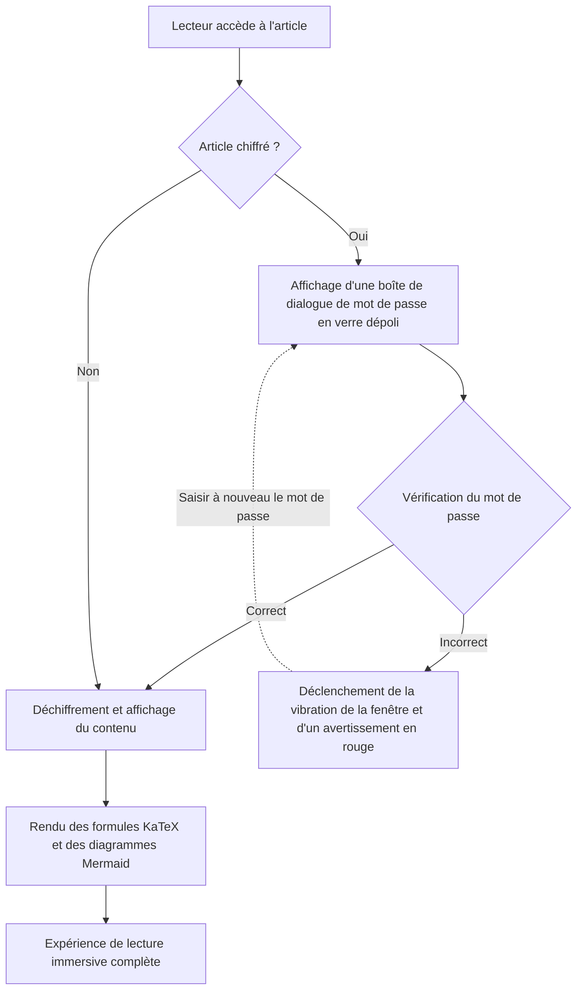
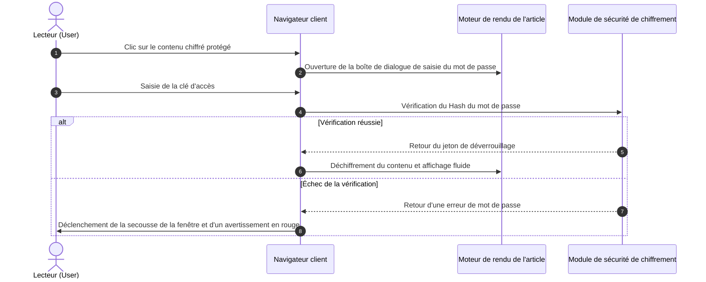

# Guide panoramique des générateurs de sites statiques (SSG) et des formats de contenu de thème

Dans les projets modernes de générateurs de sites statiques (SSG) et de thèmes de blogs indépendants, **la capacité d'analyse et de rendu des formats de contenu des articles** détermine directement les limites d'expression des créateurs et l'expérience de lecture des lecteurs.

Ce guide combine les normes de contenu de l'écosystème SSG majeur (**Hugo, Jekyll, Eleventy, Astro, Pelican, Hexo, WordPress, VitePress**, etc.), établissant un système panoramique couvrant **Markup de base, langages de documentation étendus, formats de publication WordPress, commutateurs déroulants interactifs, accordéons pliants, formules mathématiques LaTeX, diagrammes Mermaid et fonctionnalités de chiffrement/déchiffrement spécifiques**, et fournit des démonstrations de rendu en direct prêtes à l'emploi.

---

## 1. Résumé des formats de contenu supportés et de l'écosystème des générateurs de sites statiques (SSG) majeurs

Les différents générateurs de sites statiques ont des philosophies de sélection différentes dans leur architecture d'analyse de contenu. Le tableau ci-dessous résume systématiquement le support natif et étendu des divers formats par les moteurs majeurs :

| Générateur de sites statiques / Plateforme | Moteur d'analyse principal | Formats natifs intégrés | Formats supportés par extensions / outils externes | Support de sérialisation Front Matter |
| :--- | :--- | :--- | :--- | :--- |
| **Hugo** | Goldmark (Go) | `.md` (CommonMark/GFM), `.html`, `.org` (Org-mode) | `.adoc` (Asciidoctor), `.rst` (rst2html), `.pdc` (Pandoc) | YAML (`---`), TOML (`+++`), JSON (`{}`) |
| **Astro (l'architecture de ce blog)** | Vite + Unified/Remark + MDX | `.md` (GFM), `.mdx` (JSX), `.html`, `.astro` 组件 | Extensions AST Loader montables pour Org/AsciiDoc/RST | YAML, TOML, JSON |
| **Jekyll** | Kramdown (Ruby) | `.md` (Kramdown/GFM), `.html` | `.textile` (plugin Textile) | YAML |
| **Eleventy (11ty)** | Pipeline de templates JavaScript | `.md`, `.html`, `.liquid`, `.njk`, `.ejs`, `.webc` | MDX (plugin), extensions de template personnalisées | YAML, JSON, JS/11tydata |
| **Hexo** | Marked / Hexo-Renderer | `.md` (GFM), `.html`, EJS/Pug 模板 | Org-mode / Pandoc (support plugin) | YAML, JSON |
| **Pelican** | Python Docutils | `.md` (Markdown), `.rst` (reStructuredText) | `.asciidoc` (Asciidoctor) | YAML, Markdown Metadata |
| **WordPress (Headless/Thème)** | Gutenberg Block Engine | HTML5 Blocks, Shortcodes, Post Formats | Classic Editor HTML | JSON metadata de bloc / Post Meta |
| **VitePress / Docusaurus** | Markdown-It / MDX | `.md`, `.mdx`, Vue/React 组件 | Syntaxe de conteneur personnalisée (::: tip) | YAML |

> [!NOTE]
> **Perspectives sur l'architecture de l'écosystème** : Hugo, grâce au support natif de la concurrence élevée du langage Go, prend en charge Markdown et Org-mode ; tandis que le SSG front-end moderne représenté par **Astro** utilise la capacité **MDX et les îlots de composants (Islands)** pour intégrer de manière transparente des interfaces utilisateur interactives dynamiques (telles que le commutateur déroulant, la fenêtre de mot de passe, le disque vinyle présentés dans cet article) dans le texte, offrant une flexibilité ultime.

---

## 2. Spécifications de support des formats de sérialisation Front Matter

Les métadonnées (Front Matter) de l'en-tête d'un article de blog déterminent le routage, le titre, la date, la catégorie, la couverture et l'état de protection de l'article. Ce thème prend en charge tous les modes de sérialisation principaux :

### 1. Format YAML (le plus utilisé, recommandé par défaut)

```yaml
---
title: "文章标题"
pubDate: 2026-08-28
author: "shijianus"
tags: ["Astro", "Markdown"]
featured: true
postFormat: "aside"
---
```

### 2. Format TOML (couramment utilisé par Hugo)

```toml
+++
title = "文章标题"
pubDate = 2026-08-28T00:00:00Z
author = "shijianus"
tags = ["Astro", "Markdown"]
featured = true
+++
```

### 3. Format JSON (scénarios API-driven et Headless)

```json
{
  "title": "文章标题",
  "pubDate": "2026-08-28T00:00:00.000Z",
  "author": "shijianus",
  "tags": ["Astro", "Markdown"],
  "featured": true
}
```

---

## 3. Comparaison et correspondance de migration entre les Markup légers spéciaux et les formats non Markdown

Dans différentes piles technologiques, les auteurs peuvent utiliser d'autres langages de balisage léger en plus de Markdown. Ci-dessous, les caractéristiques syntaxiques des formats majeurs et leur rendu équivalent dans ce thème sont présentés :

### 1. AsciiDoc (.adoc / .asciidoc)

AsciiDoc est couramment utilisé dans les livres techniques et les manuels d'ingénierie volumineux, disposant d'un système de blocs d'astuce et de propriétés extrêmement riche :

```asciidoc
// AsciiDoc 源码语法
= AsciiDoc 技术规范
:author: shijianus
:toc: macro

[NOTE]
====
这是一条 AsciiDoc 风格的注意卡片。
====

[cols="1,2,1", options="header"]
|===
| 模块 | 描述 | 状态
| 核心引擎 | Astro 6 静态管线 | 已就绪
|===
```

**Écriture équivalente en Markdown / MDX dans ce thème** :

> [!NOTE]
> Ceci est une carte d'astuce équivalente rendue nativement dans le thème Astro, avec un style et une interaction entièrement alignés.

| Module | Description | Statut |
| :--- | :--- | :---: |
| **Moteur principal** | Pipeline statique Astro 6 | Prêt |

---

### 2. Emacs Org-Mode (.org)

Org-mode est un outil puissant pour les utilisateurs d'Emacs pour la gestion des connaissances, le suivi des tâches et la rédaction de documents :

```ini
#+TITLE: Emacs Org-Mode 实践笔记
#+DATE: 2026-08-28
#+TAGS: Emacs OrgMode

* TODO 第一阶段：Markdown 扫描增强 [1/2]
- [X] 修复表格与移动端溢出
- [ ] 补全 Org-mode 语法转换器

#+BEGIN_QUOTE
“Org-mode 不仅是格式，更是一种可执行的思维工作流。”
#+END_QUOTE
```

**Présentation standard de la liste de tâches GFM statique dans ce thème (en lecture seule)** :

- [x] Corriger le débordement des tableaux et du mobile
- [ ] Compléter le convertisseur de syntaxe Org-mode

> [!QUOTE]
> “Org-mode n'est pas seulement un format, c'est aussi un flux de travail de pensée exécutable.”

<!-- context from previous chunk -->
一种可执行的思维工作流。”
#+END_QUOTE
```

**本主题中的标准静态 GFM 任务清单呈现（只读状态）**：

- [x] 修复表格与移动端溢出
- [ ] 补全 Org-mode 语法转换器

> [!QUOTE]
> “Org-mode 不仅是格式，更是一种可执行的思维工作流。”
<!-- end context -->

#### 可交互式任务清单与联动进度条（Interactive Tutorial Checklist & Chained Progression）

在技术教程、实战演练与部署指南中，传统的只读 `[ ]` 任务清单无法直观交互与记忆。本主题特别增设了**支持实时勾选与连锁状态联动的可交互清单（`.article-task-tracker`）**。读者每勾选一项，动态进度条将实时重新计算百分比，当全部关键步骤确认完毕后，还将**自动连锁解锁下游就绪指令**，非常适合用作教程的通关检查表：

<div class="article-task-tracker" data-storage-key="content-format-tutorial-demo">
  <div class="task-tracker__header">
    <div class="task-tracker__title">
      <svg width="20" height="20" viewBox="0 0 24 24" fill="none" stroke="currentColor" stroke-width="2"><path d="M9 11l3 3L22 4"/><path d="M21 12v7a2 2 0 0 1-2 2H5a2 2 0 0 1-2-2V5a2 2 0 0 1 2-2h11"/></svg>
      <span>静态站点工程化上线部署前置检查清单（可交互实时打勾）</span>
    </div>
    <span class="task-tracker__count">1/4 步骤已完成 (25%)</span>
  </div>
  <div class="task-tracker__bar-wrap">
    <div class="task-tracker__fill" style="width: 25%;"></div>
  </div>
  <ul class="task-checklist">
    <li class="task-checklist-item is-done">
      <input type="checkbox" checked id="chk-step-1" />
      <div class="task-item-body">
        <label for="chk-step-1" class="task-item-label">步骤 1：完成本地代码全量备份与 Git Commit</label>
        <div class="task-item-desc">确认当前工作树干净，备份 Hash 记录至开发审计日志。</div>
      </div>
    </li>
    <li class="task-checklist-item">
      <input type="checkbox" id="chk-step-2" />
      <div class="task-item-body">
        <label for="chk-step-2" class="task-item-label">步骤 2：配置 Cloudflare Pages 静态构建管线</label>
        <div class="task-item-desc">设置 <code>BLOG_BUILD_TARGET=static</code> 与 Node.js 20+ 运行时环境。</div>
      </div>
    </li>
    <li class="task-checklist-item">
      <input type="checkbox" id="chk-step-3" />
      <div class="task-item-body">
        <label for="chk-step-3" class="task-item-label">步骤 3：验证媒体资源与外部视频/音频内嵌</label>
        <div class="task-item-desc">确保所有音频与视频单文件体积严格控制在 25MB 以内，满足 CDN 部署规范。</div>
      </div>
    </li>
    <li class="task-checklist-item">
      <input type="checkbox" id="chk-step-4" />
      <div class="task-item-body">
        <label for="chk-step-4" class="task-item-label">步骤 4：执行 Playwright 自动化视觉回归与烟测</label>
        <div class="task-item-desc">验证 PC 端与移动端多分辨率下所有富媒体卡片与交互组件排版正常。</div>
      </div>
    </li>
  </ul>
  <div class="task-tracker__status-card is-pending">
    <div class="status-card__header">
      <span class="badge badge-warning">⏳ 待办就绪中</span>
      <span style="font-weight:700;">当前进度：1/4 (25%)</span>
    </div>
    <p style="margin-top:0.4rem;margin-bottom:0;font-size:0.88rem;line-height:1.6;">请依次完成上方清单中打勾的每个步骤；当所有任务完成后，此处将实时连锁解锁生产发布指令。</p>
  </div>
</div>

---

### 3. reStructuredText (.rst)

reStructuredText 是 Python 社区（如 Sphinx、ReadTheDocs）的标准文档格式：

```rst
.. reStructuredText 源码语法
.. note::
   这是一条 RST 指令定义的 Note 块。

.. code-block:: python
   :linenos:

   def greet(name: str) -> str:
       return f"Hello, {name}!"
```

**本主题中的 Markdown 等效呈现**：

> [!NOTE]
> 这是在 Astro 中以 GitHub Alert 规范呈现的 RST Note 等价卡片。

```python
def greet(name: str) -> str:
    return f"Hello, {name}!"
```

---

### 4. Textile 语法

Textile 是老牌轻量级标记语言（常见于 Redmine 与早期 Jekyll 博客）：

```markdown
h2. 章节标题
bq. 这是 Textile 引用块内容。
*列表项 1*
_斜体强调文本_
```

---

## 四、WordPress 风格文章形态（Post Formats）全量实装与视觉呈现

WordPress 主题生态中经典的 **Post Formats** 机制允许博客针对不同类型的内容展现专属的视觉形态。我们在本主题正文栏中完整实现了这 9 种形态：

### 1. `aside`（轻语 / 便签 / 随笔卡片）

适合记录短小的思考灵感、备忘提醒或临时笔记：

<div class="article-aside">
  <p><strong>💡 随笔备忘</strong>：静态站点的真正价值不在于炫技，而在于交付极速、零服务端维护负担的纯粹阅读体验。即便经过五年、十年，生成的 HTML 文件依然可以完美打开。</p>
</div>

---

<!-- context from previous chunk -->
临时笔记：

<div class="article-aside">
  <p><strong>💡 随笔备忘</strong>：静态站点的真正价值不在于炫技，而在于交付极速、零服务端维护负担的纯粹阅读体验。即便经过五年、十年，生成的 HTML 文件依然可以完美打开。</p>
</div>

---
<!-- end context -->

### 2. `status`（状态动态 / 碎碎念 / 微语录）

类似 Twitter/微博风格的即时状态发布卡片，包含作者头像、客户端标识与心情标签：

<div class="article-status">
  <div class="article-status__header">
    <div class="article-status__user">
      
      <div>
        <div class="article-status__name">shijianus</div>
        <div class="article-status__meta">发布于 2026-08-28 14:32 · 🇨🇳 杭州</div>
      </div>
    </div>
    <div class="article-status__badge">
      <span>📱 来自 极客工坊 Mac Studio</span>
    </div>
  </div>
  <p class="article-status__content">
    今天终于完成了博客主内容栏的全部格式扩展与视觉重构！从 KaTeX、Mermaid 到交互式下拉框与黑胶唱片，全栈静态交付的感觉太棒了 🚀✨
  </p>
</div>

---

### 3. `quote`（精选引言 / 名言大卡片）

用于展现极具分量的人物语录、设计箴言或金句：

<div class="article-quote">
  <div class="article-quote__icon">“</div>
  <div class="article-quote__body">
    Simplicity is prerequisite for reliability. (简单是可靠的前提条件。)
  </div>
  <div class="article-quote__author">
    
    <div class="article-quote__author-info">
      <div class="article-quote__author-name">Edsger W. Dijkstra</div>
      <div class="article-quote__author-title">计算机科学家 · 图灵奖得主 (1972)</div>
    </div>
  </div>
</div>

---

### 4. `gallery`（图片画廊 / 自适应相册与拍立得网格）

支持多列自适应响应式网格与具有人文质感的拍立得相纸卡片，点击任意图片均可触发全屏灯箱放大：

#### 2 列与 3 列自适应画廊

<div class="article-gallery">
  <div class="gallery-grid gallery-grid-3">
    <div class="gallery-item">
      
      <div class="gallery-item__caption">极客工作台全景</div>
    </div>
    <div class="gallery-item">
      
      <div class="gallery-item__caption">系统架构设计大屏</div>
    </div>
    <div class="gallery-item">
      
      <div class="gallery-item__caption">星河漫游视觉封面</div>
    </div>
  </div>
</div>

#### 拍立得相纸画廊（Polaroid Style）

<div class="gallery-polaroid">
  <div class="polaroid-card">
    
    <div class="polaroid-card__caption">2026.04 杭州·研发基地</div>
  </div>
  <div class="polaroid-card">
    
    <div class="polaroid-card__caption">2026.08 架构演进重构夜</div>
  </div>
</div>

---

### 5. `video`（自适应视频播放卡片）

支持 16:9 响应式比例、圆角边框与底栏说明，单行独占一个完整横位展示。兼容 Bilibili、YouTube 外部代理式嵌入及站内原生 MP4（单文件均控制在 25MB 以内，满足 Cloudflare Pages 静态部署规范）：

#### 外部视频内嵌（Bilibili & YouTube 连结代理式嵌入 · 默认需读者翻到此处并点击开始播放）

<div class="video-embed-card" data-video-type="bilibili">
  <iframe src="https://player.bilibili.com/player.html?bvid=BV11k4y1T7kS&page=1&high_quality=1&danmaku=0&autoplay=0" allowfullscreen="true" loading="lazy" allow="accelerometer; autoplay; clipboard-write; encrypted-media; gyroscope; picture-in-picture; web-share" sandbox="allow-top-navigation-by-user-activation allow-same-origin allow-forms allow-scripts allow-popups"></iframe>
  <div class="embed-caption">🎬 Bilibili 外部内嵌演示：BV11k4y1T7kS (1080P 高清 · 需翻至此处并点击播放)</div>
</div>

<div class="video-embed-card" data-video-type="youtube">
  <iframe src="https://www.youtube-nocookie.com/embed/LXb3EKWsInQ?autoplay=0&rel=0" allowfullscreen="true" loading="lazy" allow="accelerometer; autoplay; clipboard-write; encrypted-media; gyroscope; picture-in-picture; web-share"></iframe>
  <div class="embed-caption">🎬 Démonstration d'intégration externe YouTube : Costa Rica 4K 60fps HDR (1080P/4K · URL réel et valide · Veuillez traduire ici et cliquer pour lire)</div>
</div>

#### Vidéo MP4 native intégrée sur le site (Lecteur HTML5 natif · Support de vitesse et picture-in-picture · Téléchargement désactivé par défaut)

<div class="video-embed-card">
  <video controls controlsList="nodownload" preload="metadata" playsinline oncontextmenu="return false;">
    <source src="/media/video/landscape_compressed.mp4" type="video/mp4" />
    您的浏览器不支持 HTML5 视频播放。
  </video>
  <div class="embed-caption">🎥 Vidéo native intégrée locale 1 : démonstration de paysages ultra haute définition 4K/1080P (Taille 21,7 MB · Support de vitesse et picture-in-picture · Téléchargement direct désactivé)</div>
</div>

<div class="video-embed-card">
  <video controls controlsList="nodownload" preload="metadata" playsinline oncontextmenu="return false;">
    <source src="/media/video/blue_archive_miracle.mp4" type="video/mp4" />
    您的浏览器不支持 HTML5 视频播放。
  </video>
  <div class="embed-caption">🎥 Vidéo native intégrée locale 2 : 【蔚蓝档案】“奇迹的终始—我们的故事由我们来决定！” (Taille 23,3 MB · Support de vitesse et picture-in-picture · Téléchargement direct désactivé)</div>
</div>

---

### 6. `audio` (Carte de musique à vinyle tournant)

Contrôleur audio HTML5 intégré, déclenchant automatiquement un effet de rotation fluide et sans interruption du disque vinyle lors de la lecture. Toutes les couvertures de disques utilisent des couvertures d'album officielles en haute définition, supportant plusieurs formats audio populaires (FLAC sans perte, MP3 haute bande passante, AAC/M4A), et disposent déjà d'une protection anti-crawling et anti-téléchargement :

#### ① Shaun - Way Back Home (FLAC sans perte · 24,55 MB)

<div class="article-audio-card">
  <div class="audio-card__cover">
    
  </div>
  <div class="audio-card__info">
    <div class="audio-card__title">
      <span>Way Back Home</span>
      <span class="badge badge-purple">FLAC sans perte</span>
    </div>
    <div class="audio-card__author">Shaun (숀) · Audio sans perte (FLAC / 44.1kHz 16-bit 961 kbps)</div>
    <audio controls preload="metadata" controlsList="nodownload" oncontextmenu="return false;" src="/media/audio/WayBackHome.flac"></audio>
  </div>
</div>

#### ② ヨルシカ (Yorushika) - 彼女は旅に出る (MP3 320 Kbps haute définition · 8,41 MB)

<div class="article-audio-card">
  <div class="audio-card__cover">
    
  </div>
  <div class="audio-card__info">
    <div class="audio-card__title">
      <span>彼女は旅に出る (She Leaves on a Journey)</span>
      <span class="badge badge-success">320 Kbps MP3</span>
    </div>
    <div class="audio-card__author">ヨルシカ (Yorushika) · Stéréo haute définition (MP3 / 48kHz 320 kbps)</div>
    <audio controls preload="metadata" controlsList="nodownload" oncontextmenu="return false;" src="/media/audio/彼女は旅に出る.mp3"></audio>
  </div>
</div>

#### ③ すこっぷ feat. 初音ミク - アイロニ (M4A / AAC format · 7,63 MB)

<div class="article-audio-card">
  <div class="audio-card__cover">
    
  </div>
  <div class="audio-card__info">
    <div class="audio-card__title">
      <span>アイロニ (Irony / Ironie)</span>
      <span class="badge badge-cyan">M4A / AAC</span>
    </div>
    <div class="audio-card__author">すこっぷ feat. 初音ミク · Audio AAC (M4A / 44.1kHz 260 kbps)</div>
    <audio controls preload="metadata" controlsList="nodownload" oncontextmenu="return false;" src="/media/audio/アイロニ.m4a"></audio>
  </div>
</div>

### 7. `link` (Liens externes et cartes d'aperçu de signets / Bookmark Preview)

Fournit un aperçu élégant sous forme de cartes pour les sources de référence clés au sein de l'article :

<a class="article-bookmark" href="https://github.com/shijianus/shijianus-blog" target="_blank" rel="noopener">
  <div class="article-bookmark__content">
    <div class="article-bookmark__title">EpoCanvas / shijianus-blog (Dépôt de spécifications de conception du thème de blog de shijianus)</div>
    <p class="article-bookmark__desc">EpoCanvas (Toile des Époques) est un système d'architecture de contenu de blog geek moderne, axé sur la présentation d'informations à haute densité, les micro-interactions élégantes et la prise en charge de tous les formats.</p>
    <div class="article-bookmark__site">
      <span class="badge badge-primary">GitHub</span>
      <span>github.com · Spécifications principales d'EpoCanvas</span>
    </div>
  </div>
  <div class="article-bookmark__icon">
    <svg viewBox="0 0 24 24" width="24" height="24" fill="none" stroke="currentColor" stroke-width="2" stroke-linecap="round" stroke-linejoin="round"><path d="M18 13v6a2 2 0 0 1-2 2H5a2 2 0 0 1-2-2V8a2 2 0 0 1 2-2h6"/><polyline points="15 3 21 3 21 9"/><line x1="10" y1="14" x2="21" y2="3"/></svg>
  </div>
</a>

---

### 8. `chat` (Flux de dialogue en bulles de chat / Organic Animated Dialogue Stream)

Utilisé pour démontrer de manière vivante les soutenances techniques, les discussions à deux ou les scénarios d'entretiens utilisateurs. Prend en charge les bulles gauche/droite, le code en ligne, la personnalisation des couleurs ainsi que **l'animation de frappe adaptative au contenu, les effets sonores synthétisés via Web Audio et les avatars dynamiques (`footer_mini_logo__media`)** :
* **Mode statique (par défaut)** : `<div class="article-chat">` maintient une présentation purement statique et légère, sans aucune surcharge JavaScript ;
* **Activation de la démonstration dynamique (contrôle par paramètre)** : en configurant `data-animate="true"` (ou `class="article-chat is-animated"`), le système déclenchera automatiquement, lorsque le lecteur fera défiler la page pour la première fois jusqu'à ce que cet élément entre dans le viewport, une animation de frappe réaliste basée sur la longueur des caractères et des rythmes aléatoires naturels, accompagnée de sons de notification spécifiques à gauche et à droite ;
* **Chronologie dynamique non mécanique (Content-Length Aware Timing)** : le système détermine intelligemment la durée de l'indicateur de frappe en fonction de la longueur de la réplique (clignotement de 380 ms pour les phrases courtes, frappe et réflexion de 1000 ms+ pour les paragraphes techniques longs), et insère des pauses naturelles entre les bulles conformes au jugement de lecture humaine, ainsi que de légères variations de fréquence sonore ;
* **Prise en charge des avatars vidéo dynamiques (`footer_mini_logo__media`)** : les avatars prennent en charge l'intégration de micro-vidéos MP4 animées et d'une image d'affiche statique de secours ;
* **Déclenchement unique et garantie de rechargement** : après le premier déclenchement lors du défilement, le système se verrouille automatiquement ; les défilements répétés ultérieurs ne déclencheront pas à nouveau l'animation, évitant ainsi de perturber la lecture ; le système ne sera réinitialisé que lorsque l'utilisateur rafraîchira la page (F5) ; une barre de micro-commandes est également fournie en haut à droite, avec « ↺ Rejouer » et « 🔊/🔇 Bascule du son ».

<div class="article-chat" data-animate="true" data-sound="true">
  <div class="chat-message chat-left">
    <span class="chat-avatar footer_mini_logo__media">
      <video autoplay muted loop playsinline preload="metadata" poster="/media/shijianus/avatar.jpg" aria-hidden="true">
        <source src="/media/shijianus/avatar-dynamic.mp4" type="video/mp4" />
      </video>
      
    </span>
    <div class="chat-body">
      <div class="chat-author">Développeur <a href="https://github.com/LeonBoven" target="_blank" rel="noopener noreferrer">Léon Boven</a> · 10:15</div>
      <div class="chat-bubble">
        Bonjour ! Est-ce que l'implémentation du rendu statique de <code>KaTeX</code> et <code>Mermaid</code> dans Astro ne ralentirait pas le chargement de la page côté front-end ?
      </div>
    </div>
  </div>

  <div class="chat-message chat-right">
    
    <div class="chat-body">
      <div class="chat-author">Architecte <a href="https://github.com/shijianus" target="_blank" rel="noopener noreferrer">shijianus</a> · 10:16</div>
      <div class="chat-bubble">
        Absolument pas ! Car <code>remark-math</code> et <code>rehype-katex</code> compilent les formules en chaînes HTML/MathML pures dès la phase de construction (Build-time), ce qui signifie <strong>0 charge d'exécution JavaScript</strong> côté navigateur ; et les diagrammes Mermaid sont également chargés de manière asynchrone et à la demande en modules ESM, ce qui rend le premier écran extrêmement léger ! ⚡
      </div>
    </div>
  </div>

<!-- context from previous chunk -->
> 在构建期（Build-time）就已经把公式编译成了纯 HTML/MathML 字符串，浏览器端 <strong>0 JS 运行时负担</strong>；而 Mermaid 图表也是动态按需异步加载 ESM 模块，首屏极其轻快！⚡
      </div>
    </div>
  </div>
<!-- end context -->

<div class="chat-message chat-left">
    <span class="chat-avatar footer_mini_logo__media">
      <video autoplay muted loop playsinline preload="metadata" poster="/media/shijianus/avatar.jpg" aria-hidden="true">
        <source src="/media/shijianus/avatar-dynamic.mp4" type="video/mp4" />
      </video>
      
    </span>
    <div class="chat-body">
      <div class="chat-author">开发者 <a href="https://github.com/LeonBoven" target="_blank" rel="noopener noreferrer">Léon Boven</a> · 10:17</div>
      <div class="chat-bubble">
        太棒了！那我们在 Markdown 里直接写架构时序图和交互式单位换算器也是开箱即用的对吧？
      </div>
    </div>
  </div>

  <div class="chat-message chat-right">
    
    <div class="chat-body">
      <div class="chat-author">架构师 <a href="https://github.com/shijianus" target="_blank" rel="noopener noreferrer">shijianus</a> · 10:18</div>
      <div class="chat-bubble">
        对的！不仅双击放大与高清 SVG 导出已全量具备，单位换算器更是接入了<strong>实时联网外汇牌价同步</strong>与<strong>基准单位下拉切换</strong>，而且保证固定质量单位完整对称表达，所有度量均经过严谨测试！🚀
      </div>
    </div>
  </div>

  <div class="chat-message chat-left">
    <span class="chat-avatar footer_mini_logo__media">
      <video autoplay muted loop playsinline preload="metadata" poster="/media/shijianus/avatar.jpg" aria-hidden="true">
        <source src="/media/shijianus/avatar-dynamic.mp4" type="video/mp4" />
      </video>
      
    </span>
    <div class="chat-body">
      <div class="chat-author">开发者 <a href="https://github.com/LeonBoven" target="_blank" rel="noopener noreferrer">Léon Boven</a> · 10:19</div>
      <div class="chat-bubble">
        收到！这个交互手感与根据消息长短变化的打字动画非常自然，我这就把团队的技术文档库升级上来！🎉
      </div>
    </div>
  </div>

  <div class="chat-message chat-right">
    
    <div class="chat-body">
      <div class="chat-author">架构师 <a href="https://github.com/shijianus" target="_blank" rel="noopener noreferrer">shijianus</a> · 10:20</div>
      <div class="chat-bubble">
        欢迎体验！后续如果遇到任何格式扩展或定制需求，随时在讨论区或 GitHub 交流探讨~ ✨
      </div>
    </div>
  </div>
</div>

---

## 五、特殊的下拉框格式与动态交互组件（Dropdown Selectors & Interactive Formats）

针对用户明确要求的**特殊下拉框格式**，我们在文章正文层提供了纯客户端即时响应的下拉选择器组件：

### 1. 多框架与多代码版本下拉切换器（Interactive Dropdown Switcher）

读者可以在下拉框中自由选择技术框架，正文面板将实时无刷新切换对应的内容与代码：

<!-- context from previous chunk -->
ats）

针对用户明确要求的**特殊下拉框格式**，我们在文章正文层提供了纯客户端即时响应的下拉选择器组件：

### 1. 多框架与多代码版本下拉切换器（Interactive Dropdown Switcher）

读者可以在下拉框中自由选择技术框架，正文面板将实时无刷新切换对应的内容与代码：
<!-- end context -->

<div class="article-dropdown-switcher">
  <div class="article-dropdown-switcher__header">
    <div class="article-dropdown-switcher__title">
      <svg width="20" height="20" viewBox="0 0 24 24" fill="none" stroke="currentColor" stroke-width="2"><rect x="3" y="3" width="18" height="18" rx="2"/><path d="M9 3v18"/><path d="m14 9 3 3-3 3"/></svg>
      <span>请选择要查看的前端框架实现代码：</span>
    </div>
    <select class="article-select dropdown-switcher__select">
      <option value="react-tab">⚛️ React 19 (Hooks & TSX)</option>
      <option value="vue-tab">🟢 Vue 3.5 (Composition API)</option>
      <option value="astro-tab">🚀 Astro 6 (Island Component)</option>
      <option value="svelte-tab">🟠 Svelte 5 (Runes)</option>
    </select>
  </div>
  <div class="article-dropdown-switcher__body">
    <div class="article-dropdown-panel is-active" data-panel="react-tab">
      <div class="article-dropdown-panel__title">⚛️ React 19 组件实现方式：</div>
      <pre class="no-code-enhance"><code class="language-tsx">import { useState } from 'react';
export function Counter() {
  const [count, setCount] = useState(0);
  return (
    &lt;button onClick={() =&gt; setCount((c) =&gt; c + 1)} className="btn-primary"&gt;
      React 点击计数：&#123;count&#125;
    &lt;/button&gt;
  );
}</code></pre>
    </div>
    <div class="article-dropdown-panel" data-panel="vue-tab">
      <div class="article-dropdown-panel__title">🟢 Vue 3.5 单文件组件实现方式：</div>
      <pre class="no-code-enhance"><code class="language-html">&lt;script setup lang="ts"&gt;
import { ref } from 'vue';
const count = ref(0);
&lt;/script&gt;
&lt;template&gt;
  &lt;button @click="count++" class="btn-primary"&gt;
    Vue 点击计数：&#123;&#123; count &#125;&#125;
  &lt;/button&gt;
&lt;/template&gt;</code></pre>
    </div>
    <div class="article-dropdown-panel" data-panel="astro-tab">
      <div class="article-dropdown-panel__title">🚀 Astro 6 零 JS 静态组件实现方式：</div>
      <pre class="no-code-enhance"><code class="language-astro">---
const { title = "Astro 极速群岛" } = Astro.props;
---
&lt;div class="astro-island"&gt;
  &lt;h3&gt;&#123;title&#125;&lt;/h3&gt;
  &lt;p&gt;默认交付 0KB JavaScript，按需注水交互！&lt;/p&gt;
&lt;/div&gt;</code></pre>
    </div>
    <div class="article-dropdown-panel" data-panel="svelte-tab">
      <div class="article-dropdown-panel__title">🟠 Svelte 5 Runes 实现方式：</div>
      <pre class="no-code-enhance"><code class="language-svelte">&lt;script lang="ts"&gt;
  let count = $state(0);
&lt;/script&gt;
&lt;button onclick={() =&gt; count++} class="btn-primary"&gt;
  Svelte 点击计数：&#123;count&#125;
&lt;/button&gt;</code></pre>
    </div>
  </div>
</div>

---

### 2. 交互式多品类通用单位换算器（Universal Interactive Unit Converter · 基准下拉切换与实时汇率）

支持用户在输入框中自由输入**任意基数数值**（默认值为 `1`，支持增减步进器与一键重置），并在不同品类（质量重量、国际汇率、数据存储、网络带宽、长度尺寸）之间即时无缝换算：
* **动态可切换换算基准（Base Unit Dropdown）**：输入框右侧的基准单位支持下拉自由选择（例如在质量中可选择 `kg`、`g`、`lb`、`斤`、`oz`、`t` 等；在汇率中可选择 `USD`、`HKD`、`CNY`、`EUR`、`JPY`、`GBP` 等）。选择任一基准单位后，目标换算网格将**智能自动排除当前基准单位（彻底杜绝 1kg=1kg 冗余卡片）**，并以当前基准为分母即时重算所有目标单位；
* **真实汇率波动联网接入（Live Forex API）**：切换至「💱 国际汇率」时，系统将自动异步请求服务端 `/api/exchange-rate` 并回退公共实时汇率接口，获取各大主流货币的最新实时牌价（右上角显示 `🟢 实时联网汇率已同步`）；在未联网或断网离线时自动无缝回退至内置基准比例（显示 `⚪ 离线基准汇率`），确保“实时”真正实时且离线体验坚如磐石；
* **通用 API 便捷调用**：系统同时在全局暴露了 `window.shijianusAPI.fetchExchangeRates(base)` 辅助函数，方便文档内的任何自定义脚本即时调用实时牌价数据；
* **快捷一键复制与等式推算**：每个换算卡片均提供一键复制按钮与高亮反馈，底部同步展示动态等式链推算摘要。

<div class="interactive-unit-converter" data-default="1" data-title="🔄 交互式通用单位换算器（支持基准单位切换与实时汇率）"></div>


### 3. Sélecteur déroulant de calcul des spécifications et du codage vidéo (Interactive Spec Calc Dropdown)

Lors de la sélection de différentes options, les indicateurs techniques correspondants et les explications de conversion s'affichent en temps réel sur la droite :

<div class="interactive-calc-select">
  <div class="article-select-box">
    <label>
      <svg width="18" height="18" viewBox="0 0 24 24" fill="none" stroke="currentColor" stroke-width="2"><circle cx="12" cy="12" r="10"/><path d="M12 6v6l4 2"/></svg>
      <span>Sélectionnez la résolution de codage vidéo :</span>
    </label>
    <select class="article-select">
      <option value="1080p" data-desc="1920 × 1080 @ 60fps · Débit binaire 6 000 Kbps · Bande passante recommandée 15 Mbps">1080P Full HD (1080p60)</option>
      <option value="2k" data-desc="2560 × 1440 @ 60fps · Débit binaire 12 000 Kbps · Bande passante recommandée 30 Mbps">2K Ultra HD (1440p60)</option>
      <option value="4k" data-desc="3840 × 2160 @ 60fps · Débit binaire 25 000 Kbps · Bande passante recommandée 60 Mbps">4K Ultra HD (2160p60 HDR)</option>
      <option value="8k" data-desc="7680 × 4320 @ 60fps · Débit binaire 80 000 Kbps · Bande passante recommandée 200 Mbps">8K Qualité cinéma (4320p60 AV1)</option>
    </select>
  </div>
  <div class="calc-output-box">
    <span>📊 <strong>Résultats du calcul des spécifications techniques</strong> :</span>
    <span class="calc-output-value">1920 × 1080 @ 60fps · Débit binaire 6 000 Kbps · Bande passante recommandée 15 Mbps</span>
  </div>
</div>

---

## VI. Accordéons, onglets et mise en page multicolonnes (Collapsibles, Tabs & Columns)

### 1. Groupe d'accordéons exclusifs (Exclusive Accordion Group · L'expansion d'un élément ferme automatiquement les autres)

Configurez `data-single="true"`. Lors de l'expansion d'un élément, les autres éléments ouverts du même groupe se ferment automatiquement, maintenant la page propre et focalisée :

<div class="article-accordion-group" data-single="true">
  <details class="article-accordion" open>
    <summary>
      <span>🔒 1. Avantages en matière de sécurité des sites statiques</span>
      <svg class="accordion-chevron" viewBox="0 0 24 24" fill="none" stroke="currentColor" stroke-width="2"><polyline points="9 18 15 12 9 6"/></svg>
    </summary>
    <div class="accordion-content">
      <p>Les sites statiques ne disposent pas de moteurs d'exécution dynamique traditionnels (PHP/Node.js) ni de bases de données SQL exposées sur Internet, les rendant physiquement immunisés contre les risques d'injection SQL et d'exécution de code à distance sur le serveur (RCE).</p>
    </div>
  </details>

  <details class="article-accordion">
    <summary>
      <span>⚡ 2. Distribution accélérée par CDN mondial aux nœuds périphériques</span>
      <svg class="accordion-chevron" viewBox="0 0 24 24" fill="none" stroke="currentColor" stroke-width="2"><polyline points="9 18 15 12 9 6"/></svg>
    </summary>
    <div class="accordion-content">
      <p>En déployant les artefacts compilés sur Cloudflare Pages ou GitHub Pages, toutes les ressources statiques peuvent être mises en cache sur plus de 300 nœuds périphériques dans le monde, avec un temps de réponse au premier octet (TTFB) généralement inférieur à 20 ms.</p>
    </div>
  </details>

  <details class="article-accordion">
    <summary>
      <span>💰 3. Coûts d'hébergement cloud extrêmement faibles</span>
      <svg class="accordion-chevron" viewBox="0 0 24 24" fill="none" stroke="currentColor" stroke-width="2"><polyline points="9 18 15 12 9 6"/></svg>
    </summary>
    <div class="accordion-content">
      <p>Les sites statiques n'ont pas besoin de faire fonctionner des serveurs cloud VPS coûteux 24h/24 et 7j/7. Couplés à une base de données Cloudflare D1 et à un système de commentaires Serverless en niveau gratuit, les coûts opérationnels quotidiens sont pratiquement nuls.</p>
    </div>
  </details>
</div>

---

### 2. Groupe d'accordéons indépendants non exclusifs (Multi-Expand / Non-Exclusive Accordion Group · Autorise l'expansion simultanée de plusieurs éléments)

Configurez `data-single="false"` (ou mode multi-ouverture par défaut). Les lecteurs peuvent librement développer plusieurs ou tous les éléments repliés pour une comparaison transversale et une lecture approfondie, sans que l'ouverture d'un nouvel élément ne ferme le contenu déjà affiché :

<div class="article-accordion-group" data-single="false">
  <details class="article-accordion" open>
    <summary>
      <span>🛠️ Module d'architecture A : Pipeline de compilation syntaxique Markdown AST</span>
      <svg class="accordion-chevron" viewBox="0 0 24 24" fill="none" stroke="currentColor" stroke-width="2"><polyline points="9 18 15 12 9 6"/></svg>
    </summary>
    <div class="accordion-content">
      <p>Basé sur l'architecture Unified, Remark-math et Rehype-katex, il convertit statiquement l'arbre syntaxique Markdown en nœuds HTML sémantiques standard lors de la phase de compilation, et finalise la coloration syntaxique et la génération de formules côté Node.js.</p>
    </div>
  </details>

<details class="article-accordion" open>
    <summary>
      <span>🎨 Module d'architecture B : Moteur visuel dynamique EpoCanvas et système adaptatif</span>
      <svg class="accordion-chevron" viewBox="0 0 24 24" fill="none" stroke="currentColor" stroke-width="2"><polyline points="9 18 15 12 9 6"/></svg>
    </summary>
    <div class="accordion-content">
      <p>Offre des fonds aurora (Aurora), des parallaxes de champ d'étoiles (Starfield), du glassmorphism et une adaptation aux points de rupture responsives multi-appareils, garantissant une expérience esthétique cohérente, que ce soit sur un écran large 4K ou un téléphone pliable.</p>
    </div>
  </details>

  <details class="article-accordion">
    <summary>
      <span>🛡️ Module d'architecture C : Système d'isolation sécurisée par niveaux WebCrypto SHA-256</span>
      <svg class="accordion-chevron" viewBox="0 0 24 24" fill="none" stroke="currentColor" stroke-width="2"><polyline points="9 18 15 12 9 6"/></svg>
    </summary>
    <div class="accordion-content">
      <p>Inclut le déblocage persistant de session de niveau 1, le masque dynamique polymorphe anti-espionnage de niveau 2 (flou gaussien / mosaïque / masque anti-spoiler), le verrouillage immédiat par sentinelle de viewport de niveau 3 et le schéma de chiffrement par fragments des URL externes, éliminant totalement l'exposition des mots de passe en clair dans le DOM.</p>
    </div>
  </details>
</div>

---

### 3. Onglets interactifs (Interactive Tabs)

<div class="article-tabs">
  <div class="article-tabs__nav">
    <button class="article-tabs__button is-active" type="button">pnpm</button>
    <button class="article-tabs__button" type="button">npm</button>
    <button class="article-tabs__button" type="button">yarn</button>
    <button class="article-tabs__button" type="button">bun</button>
  </div>
  <div class="article-tabs__panels">
    <div class="article-tabs__panel is-active">
      <pre class="no-code-enhance"><code class="language-bash">pnpm add @astrojs/mdx remark-math rehype-katex katex mermaid</code></pre>
    </div>
    <div class="article-tabs__panel">
      <pre class="no-code-enhance"><code class="language-bash">npm install @astrojs/mdx remark-math rehype-katex katex mermaid</code></pre>
    </div>
    <div class="article-tabs__panel">
      <pre class="no-code-enhance"><code class="language-bash">yarn add @astrojs/mdx remark-math rehype-katex katex mermaid</code></pre>
    </div>
    <div class="article-tabs__panel">
      <pre class="no-code-enhance"><code class="language-bash">bun add @astrojs/mdx remark-math rehype-katex katex mermaid</code></pre>
    </div>
  </div>
</div>

---

### 4. Système de mise en page en grille multi-colonnes (Multi-Column Grid)

#### Grille de cartes à 3 colonnes de largeur égale

<div class="article-grid article-grid-3">
  <div class="article-col-card">
    <h4>🎨 Système visuel</h4>
    <p>Intègre en profondeur l'esthétique de design geek moderne d'EpoCanvas, avec prise en charge du contraste élevé clair/sombre, des fonds en glassmorphism et des transitions de couleurs fluides.</p>
  </div>
  <div class="article-col-card">
    <h4>⚡ Ingénierie des performances</h4>
    <p>Architecture d'îlots statiques Astro 6, pré-rendu HTML à la compilation, optimisation SEO statique ultime.</p>
  </div>
  <div class="article-col-card">
    <h4>🛠️ Écosystème extensible</h4>
    <p>Prise en charge complète des formules KaTeX, des diagrammes Mermaid, des fenêtres modales chiffrées et de 9 formats de publication.</p>
  </div>
</div>

#### Grille latérale inégale 1:2

<div class="article-grid article-columns-1-2">
  <div class="article-col-card">
    <h4>📌 Positionnement architectural</h4>
    <p>Un support de rédaction technique moderne dédié aux geeks et aux ingénieurs.</p>
  </div>
  <div class="article-col-card">
    <h4>🚀 Garantie de livraison</h4>
    <p>Intègre des mécanismes complets de tests de fumée automatisés et de validation de la construction statique, garantissant une présentation impeccable sur tous les appareils, que ce soit pour les formules, les diagrammes ou les cartes complexes.</p>
  </div>
</div>

---

## VII. 13 types de boîtes d'avertissement sémantiques (Admonitions / GitHub Alerts)

Basé sur les normes GitHub Alert et EpoCanvas, prend en charge 13 types de cartes colorées à sémantique différente et permet le repliement par défaut à l'aide de la syntaxe `[!TYPE]-` :

> [!NOTE]
> **Remarque standard (Note)** : Il s'agit d'une information de contexte ou d'une explication standard.

> [!TIP]
> **Astuce pratique (Tip)** : Utilisez les raccourcis <kbd>Ctrl</kbd> + <kbd>K</kbd> pour invoquer rapidement le panneau de recherche global des articles !

> [!IMPORTANT]
> **Point important (Important)** : Avant le déploiement en production, veuillez vous assurer que la variable d'environnement `BLOG_BUILD_TARGET=static` est correctement injectée.

> [!WARNING]
> **Avertissement de risque (Warning)** : Ne commitez jamais les clés de base de données de production ou les clés privées de services cloud dans un dépôt Git public.

> [!CAUTION]
> **Alerte de danger (Caution)** : L'opération de reconstruction des tables de données est destructive, veuillez d'abord sauvegarder la base de données D1 !

> [!DANGER]
> **Danger critique (Danger)** : La suppression directe de la base de données de production entraînera la destruction permanente de tous les commentaires et des actifs des utilisateurs.

> [!SUCCESS]
> **Opération réussie (Success)** : Le processus de construction statique s'est terminé avec succès, les 47 routes statiques sont prêtes !

<!-- context from previous chunk -->
*：执行数据表重建操作具有破坏性，请先备份 D1 数据库！

> [!DANGER]
> **致命危险（Danger）**：直接删除生产数据库将导致全部评论与用户资产永久损毁。

> [!SUCCESS]
> **操作成功（Success）**：静态构建流程已成功完成，所有 47 个静态路由已就绪！
<!-- end context -->

> [!QUESTION]
> **疑难探讨（Question）**：如何在无服务端依赖的环境下实现毫秒级的纯客户端全文检索？

> [!QUOTE]
> **精选引用（Quote）**：“优秀的代码不仅能被机器执行，更能像诗歌一样优雅地向人类传达思想。”

> [!INFO]
> **详细信息（Info）**：本博客基于 Astro 6 与 Tailwind 4 构建，全站纯静态导出。

> [!TODO]
> **待办计划（Todo）**：计划在下一迭代中引入 WebAssembly 客户端全文检索索引。

> [!BUG]
> **缺陷记录（Bug）**：已修复旧版在极端窄屏设备下表格横向截断的排版问题。

> [!EXAMPLE]
> **范例说明（Example）**：以上所有告示框均自动适配深色与浅色模式的高对比度色彩。

### 折叠式告示框演示

> [!TIP]- 点击展开查看：生产环境 Nginx 极速缓存配置参考
> ```nginx
> location ~* \.(?:css|js|woff2?|svg|png|jpg|webp)$ {
>     expires 1y;
>     add_header Cache-Control "public, immutable";
>     access_log off;
> }
> ```

---

## 八、学术数学公式（KaTeX）、架构图表（Mermaid 11）与动态思维导图（Markmap）

在展示型与示例型技术文档中，以 **「实际渲染效果 + 对应源码对照」**（双标签选项卡 Tabs）为核心呈现理念，不仅能让读者直观体验最终视觉与交互特性，更能方便开发者一键参考、复制并迁移至实际项目中。

---

### 1. LaTeX 数学公式（KaTeX Math · 行内与块级多行推导）

#### 行内公式（Inline Formula）

<div class="article-tabs">
<div class="article-tabs__nav">
<button class="article-tabs__button is-active" type="button">🌟 渲染效果呈现</button>
<button class="article-tabs__button" type="button">💻 LaTeX 源码</button>
</div>
<div class="article-tabs__panels">
<div class="article-tabs__panel is-active">

质能方程 $E = mc^2$，欧拉恒等式 $e^{i\pi} + 1 = 0$，高斯积分 $\int_{-\infty}^{\infty} e^{-x^2} dx = \sqrt{\pi}$。

</div>
<div class="article-tabs__panel">

```latex
质能方程 $E = mc^2$，欧拉恒等式 $e^{i\pi} + 1 = 0$，高斯积分 $\int_{-\infty}^{\infty} e^{-x^2} dx = \sqrt{\pi}$。
```

</div>
</div>
</div>

#### 块级多行推导公式 1：二阶动态系统拉普拉斯变换（Block Math · Single Equation）

<div class="article-tabs">
<div class="article-tabs__nav">
<button class="article-tabs__button is-active" type="button">🌟 渲染效果呈现</button>
<button class="article-tabs__button" type="button">💻 LaTeX 源码</button>
</div>
<div class="article-tabs__panels">
<div class="article-tabs__panel is-active">

$$
\mathcal{L}\{\ddot{x}(t) + 2\zeta\omega_n\dot{x}(t) + \omega_n^2 x(t)\} = X(s)(s^2 + 2\zeta\omega_n s + \omega_n^2)
$$

</div>
<div class="article-tabs__panel">

```latex
$$
\mathcal{L}\{\ddot{x}(t) + 2\zeta\omega_n\dot{x}(t) + \omega_n^2 x(t)\} = X(s)(s^2 + 2\zeta\omega_n s + \omega_n^2)
$$
```

</div>
</div>
</div>

#### 块级多行推导公式 2：麦克斯韦经典电磁方程组（Block Math · Multi-line Aligned）

<div class="article-tabs">
<div class="article-tabs__nav">
<button class="article-tabs__button is-active" type="button">🌟 渲染效果呈现</button>
<button class="article-tabs__button" type="button">💻 LaTeX 源码</button>
</div>
<div class="article-tabs__panels">
<div class="article-tabs__panel is-active">

$$
\begin{aligned}
\nabla \cdot \mathbf{E} &= \frac{\rho}{\varepsilon_0} \\
\nabla \cdot \mathbf{B} &= 0 \\
\nabla \times \mathbf{E} &= -\frac{\partial \mathbf{B}}{\partial t} \\
\nabla \times \mathbf{B} &= \mu_0 \mathbf{J} + \mu_0 \varepsilon_0 \frac{\partial \mathbf{E}}{\partial t}
\end{aligned}
$$

</div>
<div class="article-tabs__panel">

```latex
$$
\begin{aligned}
\nabla \cdot \mathbf{E} &= \frac{\rho}{\varepsilon_0} \\
\nabla \cdot \mathbf{B} &= 0 \\
\nabla \times \mathbf{E} &= -\frac{\partial \mathbf{B}}{\partial t} \\
\nabla \times \mathbf{B} &= \mu_0 \mathbf{J} + \mu_0 \varepsilon_0 \frac{\partial \mathbf{E}}{\partial t}
\end{aligned}
$$
```

</div>
</div>
</div>

---

### 2. Mermaid 11 架构图表（Flowchart & Sequence · 流程图与时序图）

#### ① 博客加密验证与内容渲染流程图（Flowchart TD）

<div class="article-tabs">
<div class="article-tabs__nav">
<button class="article-tabs__button is-active" type="button">🌟 Présentation de l'effet de rendu</button>
<button class="article-tabs__button" type="button">💻 Code source Mermaid</button>
</div>
<div class="article-tabs__panels">
<div class="article-tabs__panel is-active">



</div>
<div class="article-tabs__panel">

````markdown

````

</div>
</div>
</div>

#### ② Diagramme de séquence de l'authentification et du déchiffrement côté client

<div class="article-tabs">
<div class="article-tabs__nav">
<button class="article-tabs__button is-active" type="button">🌟 Présentation de l'effet de rendu</button>
<button class="article-tabs__button" type="button">💻 Code source Mermaid</button>
</div>
<div class="article-tabs__panels">
<div class="article-tabs__panel is-active">



</div>
<div class="article-tabs__panel">

````markdown

````

</div>
</div>
</div>

---

### 3. Carte mentale interactive dynamique (Markmap / Mindmap · Diffusion de branches multidirectionnelles)

Dans l'élaboration de spécifications techniques volumineuses et l'analyse d'architectures système, les listes statiques traditionnelles peinent à présenter de manière intuitive les réseaux de connaissances complexes. Ce thème intègre entièrement le **moteur de cartes mentales interactives dynamiques Markmap**, permettant une analyse native complète et un renforcement de l'interactivité dans la colonne principale de l'article (`.post.post-page-shell`) :

> [!TIP]
> **Règles fondamentales de la diffusion de branches multidirectionnelles** :
> 1. **Espace de protection par défaut à bloc unique** : par défaut, la carte mentale n'affiche que **1 nœud racine central** (Niveau 1), accompagné d'un indicateur de point circulaire replié sur la droite ;
> 2. **Déploiement multidirectionnel au clic** : en cliquant sur le nœud racine ou sur le point circulaire d'un sous-nœud quelconque, les sous-branches se **déplient en douceur vers l'extérieur** ;
> 3. **Contrôle total via la barre d'outils** : prise en charge du **zoom avant / zoom arrière / centrage adaptatif / déploiement de tout / repli en bloc unique / lecture immersive plein écran / copie du code source** ;
> 4. **Glisser-déposer et zoom de la toile** : maintenir le bouton gauche de la souris permet de faire glisser et déplacer librement la toile, tandis que la molette de la souris permet de zoomer ou de dézoomer la vue.

#### Présentation d'une carte mentale vivante : Panorama de l'écosystème SSG et des formats de contenu du thème

<div class="article-tabs">
<div class="article-tabs__nav">
<button class="article-tabs__button is-active" type="button">🌟 Présentation de la carte interactive</button>
<button class="article-tabs__button" type="button">💻 Code source de la structure Mindmap</button>
</div>
<div class="article-tabs__panels">
<div class="article-tabs__panel is-active">

```mindmap
# Architecture de l'écosystème de contenu à formats multiples et des générateurs de sites statiques
## 1. Pipeline central de compilation statique
### Pipeline de transformation syntaxique AST
#### Pipeline de sémantique Markdown / MDX
##### Extensions de syntaxe Unified / Remark
- Conversion des tableaux GFM et de la syntaxe de texte barré
- Génération automatique d'ancres et d'ID pour les titres
##### Extension de carte mentale interactive multidirectionnelle Markmap
- Construction récursive de l'arbre AST (Transformer.transform)
- Mise en page hiérarchique élastique D3 (Algorithme Flextree)
- Machine à états de repli interactif (payload.fold)
- Coloration dynamique des branches par palette (d3.scaleOrdinal)
##### Extension de formules mathématiques Rehype Katex
- Analyse des formules en ligne et des blocs de formules indépendants
- Prise en charge des définitions de macros et tolérance aux erreurs avec retour arrière
#### Mise en surbrillance du code et shaders statiques
##### Compilateur à double thème Shiki
- Analyse des règles de syntaxe TextMate de VSCode
- Pré-rendu à double thème clair/sombre sans hydratation
### Compilateur et regroupement des ressources
#### Rechargement à chaud ultra-rapide Vite 6 (HMR)
##### Chargement natif de modules ESM
- Compilation et mise à jour à chaud en millisecondes
#### Pipeline de génération statique Rollup
##### Optimisation du regroupement statique
- Découpage intelligent du code (Code Splitting)
- Élimination des redondances par Tree-Shaking
## 2. Interactivité dynamique et système d'îlots
### Système d'îlots de composants hybrides Islands
#### Montage par îlot des composants côté client
##### Composants client React 19
- Isolation d'état indépendante et communication par contexte
- Maintien de l'état de session (SessionStorage / Crypto)
##### Îlots côté serveur Astro
- JS client zéro temps d'exécution (Zero-JS par défaut)
- Activation à la demande des îlots interactifs (client:visible)
### Système visuel et d'animations moderne
#### Moteur de rendu et fonds dynamiques
##### Aurores boréales / Champ d'étoiles
- Accélération matérielle WebGL / Canvas 2D
- Mode économie d'énergie et pause automatique lors de la sortie du viewport
##### Spécification de cartes en verre dépoli Glassmorphism
- Flou gaussien dynamique et ombres environnementales multiples
- Mise en page adaptative multi-plateformes (PC / Tablette / Mobile)
## 3. Panorama des formats et fonctionnalités spécifiques
### Correspondance des spécifications de documents étendus
#### Adaptation native équivalente AsciiDoc (.adoc)
#### Mappage des listes de tâches Emacs Org-Mode (.org)
#### Conversion des directives reStructuredText (.rst)
### Ensemble de composants riches en interactivité
#### Commutateur de menu déroulant interactif (Dropdown Switcher)
#### Cartes accordéon exclusives (Accordion Groups)
#### Lecteur audio vinyle dynamique (Vinyl Audio)
### Sécurité, confidentialité et chiffrement par niveaux
#### Vérification de hachage WebCrypto SHA-256 (sans exposition en clair)
#### Déverrouillage persistant de session niveau 1 (Session Persistent)
#### Bascule du masque anti-espionnage niveau 2 (Flou gaussien / Mosaïque / Masque anti-spoiler)
#### Verrouillage immédiat lors de la sortie du viewport niveau 3 (IntersectionObserver)


#### Isolation des points de terminaison de déchiffrement segmenté externe (Standalone Token)
```

</div>
<div class="article-tabs__panel">

````markdown
```mindmap
# 静态站点生成器与全格式内容生态架构
## 1. 静态编译核心流水线
### AST 语法转换管道
#### Markdown / MDX 语义解析流水线
##### Unified / Remark 语法拓展
- GFM 表格与删除线语法转换
- 自动生成 Heading 锚点与 ID
##### Markmap 交互式多向思维导图拓展
- 递归 AST 树构建 (Transformer.transform)
- D3 层次化弹性布局 (Flextree Algorithm)
- 交互式折叠状态机 (payload.fold)
- 动态调色板分支染色 (d3.scaleOrdinal)
##### Rehype Katex 数学公式拓展
- 行内公式与独立块公式解析
- 宏定义支持与错误容错回退
#### 代码高亮与静态着色器
##### Shiki 双主题编译器
- VSCode TextMate 语法规则解析
- 浅色/深色模式双主题预渲染零水合
### 编译器与资源打包
#### Vite 6 极速热重载 (HMR)
##### ESM 原生模块加载
- 毫秒级按需编译与热更新
#### Rollup 静态生成流水线
##### 静态打包优化
- 智能代码分块 (Code Splitting)
- Tree-Shaking 冗余消除
## 2. 动态交互与群岛体系
### 混合组件群岛 Islands
#### 客户端组件分岛挂载
##### React 19 Client Components
- 独立状态隔离与上下文通信
- 会话状态保持 (SessionStorage / Crypto)
##### Astro Server-Side Islands
- 零运行时客户端 JS (Zero-JS by Default)
- 按需激活交互岛屿 (client:visible)
### 现代视觉与动效系统
#### 动态背景与渲染引擎
##### Aurora 极光 / Starfield 星空
- WebGL / Canvas 2D 硬件加速
- 节能模式与视口离开自动暂停
##### 毛玻璃卡片 Glassmorphism 规范
- 动态高斯模糊与多重环境阴影
- 响应式全端自适应布局 (PC / Pad / Mobile)
## 3. 格式全景与特异功能
### 扩展文档规范对照
#### AsciiDoc (.adoc) 原生等效适配
#### Emacs Org-Mode (.org) 任务清单映射
#### reStructuredText (.rst) 指令转换
### 富交互组件集
#### 交互式下拉框切换器 (Dropdown Switcher)
#### 互斥手风琴折叠卡片 (Accordion Groups)
#### 动态黑胶唱片音频播放器 (Vinyl Audio)
### 安全隐私与分级加密
#### WebCrypto SHA-256 哈希校验 (无明文外露)
#### 1级会话持久解锁 (Session Persistent)
#### 2级防窥遮罩切换 (高斯模糊 / 马赛克 / 剧透遮罩)
#### 3级视口防窥离开即锁 (IntersectionObserver)
#### 外联分段解密端点隔离 (Standalone Token)
```
````

</div>
</div>
</div>

#### Normes de rédaction Markdown et référence syntaxique

Le **moteur de rendu Mindmap** intégré à ce blog repose sur une analyse récursive AST et une mise en page d'arbre élastique D3 Flextree. Il **prend nativement en charge une extension à profondeur infinie (Niveau 1 à Niveau N)**, sans aucune limite de profondeur. Lors de la rédaction d'un article, l'auteur peut choisir parmi les normes d'écriture suivantes en fonction de la complexité en profondeur de l'arborescence des connaissances :

##### 1. Syntaxe hybride en échelon (recommandé pour un squelette de 1 à 6 niveaux + dér

Afin d'éliminer définitivement l'exposition en clair des mots de passe dans les attributs du DOM (comme `data-password`, vulnérable à l'inspection des éléments), le système de contenu de ce blog a été entièrement mis à niveau vers la **vérification par hachage WebCrypto SHA-256 (`data-hash`)**, et un système de cryptage local à trois niveaux et de décryptage segmenté pour les liens externes a été établi :
* **Règle de réinitialisation sécurisée par défaut (Aucune persistance au rechargement)** : Par défaut, tout le contenu chiffré (niveaux 1, 2, 3 et portes de décryptage externe) **repassera automatiquement et fermement à l'état verrouillé après un rafraîchissement de la page (F5 / rechargement)**, éliminant ainsi complètement le risque de sécurité lié à la persistance de l'exposition après un rafraîchissement ;
* **Paramètre de persistance ouvert (`data-persist`)** : Pour répondre aux besoins d'ouverture de scénarios documentaires spécifiques, la stratégie de réinitialisation par défaut peut être remplacée par la configuration de paramètres :
  * `data-persist="session"` (ou `data-persist="true"`) : Maintient l'état déverrouillé entre les rafraîchissements pendant la durée de la session de l'onglet actuel ;
  * `data-persist="local"` : Mémorise de manière persistante l'état déverrouillé dans le stockage local du navigateur ;
  * Non configuré par défaut : Cycle de vie en mémoire pure, **réinitialisation sécurisée immédiate et verrouillage au rafraîchissement de la page**.

---

### 1. Chiffrement de niveau 1 : Chiffrement de base par page (Niveau 1 · Réinitialisation automatique au rafraîchissement)

La saisie d'une seule fois des identifiants d'accès permet de déverrouiller la lecture du corps du texte ; par défaut, la page se verrouille automatiquement et immédiatement après un rafraîchissement ; si un maintien entre les rafraîchissements est nécessaire, il est possible d'ajouter `data-persist="session"` à l'onglet :

<div class="article-encrypted-box" data-level="1" data-hash="d7fb6c64b9aa44cc0c3b427edaa623369dee1a9778329801f68fdaa34b09d351" data-hint="💡 Indication de chiffrement niveau 1 : Veuillez saisir shijianus2026 comme clé de démonstration (Vérification par hachage · Verrouillage automatique au rafraîchissement)">
  <div class="encrypted-box__lock">
    <div class="encrypted-box__level-tag"><span class="badge badge-success">🛡️ Chiffrement niveau 1 · Réinitialisation automatique au rafraîchissement</span> <span class="badge badge-cyan">Protection SHA-256</span></div>
    <div class="encrypted-box__icon">🔒</div>
    <div class="encrypted-box__title">Protection niveau 1 : Configuration de développement privée et actifs de code source</div>
    <div class="encrypted-box__desc">Cette zone est protégée par la stratégie de sécurité de niveau 1, le mot de passe utilise une vérification par hachage WebCrypto, sans exposition en clair ; la page se verrouillera automatiquement après un rafraîchissement.</div>
    <button class="encrypted-box__btn" type="button">🔑 Vérifier la clé pour déverrouiller le contenu</button>
  </div>
  <div class="encrypted-box__content">
    <div class="admonition admonition-success">
      <div class="admonition-title">
        <svg viewBox="0 0 24 24" fill="none" stroke="currentColor" stroke-width="2"><path d="M22 11.08V12a10 10 0 1 1-5.93-9.14"/><polyline points="22 4 12 14.01 9 11.01"/></svg>
        <span>🎉 Vérification de niveau 1 réussie ! La page actuelle est déverrouillée (verrouillage sécurisé automatique au rafraîchissement)</span>
      </div>
      <div class="admonition-content">
        <p><strong>Paramètres de l'environnement de développement principal déverrouillés :</strong></p>
        <ul>
          <li><code>DEPLOY_ENDPOINT</code> : <code>https://api.shijian.us/v2/deploy/core</code></li>
          <li><code>AUTH_SCOPE</code> : <code>read:articles, write:releases</code></li>
        </ul>
      </div>
    </div>
  </div>
</div>

---

### 2. Chiffrement de niveau 2 : Protection anti-espionnage par masque après décryptage (Niveau 2 · Protection par masque)

Après la réussite de la vérification, bien que le contenu soit décodé, il **entre automatiquement par défaut dans un état de masque anti-espionnage avec flou gaussien** (la barre de bascule n'est pas affichée par défaut, un survol de la souris permet une visualisation claire), offrant une protection efficace contre l'espionnage à courte distance.
- **Activation de la barre d'outils** : Configurer `data-allow-select="true"` pour activer la barre d'outils de bascule du masque, **la barre d'outils est par défaut également incluse dans le masque et protégée** (au survol de la souris, la barre d'outils et le corps du texte apparaissent clairement ensemble et peuvent être cliqués pour basculer) ; si la barre d'outils doit rester à l'extérieur du masque, il est possible de configurer `data-toolbar-masked="false"` ;
- **Spécification de la méthode de masquage** : Il est possible de forcer le mode de masque via `data-mask="blur|mosaic|spoiler|reveal"` ;
- **Barre de personnalisation** : Prend en charge la transmission de `data-mask-options="blur,mosaic"` dans les balises Markdown pour personnaliser rapidement les modes disponibles, ou l'écriture directe de la structure `<div class="encrypted-mask-toolbar">` dans le corps du texte, le système scannera et activera automatiquement la barre de personnalisation ;
- **Garantie de réinitialisation au rafraîchissement** : Par défaut, la page se verrouille automatiquement après un rafraîchissement.

kdown 标签中传入 `data-mask-options="blur,mosaic"` 快速定制可选模式，或直接在正文中书写 `<div class="encrypted-mask-toolbar">` 结构，系统会自动扫描并激活自定义设置栏；
- **刷新重置保障**：默认刷新页面后自动重锁。

<div class="article-encrypted-box" data-level="2" data-allow-select="true" data-hash="f31aafdcf42582306027026c37ee59c747be6e17258aa490c5bba32b93911c07" data-hint="💡 Indication de chiffrement de niveau 2 : pour la démonstration, entrez la clé epocanvas2026">
  <div class="encrypted-box__lock">
    <div class="encrypted-box__level-tag"><span class="badge badge-warning">🛡️ Niveau 2 de chiffrement · Mode masque anti-espionnage</span> <span class="badge badge-purple">Masque polymorphe dynamique</span></div>
    <div class="encrypted-box__icon">🛡️</div>
    <div class="encrypted-box__title">Niveau 2 de protection : données commerciales confidentielles et liste financière</div>
    <div class="encrypted-box__desc">Après décryptage, la protection par flou gaussien sera activée par défaut, le contenu ne sera visible qu'au survol ou au clic, ce qui protège efficacement contre les regards rapprochés ; la page se verrouille automatiquement après un rafraîchissement.</div>
    <button class="encrypted-box__btn" type="button">🔑 Vérifier le certificat et activer la visualisation anti-espionnage</button>
  </div>
  <div class="encrypted-box__content">
    <div class="admonition admonition-important">
      <div class="admonition-title">
        <svg viewBox="0 0 24 24" fill="none" stroke="currentColor" stroke-width="2"><path d="M12 2v20"/><path d="M17 5H9.5a3.5 3.5 0 0 0 0 7h5a3.5 3.5 0 0 1 0 7H6"/></svg>
        <span>📊 Paramètres financiers et contractuels clés du projet commercial</span>
      </div>
      <div class="admonition-content">
        <p>Voici la répartition du budget de soutien commercial EpoCanvas pour l'année 2026 :</p>
        <ul>
          <li><strong>Frais de licence d'entreprise privée</strong> : ¥ 280 000 / an (incluant un cluster haute disponibilité et la garantie SLA)</li>
          <li><strong>Dépenses de trafic CDN en périphérie</strong> : ¥ 36 500 / mois</li>
          <li><strong>Clé du conseiller technique dédié</strong> : <code>sec_corp_epocanvas_key_2026</code></li>
        </ul>
      </div>
    </div>
  </div>
</div>

---

### 3. Niveau 3 de chiffrement : verrouillage immédiat hors de la vue (Level 3 · Viewport Auto-Lock)

超高安全级别！**不写入任何持久化存储**；一旦解密后的内容在滚动中**离开当前屏幕视口**，或者浏览器标签页切换到后台，系统将**瞬间自动重新上锁**，再次查看必须重新输入密码：

<div class="article-encrypted-box" data-level="3" data-hash="0f67fcb3bceddb88ef917fa5cf73affc3490db

<!-- context from previous chunk -->
ad015a3bf4f1b2b0b822cd15d6c15b0f00a08"</code></pre>
      </div>
    </div>
  </div>
</div>

---

### 4. 外联分段加密（External Link Segment Decryption Gate）
<!-- end context -->

在构建期或架构分层时，同一篇文章可以被物理分割为**公开正文段**与**外联受控密文段**。创作者可在文末或章节任意位置插入外联解密引导门，验证凭据后动态解密并在此无缝挂载完整后半段正文：

<div class="article-external-decrypt-gate" data-hash="d7fb6c64b9aa44cc0c3b427edaa623369dee1a9778329801f68fdaa34b09d351" data-hint="🔑 外联分段密钥：请输入 shijianus2026">
  <div class="external-gate__header">
    <div class="external-gate__badge">
      <span class="badge badge-purple">🌐 外联安全分段加密</span>
      <span class="badge badge-cyan">端点分片存储</span>
      <span class="badge badge-success">WebCrypto SHA-256</span>
    </div>
    <h3 class="external-gate__title">🔐 正文深度章节已外联隔离存放</h3>
    <p class="external-gate__desc">当前长文在构建阶段启用了**外联分段隔离存储**：前 75% 基础语法与组件说明公开交付；核心企业级工程落地方案与架构推导演示已被加密打包存放。点击下方按钮输入密钥，即可在当前页面实时无缝解密并挂载剩余正文内容。</p>
  </div>
  <div class="external-gate__actions">
    <button type="button" class="external-gate__btn">🔑 输入凭据解密并挂载完整正文</button>
    <a href="#top" class="article-btn article-btn-outline external-gate__btn-alt">⬆️ 返回文章顶部</a>
  </div>
  <div class="external-gate__decrypted-payload">
    <div class="decrypted-payload-banner">
      <span class="badge badge-success">✨ 外联分段密文已成功验证解密，正文无缝挂载完成</span>
      <span class="payload-timestamp">SHA-256 Stream Verified</span>
    </div>
    <div class="decrypted-payload-body">
      <h4>📦 外联分段解密正文：企业级 SSG 内容工程落地规范</h4>
      <p>恭喜您成功解锁了本文的外联分段核心内容！在现代大型静态知识库工程中，将高敏感或付费特权内容采用外联分段加密存放，具有以下核心优势：</p>
      <ul>
        <li><strong>首屏负载极小化</strong>：未授权访问者仅拉取基础公开 HTML，网络开销减少 60% 以上；</li>
        <li><strong>防抓取与防逆向</strong>：敏感密文与密钥隔离存储，静态爬虫无法从公开 DOM 中抓取到任何有效数据；</li>
        <li><strong>无感流式接入</strong>：通过客户端 WebCrypto 引擎，读者在当前页面无需页面跳转即可享受无缝展开的连贯阅读体验。</li>
      </ul>
    </div>
  </div>
</div>

---

### 5. 行内高斯模糊、马赛克与剧透隐藏

除了块级加密外，正文行内亦提供丰富的轻量级防窥与趣味遮罩：

- **文字高斯模糊**：<span class="blur-text">这是一段被高斯模糊保护的关键剧透文字，鼠标悬浮或点击即可看清！</span>
- **黑幕马赛克**：<span class="mosaic-text">机密数据：SHA256-7f83b1657ff1fc53b92dc18148a1d65dfc2d4b1fa3d677284addd200126d9069</span>
- **Discord 剧透遮罩**：||这是一段使用双竖线包裹的剧透遮罩，点击揭开。||
- **内联隐藏锁**：%%这里是使用百分号包裹的内联隐藏内容，点击展开。%%

#### 图片高斯模糊保护

<div class="blur-image-wrap">
  
  <div class="blur-image-badge"><span>👁️ 悬浮或点击揭开迷雾</span></div>
</div>

---

## 十、时间轴、步骤条、定义列表与数据表格

### 1. 垂直时间轴（Vertical Timeline）

<div class="article-timeline">
  <div class="timeline-node is-success">
    <div class="timeline-node__dot"></div>
    <div class="timeline-node__content">
      <div class="timeline-node__date">2026.04 · 基础重构</div>
      <div class="timeline-node__title">完成 Astro 6 静态站点内核迁移</div>
      <p class="timeline-node__desc">建立全新 Content Collections 架构与 Shiki 代码高亮管道。</p>
    </div>
  </div>

  <div class="timeline-node is-warning">
    <div class="timeline-node__dot"></div>
    <div class="timeline-node__content">
      <div class="timeline-node__date">2026.08 · 特性扩展</div>
      <div class="timeline-node__title">全量实装 WordPress Post Formats 与下拉框切换器</div>
      <p class="timeline-node__desc">补全 13 种 Admonitions、KaTeX 数学公式与密码弹窗解密系统。</p>
    </div>
  </div>

  <div class="timeline-node">
    <div class="timeline-node__dot"></div>
    <div class="timeline-node__content">
      <div class="timeline-node__date">未来展望 · 生态演进</div>
      <div class="timeline-node__title">发布开源主题标准与多平台插件</div>
      <p class="timeline-node__desc">提供从 Hexo/WordPress 到 Astro 的一键无缝内容迁移工具链。</p>
    </div>
  </div>
</div>

---

### 2. 教程步骤条（Tutorial Steps）

### 3. Listes de définitions et spécifications (Definition Lists & Specs)  

<dl class="article-dl">  
  <dt>Astro Islands (Islands)</dt>  
  <dd>Diviser la page en une structure HTML statique et des composants interactifs injectés séparément, réduisant considérablement la taille du JavaScript.</dd>  
  <dt>Compilateur KaTeX</dt>  
  <dd>Effectuer l'analyse AST de la syntaxe LaTeX lors de la phase de construction, éliminant tout délai de rendu supplémentaire côté client.</dd>  
  <dt>Post Formats</dt>  
  <dd>Norme de définition des formes de contenu issue de WordPress, utilisée pour attribuer à chaque type d'article une apparence typographique propre.</dd>  
</dl>  

---  
## Onze, Embellissement micro-typographique en ligne du texte riche et badges

<!-- context from previous chunk -->
>在构建期完成 LaTeX 语法的 AST 解析，零客户端额外渲染延迟。</dd>
  <dt>Post Formats</dt>
  <dd>源自 WordPress 的内容形态定义规范，用于赋予不同文章类型专属的排版外观。</dd>
</dl>

---

## 十一、富文本行内微排版美化与徽章
<!-- end context -->

- **多色彩高亮（HTML 标签形式）**：
  - <mark class="mark-yellow">黄色高亮（重点标注）</mark>
  - <mark class="mark-green">绿色高亮（成功推荐）</mark>
  - <mark class="mark-blue">蓝色高亮（信息线索）</mark>
  - <mark class="mark-pink">粉色高亮（设计灵感）</mark>
  - <mark class="mark-purple">紫色高亮（深度原理）</mark>
  - <mark class="mark-orange">橙色高亮（操作预警）</mark>
  - <mark class="mark-red">红色高亮（风险警示）</mark>
  - <mark class="mark-cyan">青色高亮（网络协议）</mark>
- **快捷语法糖高亮（`==颜色:内容==` 形式）**：
  - ==默认高亮文本（自动黄色）==
  - ==green:绿色高亮语法糖（敏捷标记）==
  - ==blue:蓝色高亮语法糖（架构要素）==
  - ==pink:粉色高亮语法糖（界面美化）==
  - ==purple:紫色高亮语法糖（核心算法）==
- **状态徽章（Badges）**：
  - <span class="badge badge-primary">推荐 (Primary)</span>
  - <span class="badge badge-success">通过 (Success)</span>
  - <span class="badge badge-warning">注意 (Warning)</span>
  - <span class="badge badge-danger">危险 (Danger)</span>
  - <span class="badge badge-info">信息 (Info)</span>
  - <span class="badge badge-purple">架构 (Purple)</span>
  - <span class="badge badge-cyan">网络 (Cyan)</span>
  - <span class="badge badge-orange">硬件 (Orange)</span>
- **按键展示**：<kbd>Ctrl</kbd> + <kbd>Shift</kbd> + <kbd>P</kbd> 打开全局命令调色板。
- **多语言注音与发音标注（Ruby / Multilingual Phonetics）**：
  - **中文汉语拼音（Hanyu Pinyin）**：<ruby>時間<rt>shí jiān</rt></ruby> · <ruby>画布<rt>huà bù</rt></ruby> · <ruby>極客<rt>jí kè</rt></ruby>
  - **中文注音符号（Bopomofo / 台湾注音）**：<ruby>時間<rt>ㄕˊ ㄐㄧㄢ</rt></ruby> · <ruby>極客<rt>ㄐㄧˊ ㄎㄜˋ</rt></ruby> · <ruby>編程<rt>ㄅㄧㄢ ㄔㄥˊ</rt></ruby>
  - **日文汉字 + 平假名振假名（Furigana / 訓読・音読）**：<ruby>時間<rt>じかん</rt></ruby> · <ruby>明日<rt>あす</rt></ruby> · <ruby>儚い<rt>はかない</rt></ruby>
  - **日文片假名外来语与当て字（Katakana / Loanwords & Ateji）**：<ruby>画布<rt>キャンバス</rt></ruby> · <ruby>電脳<rt>パソコン</rt></ruby> · <ruby>宇宙<rt>コスモ</rt></ruby>
  - **日文熟字训（Jukujikun / 義訓特殊读法）**：<ruby>煙草<rt>タバコ</rt></ruby> · <ruby>大人<rt>おとな</rt></ruby> · <ruby>今日<rt>きょう</rt></ruby>
  - **英文单词 + IPA 国际音标标注（English + IPA Transcription）**：<ruby>EpoCanvas<rt>/ˌepəˈkænvəs/</rt></ruby> · <ruby>Aesthetics<rt>/esˈθetɪks/</rt></ruby> · <ruby>Chronos<rt>/ˈkrɒnɒs/</rt></ruby>
  - **法语音标与特殊连诵（French IPA & Special Pronunciation）**：<ruby>Rendez-vous<rt>/ʁɑ̃.de.vu/</rt></ruby> · <ruby>Déjà-vu<rt>/de.ʒa.vy/</rt></ruby> · <ruby>C'est la vie<rt>/sɛ la vi/</rt></ruby>
  - **德语变音与复合词发音（German Umlaut & Compounds）**：<ruby>Zeitgeist<rt>/ˈtsaɪtɡaɪst/</rt></ruby> · <ruby>Schadenfreude<rt>/ˈʃaːdn̩ˌfʁɔʏ̯də/</rt></ruby>
  - **希腊文与其拉丁转写（Greek + Romanization）**：<ruby>Φιλοσοφία<rt>philosophia</rt></ruby> · <ruby>Καλημέρα<rt>kaliméra</rt></ruby>
  - **韩文汉字与谚文注音（Hanja + Hangul）**：<ruby>時間<rt>시간</rt></ruby> · <ruby>極客<rt>긱</rt></ruby> · <ruby>未來<rt>미래</rt></ruby>
  - **俄语/西里尔字母音标（Russian Cyrillic + IPA）**：<ruby>Привет<rt>/prʲɪˈvʲet/</rt></ruby> · <ruby>Спасибо<rt>/spɐˈsʲibə/</rt></ruby>
  - **梵文/天城文与 IAST 转写（Sanskrit Devanagari + IAST）**：<ruby>नमस्ते<rt>namaste</rt></ruby> · <ruby>शान्तिः<rt>śāntiḥ</rt></ruby>
- **缩写说明**：<abbr title="Static Site Generator 静态站点生成器">SSG</abbr> 与 <abbr title="Single Page Application 单页应用程序">SPA</abbr>。
- **波浪与虚线下划线**：<u class="u-wavy">波浪强调下划线</u> 与 <u class="u-dashed">虚线注重下划线</u>。
- **行动呼吁按钮（CTA Buttons）**：
  - <a class="article-btn article-btn-primary" href="#top">返回顶部 ⬆️</a>
  - <a class="article-btn article-btn-outline" href="/archives/">查看全站归档 📂</a>

---

## 十二、脚注与悬浮气泡（Footnotes）

在学术或长篇技术文章中，脚注是必不可少的引用形式。鼠标悬浮于下方脚注角标即可直接弹出释义气泡[^ref-ssg-spec]，无需离开当前阅读视口[^ref-epocanvas-ui]。

[^ref-ssg-spec]: **SSG 内容规范**：主流静态站点生成器均遵循以 Markdown/GFM 为核心，以 MDX 或模板语言为扩展的现代内容工程标准。
[^ref-epocanvas-ui]: **EpoCanvas 美学规范**：以精致的微交互、高对比色彩与克制的留白，为中文与全球极客社区带来一流的阅读体验。

---

## Conclusion : Construire un système de présentation de contenu orienté vers l'avenir

Grâce à cette mise à niveau complète et à l'expansion, `shijianus-blog` couvre de manière panoramique les formats de contenu SSG dominants, les formats de publication WordPress, les menus déroulants interactifs, les accordéons, les formules LaTeX, les diagrammes Mermaid et les fonctions de chiffrement par mot de passe, sur la colonne de contenu principale (`.article-body.post-content`).

Que ce soit un long article technique rigoureux ou un essai léger sur la vie culturelle, chaque créateur peut trouver la forme d'expression la plus adaptée dans ce système !